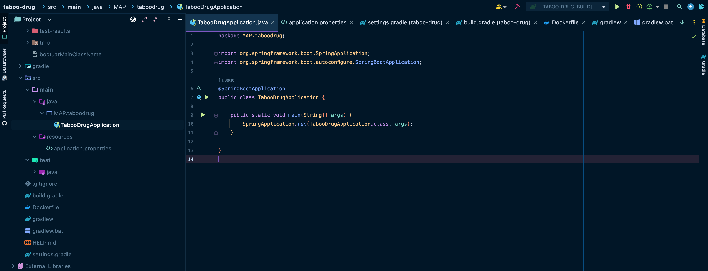
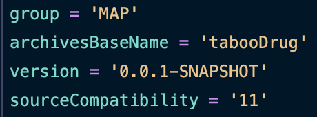
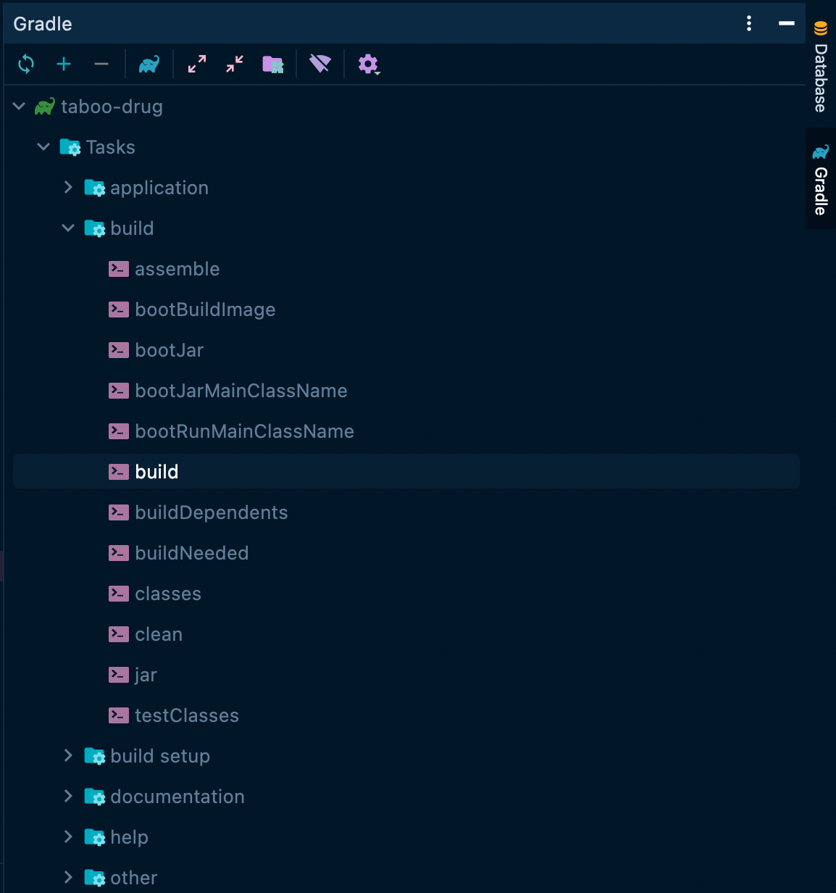
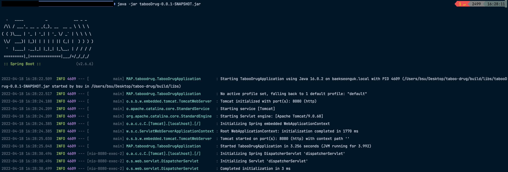
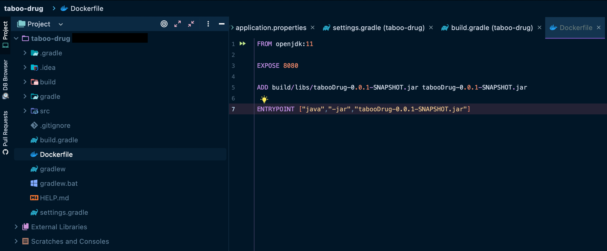
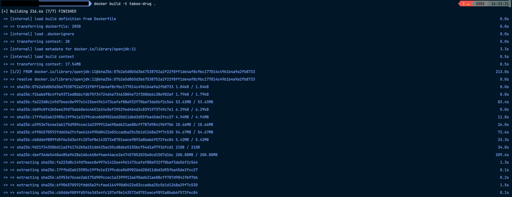
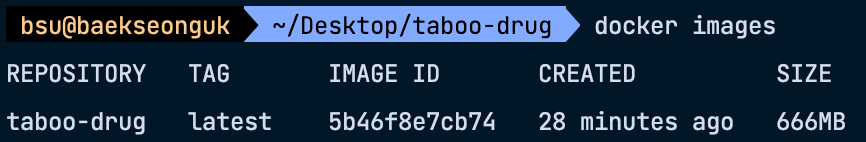
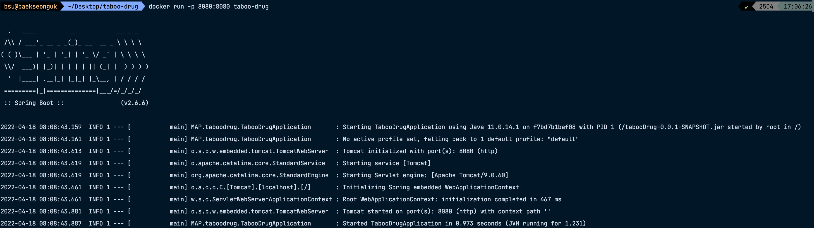
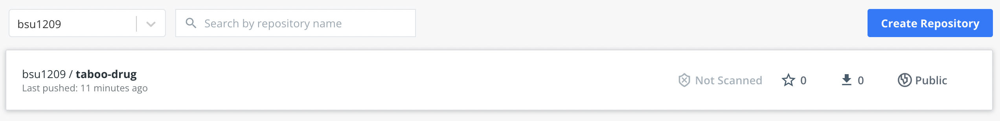

## 🔧 Docker란

## 🔧 스프링 서버 배포해보기
### ✂️ 스프링 서버 준비
우선, 배포할 스프링 서버가 필요하다. [start.io](https://start.spring.io/) 를 이용하여 생성한다.



생성한 이후, 프로젝트가 정상적으로 동작하는지 한 번 실행해보도록 한다.

이제 Docker에서 사용할 `jar` 파일을 빌드해본다. `build.gradle` 파일을 열어 파일의 빌드명을 지정해준다.



- 위 경우는 `tabooDrug-0.0.1-SNAPSHOT.jar` 이라는 이름으로 `jar` 파일이 생성된다.

이후 화면 오른쪽의 `Gradle` -> `Tasks` -> `build` -> `build.sh` 을 실행하여 프로젝트를 빌드한다.



- 빌드가 완료됨을 터미널에서 확인한 후, `build` -> `libs` 디렉토리를 확인하면 `jar` 파일이 생성된 것을 확인할 수 있다.

빌드된 `jar` 파일은 터미널에서 바로 실행할 수 있다. 
- `java -jar tabooDrug-0.0.1-SNAPSHOT.jar` 명령어를 이용하여 실행해본다.



이제 이 애플리케이션을 배포할 준비는 끝났고, Docker 컨테이너로 배포하기 위한 설정이 필요하다.

### ✂️ Docker 준비
우선 `Dockerfile` 이 필요하다. 
- 이는 컨테이너 내부 환경을 정의하고, 
- `docker build` 를 통해 **docker image**를 생성하고,
- 생성된 **docker image**를 통해 항상 같은 환경에서의 컨테이너를 구성한다.



- `openjdk:11` 은 `openjdk11` 이 설치된 기본 OS 환경을 의미하고,
- `EXPOSE 8080` 는 Host OS와 연결할 포트를 의미하고,
- `ADD` 에 정의한 파일을 이미지 `build` 시 추가한다의 의미이다.
- `ENTRYPOINT` 는 컨테이너가 실행될 때 먼저 실행할 명령어를 배열 형태로 정의한다.

이제 사용할 Docker를 환경에 맞게 설치한다. (설치 과정은 생략!) 

Docker를 백그라운드에서 실행시킨 이후(Docker Desktop 실행), `Dockerfile` 이 위치한 경로로 이동하여 정의한 설정을 이미지로 build 하도록 아래의 명령어를 실행한다.

```shell
docker build -t '로컬 레포지토리명' .
```



성공적으로 빌드가 되었다면, `docker images` 로 이미지 목록을 확인하는 명령어로 확인할 수 있다.



해당 이미지를 Docker 컨테이너에 올려본다.
- 이제는 애플리케이션이 구동되는 환경이 Host OS가 아닌, Docker 엔진 위에 올라간 컨테이너이다.



### ✂️ Docker Hub 사용하기
github처럼, Docker hub도 존재한다. hub에 생성한 이미지를 올려 다른 팀원들도 사용할 수 있도록 한다.

docker hub 홈페이지를 이용하는 방법도 있지만, IntelliJ에서 제공하는 Docker plugin을 이용하면 손쉽게 hub에 push가 가능하다.

1. 먼저 docker plugin을 설치한다.
2. 이후, IntelliJ 아래쪽의 `Service` -> `Docker` 를 우클릭하여 `Connect` 한다. 로그인한 계정과 연결할 수 있다.
3. 이후, `Docker` -> `Images` 에서 금방 생성한 image를 확인할 수 있는데, 이를 우클릭하여 `Push Image...` 를 클릭한다.
4. `Registry` , `Namespace` , `Repository` , `Tag` 를 입력하는데, `Registry` 를 생성하지 않았다면 생성한다. 모두 입력한 후 PUSH를 누르고, 잠시 기다린 후 Docker hub 홈페이지를 확인하면, 해당 `Registry` 에 올라간 것을 확인할 수 있다.



이제 내가 올린 Docker image를 `docker pull` 명령어를 사용해 다운받아 사용할 수 있을 것이다.

## 📕 참고
- [스프링부트 어플리케이션을 도커컨테이너에 배포 해보자](https://parkjangwon.github.io/springboot/java/docker/2020/11/14/%EC%8A%A4%ED%94%84%EB%A7%81%EB%B6%80%ED%8A%B8-%EC%96%B4%ED%94%8C%EB%A6%AC%EC%BC%80%EC%9D%B4%EC%85%98%EC%9D%84-%EB%8F%84%EC%BB%A4%EC%BB%A8%ED%85%8C%EC%9D%B4%EB%84%88%EC%97%90-%EB%B0%B0%ED%8F%AC-%ED%95%B4%EB%B3%B4%EC%9E%90.html)
- [dockerfile 역할과 활용 정리](https://lejewk.github.io/docker-dockerfile/)