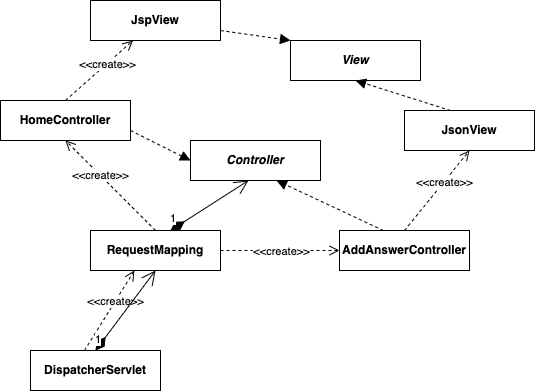

<em>[자바 웹 프로그래밍 Next Step - 박재성]을 읽고 인용하고 정리하는 POST입니다.</em>

> 직접 구현한 프레임워크와 라이브러리를 활용해 질문/답변 게시판을 구현해보자. 이때, AJAX 기술을 활용해 답변을 추가, 삭제하는 기능을 구현한다. 이때 서버측은 HTML이 아닌 JSON 데이터로 응답하도록 구현한다.

## 🚩 AJAX 활용해 답변 추가, 삭제 실습
**브라우저가 서버에서 HTML 응답을 받아 처리하는 과정**<br/>
- HTML 응답을 받은 브라우저는 먼저 HTML을 라인 단위로 읽어가면서 서버에 재요청이 필요한 부분(CSS, JS, Image)을 찾아 서버에 재요청한다.
- 서버에서 자원을 다운로드하면서 HTML DOM 트리를 구성한다.
- 서버에서 CSS 파일을 다운로드하면 생성한 HTML DOM 트리에 CSS 스타일을 적용한 후 화면에 그린다.
- 반복

**답변 추가, 삭제 기능의 경우**<br/>
- 화면 대부분은 변경할 필요없이 답변이 추가되는 부분, 삭제되는 부분만 처리가 필요하다.
- 즉, 매번 서버에 요청을 보내 위 과정 전체를 실행하는 것은 비효율적이다.

이 같은 단점 보완을 위해 **AJAX(Asynchronous JavaScript and XML)**가 등장했다.

### 🔧 답변하기
- 사용자가 답변하기 버튼을 클릭
- 사용자가 입력한 데이터를 서버로 전송
- 서버는 사용자가 입력한 데이터를 DB에 저장
- 저장한 데이터를 클라이언트에 JSON 형태로 전송
- 클라이언트는 서버가 응답한 JSON 데이터를 HTML로 변환해 화면에 출력

먼저 답변하기 버튼 클릭을 위한 HTML 코드를 보면,

```html
<div class="answerWrite">
    <form name="answer" method="post">
        <input type="hidden" name="questionId" value="${question.questionId}">
        <div class="form-group col-lg-4" style="padding-top:10px;">
            <input class="form-control" id="writer" name="writer" placeholder="이름">
        </div>
        <div class="form-group col-lg-12">
            <textarea name="contents" id="contents" class="form-control" placeholder=""></textarea>
        </div>
        <input class="btn btn-success pull-right" type="submit" value="답변하기" />
        <div class="clearfix" />
    </form>
</div>
```

- 사용자는 답변 작성 후 답변하기 버튼을 클릭한다.
- 해당 버튼 클릭 이벤트는 `webapp/js/scripts.js` 에 구현한다.

```js
$(".answerWrite input[type=submit]").click(addAnswer);

function addAnswer(e) {
  e.preventDefault();
  var queryString = $("form[name=answer]").serialize();

  $.ajax({
    type : 'post',
    url : '/api/qna/addAnswer',
    data : queryString,
    dataType : 'json',
    error : onError,
    success : onSuccess,
  });
}
```

**`addAnswer()`**
- `submit` 버튼의 기본 동작을 막고, `<form>` 태그에 사용자가 입력한 데이터를 추출하여 `queryString` 에 담는다.
- 그리고 jQuery의 `ajax()` 함수를 활용해 서버에 요청을 보낸다.
  - 요청 메소드는 POST
  - 요청 URL은 `/api/qna/addAnswer`
  - 응답 데이터 타입은 `Json`
  - 서버에 응답이 성공하면, `onSuccess()` 함수를 호출하면서 응답 데이터를 전달받는다.
  - 실패하면, `onError()` 함수를 호출하면서 실패 원인을 전달받는다.

위 구현으로 클라이언트에서 서버에 요청을 보내는 것은 완료했다. 이제 서버가 클라이언트의 요청을 처리해야 한다. 해당 요청을 처리할 클래스를 생성하고, 요청 URL에 대응하도록 `RequestMapping` 에 추가해준다.

```java
import com.fasterxml.jackson.databind.ObjectMapper;

public class AddAnswerController implements Controller {
    private static final Logger log = LoggerFactory.getLogger(AddAnswerController.class);

    @Override
    public String execute(HttpServletRequest req, HttpServletResponse resp) throws Exception {
        Answer answer = new Answer(req.getParameter("writer"), req.getParameter("contents"), Long.parseLong(req.getParameter("questionId")));
        log.debug("answer : {}", answer);
        
        AnswerDao answerDao = new AnswerDao();
        Answer savedAnswer = answerDao.insert(answer);
        ObjectMapper mapper = new ObjectMapper();
        resp.setContentType("application/json;charset=UTF-8");
        PrintWriter out = resp.getWriter();
        out.print(mapper.writeValueAsString(savedAnswer));
        return null;
    }
}
```

- 기존의 Controller들과 달리, 응답 시 HTML이 아닌 **JSON 형태로 데이터만 전달**한다.
  - 자바 객체의 데이터를 JSON으로 변환하기 위해 [Jackson 라이브러리](https://github.com/FasterXML/jackson)를 사용했다.
- JSON 데이터 생성 후 바로 응답으로 보내기 때문에 이동할 페이지가 없어 `null` 을 반환한다.
  - `DispatchServlet` 이 `null` 처리를 하지 않기에 뷰 이름이 `null` 인 경우 페이지 이동을 하지 않도록 `null` 처리를 한다.

```java
public class DispatcherServlet extends HttpServlet {
    ...

    @Override
    protected void service(HttpServletRequest req, HttpServletResponse resp) throws ServletException, IOException {
        String requestUri = req.getRequestURI();
        logger.debug("Method : {}, Request URI : {}", req.getMethod(), requestUri);

        Controller controller = rm.findController(requestUri);
        try {
            String viewName = controller.execute(req, resp);
            if (viewName != null) {
                move(viewName, req, resp);
            }
        } catch (Throwable e) {
            logger.error("Exception : {}", e);
            throw new ServletException(e.getMessage());
        }
    }
}
```

- 위 코드에서 볼 수 있듯, `viewName` 이 `null` 이 아닌 경우만 `move()` 하는 로직이어서 그런 것 같다.

그래서 구현한 응답 결과는 다음과 같이 클라이언트 JS에 전달된다.

```json
{"answerId":6,"writer":"재성","contents":"테스트","createdDate":1456066690411,"questionId":8,"timeFromCreateDate":1457066690411}
```

이제, 서버에서 응답한 이 JSON 데이터를 활용해 HTML을 동적으로 생성한 후 화면에 출력하면 된다. 아까 서버 응답 성공 시, `onSuccess()` 함수가 호출되도록 구현했다. 따라서 동적으로 HTML을 생성하는 부분을 `onSuccess()` 에 구현한다.

```js
String.prototype.format = function() {
  var args = arguments;
  return this.replace(/{(\d+)}/g, function(match, number) {
    return typeof args[number] != 'undefined'
        ? args[number]
        : match
        ;
  });
};
...

function onSuccess(json, status) {
  var answerTemplate = $("#answerTemplate").html();
  var template = answerTemplate.format(json.writer, new Date(json.createdDate), json.contents, json.answerId);
  $(".qna-comment-slipp-articles").prepend(template);
}
```

- 간단한 HTML 템플릿과 이 템플릿에 값을 전달하는 `template()` 함수를 `format()` 으로 구현했기에 간단하게 구현할 수 있다.
- 동적으로 생성한 HTML을 `qna-comment-slipp-articles` class에서 사용할 수 있도록 `prepend` 하여 답변 중 제일 위에 위치하도록 한다.
- 아래는 HTML 템플릿이다. 템플릿과 `template()` 함수를 활용해 동적인 HTML을 간단하게 생성할 수 있다.

```html
<script type="text/template" id="answerTemplate">
	<article class="article">
		<div class="article-header">
			<div class="article-header-thumb">
				
			</div>
			<div class="article-header-text">
				{0}
				<div class="article-header-time">{1}</div>
			</div>
		</div>
		<div class="article-doc comment-doc">
			{2}
		</div>
		<div class="article-util">
			<ul class="article-util-list">
				<li>
					<a class="link-modify-article" href="/api/qna/updateAnswer/{3}">수정</a>
				</li>
				<li>
					<form class="form-delete" action="/api/qna/deleteAnswer" method="POST">
						<input type="hidden" name="answerId" value="{4}" />
						<button type="submit" class="link-delete-article">삭제</button>
					</form>
				</li>
			</ul>
		</div>
	</article>
</script>
```

### 🔧 답변 삭제하기 실습
- 사용자가 삭제 버튼을 클릭
- 해당 답변 삭제 요청을 서버로 전송
- 서버는 요청에 대해 답변을 삭제
  - 답변 삭제 성공 시, `next.model.Result` 의 `ok()` 응답
  - 실패 시, `fail("error message")` 응답
- 클라이언트는 서버 응답 `status` 값이 `true` 인 경우 HTML에서 해당 답변의 HTML을 삭제
  - 클릭한 삭제 버튼(`$(this)`)에서 가장 가까이 있는 `article` 태그를 찾아 삭제

```js
$(".qna-comment").click(deleteAnswer);

function deleteAnswer(e) {
  e.preventDefault();

  var deleteBtn = $(this);
  var deleteId = deleteBtn.closest("form").serialize();

  $.ajax({
    type : 'post',
    url : '/api/qna/deleteAnswer',
    data : deleteId,
    dataType : 'json',
    error : onError,
    success : function (json, status) {
      if (json.status) {
        deleteBtn.closest("article").remove();
      }
    },
  });
}
```

- 삭제 버튼 클릭 이벤트 처리와 서버에 삭제 요청을 보내는 함수를 구현한다.
  - `deleteBtn` 으로 클릭된 삭제 버튼을 가져오고, 이와 가장 가까운 `form` 태그의 입력 값을 가져온다. (`deleteId` 에는 `answerId` 정보)
  - 서버 응답이 성공이면, `deleteBtn` 에서 가장 가까운 `article` 태그를 삭제한다.

```java
public void delete(long answerId) {
    JdbcTemplate jdbcTemplate = new JdbcTemplate();
    String sql = "DELETE FROM ANSWERS WHERE answerId = ?";
    jdbcTemplate.update(sql, answerId);
}
```

- 답변의 삭제를 위해, `AnswerDao` 에 `delete()` 메소드를 추가 구현한다.

```java
public class DeleteAnswerController implements Controller {
    private static final Logger log = LoggerFactory.getLogger(AddAnswerController.class);

    @Override
    public String execute(HttpServletRequest req, HttpServletResponse resp) throws Exception {
        Long deleteId = Long.parseLong(req.getParameter("answerId").replaceAll("[{}]", ""));
        log.debug("deleteId : {}", deleteId);

        AnswerDao answerDao = new AnswerDao();
        answerDao.delete(deleteId);

        ObjectMapper mapper = new ObjectMapper();
        resp.setContentType("application/json;charset=UTF-8");
        PrintWriter out = resp.getWriter();
        out.print(mapper.writeValueAsString(Result.ok()));
        return null;
    }
}
```

- `AddAnswerController` 와 동일하게 이를 처리할 컨트롤러를 생성하고 mapping한다.
- 금방 생성한 `delete()` 메소드를 이용해 답변을 삭제하고, `Result.ok()` 메소드를 이용하여 성공적인 JSON 데이터를 응답한다.

> 위와 같이 구현 시, ajax에서 `success` 로 넘어가지지 않아 화면에 JSON이 그대로 출력된다. 왜 안되는 건지 이유를 모르겠다 ...

---

## 🚩 MVC 프레임워크 요구사항 2단계
MVC 프레임워크 구조에 빈틈이 보인다. `DeleteAnswerController` 코드의 문제점을 찾아보자.

**첫번째 문제점**<br/>
: JSON으로 응답을 보내는 경우 이동할 JSP 페이지가 없다보니 불필요하게 `null` 을 반환해야 한다. (AJAX에서 사용할 컨트롤러는 반환 값이 굳이 필요없다.)

해당 문제점이 발생한 이뉴는 컨트롤러에서 응답할 뷰가 JSP 하나에서 JSP와 JSON 두 개로 증가했기 때문이다. 뷰가 JSP(또는 서블릿)일 경우 항상 `String` 을 반환해야 했지만, JSON일 경우는 반환 값이 필요없다. 
- 이를 해결하기 위해 `DispatcherServlet` 에서 `execute()` 메소드의 반환 값이 `null` 일 때 아무 처리도 하지 않도록 `if/else` 형태로 구현할 수 있다.
  - 하지만 또 다른 뷰가 추가된다면, 이에 대한 예외 처리가 필요해진다. 근본적인 해결책이 되지 못한다.

**두번째 문제점**<br/>
: `AddAnswerController` 와 `DeleteAnswerController` 를 보면, 자바 객체를 JSON으로 변환하고 응답하는 부분에 중복이 발생한다. 이를 제거한다.

- 중복 코드를 별도의 메소드로 분리한 후 `Abstract JsonController` 와 같은 부모 클래스를 만들어 중복을 해결할 수 있다.

### 🔧 요구사항 분리 및 힌트
- 뷰를 추상화한 인터페이스를 추가한다. (이전에 `Controller` 인터페이스를 추가한 것과 동일)
  - `View` 라는 이름의 인터페이스를 추가한다.
- `View` 를 구현하는 `JspView` 와 `JsonView` 를 생성해 각 기능에 맞게 구현한다.
  - `JspView` 의 생성자는 이동할 URL을 인자로 받는다. 즉, `Controller` 의 `execute()` 메소드의 반환 값을 가진다.
  - `JsonView` 는 생성자로 인자를 전달하지 않아도 된다.
  - `JspView` 의 `render()` 메소드는 `DispatcherServlet` 의 `move()` 를 구현한다.
  - `JsonView` 는 자바 객체를 JSON으로 변환 후 응답을 보내는 기능을 구현한다.
  - `HttpServletRequest` 를 통해 전달하는 모든 값을 `Map` 에 저장한 후 JSON으로 변환한다.
- `Controller` 인터페이스의 반환 값을 `String` 에서 `View` 로 변경한다.
- 각 `Controller` 에서 `String` 대신 새로 생성한 `JspView` 와 `JsonView` 중 하나를 사용하도록 변경한다.
- `DispatcherServlet` 에서 `String` 대신 `View` 인터페이스를 사용하도록 변경한다.



**`HttpServletRequest` 를 사용하면서 발생하는 이슈**
- `JsonView` 는 `HttpServletRequest` 에 추가되어 있는 모든 데이터를 JSON으로 변경한다.
- 그런데 `HttpRequestServlet` 의 경우 서블릿 필터, 서블릿의 여러 단계를 거치면서 개발자 모르게 값이 추가될 수도 있다.
  - 이로 인해 의도치 않은 데이터가 불필요하게 JSON으로 변경되어 클라이언트 응답으로 보내질 수도 있다.
- `HttpRequestServlet` 를 통해 데이터를 전달하지 않고 개발자가 원하는 데이터만 뷰에 전달할 수 있도록 모델 데이터에 대한 추상화 작업을 진행한다.
  - 모델 데이터를 `View` 아 같이 전달해야 하므로, `ModelAndView` 와 같은 이름의 클래스를 새로 추가한다.
  - `ModelAndView` 는 `View` 와 모델 데이터를 `Map<String, Object>` 형태로 관리하도록 구현한다.
- `View` 의 `render()` 메소드에 모델 데이터를 인자로 추가하고 `JspView` 와 `JsonView` 를 수정한다.
  - `View` 의 `render()` 메소드 인자에 `Map` 을 추가한다.
  - `JspView` 의 `render()` 메소드는 모델 데이터를 꺼내 `HttpServletRequest` 에 전달한다.
  - `JsonView` 의 `render()` 메소드는 `HttpServletRequest` 메소드에서 `Map` 으로 변경하는 부분을 제거한다.
- `Controller` 의 반환 값을 `View` → `ModelAndView`, 각 `Controller` 구현체는 `HttpServletRequest` → `ModelAndView`, `DispatcherServlet` 에서 `View` → `ModelAndView`

---

## 🚩 MVC 프레임워크 구현 2단계
### 🔧 View 인터페이스 추가
JSP와 JSON 뷰를 추상화한 `View` 인터페이스를 추가한다.

```java
public interface View {
    void render(HttpServletRequest req, HttpServletResponse resp) throws Exception;
}
```

### 🔧 JspView와 JsonView 추가
JSP에 대한 페이지 이동 처리를 담당하는 `JspView` 를 추가한다. 이는 이동할 뷰 이름을 생성자로 받은 후 `render()` 메소드 호출 시 해당 페이지로 이동하면 된다. 
- `DispatcherServlet` 의 `move()` 메소드 구현부를 `render()` 메소드에 구현한다.

```java
public class JspView implements View {
    private static final String DEFAULT_REDIRECT_PREFIX = "redirect:";
    
    private String viewName;
    
    public JspView(String viewName) {
        if (viewName == null) {
            throw new NullPointerException("viewName is null. 이동할 URL을 추가해주세요.");
        }
        this.viewName = viewName;
    }
    
    @Override
    public void render(HttpServletRequest req, HttpServletResponse resp) throws Exception {
        if (viewName.startsWith(DEFAULT_REDIRECT_PREFIX)) {
            resp.sendRedirect(viewName.substring(DEFAULT_REDIRECT_PREFIX.length()));
            return;
        }

        RequestDispatcher rd = req.getRequestDispatcher(viewName);
        rd.forward(req, resp);
    }
}
```

JSON 데이터 응답을 담당할 `JsonView` 를 추가한다. 이동할 URL이 없으므로, `render()` 메소드는 `HttpServletRequest` 를 통해 전달되는 자바 객체를 JSON으로 변환한 후 응답하는 기능을 가지도록 구현한다.

```java
public class JsonView implements View {
    @Override
    public void render(HttpServletRequest req, HttpServletResponse resp) throws Exception {
        ObjectMapper mapper = new ObjectMapper();
        resp.setContentType("application/json; charset=UTF-8");
        PrintWriter out = resp.getWriter();
        out.print(mapper.writeValueAsString(createModel(req)));
    }
    
    private Map<String, Object> createModel(HttpServletRequest req) {
        Enumeration<String> names = req.getAttributeNames();
        Map<String, Object> model = new HashMap<>();
        while(names.hasMoreElements()) {
            String name = names.nextElement();
            model.put(name, req.getAttribute(name));
        }
        return model;
    }
}
```

### 🔧 Controller 반환 값을 String에서 View로 수정
이제 `Controller` 가 `String` 을 반환하지 않고, `View` 를 반환하도록 수정한다.
- `execute()` 의 반환형을 `View` 로 수정한다.

### 🔧 Controller 구현체가 String 대신 View를 반환하도록 수정
컴파일 에러 해결을 위해 모든 `Controller` 구현체가 `String` 대신 `View` 를 반환하도록 수정하고 반환형에 맞게 `new JspView()` or `new JsonView()` 로 수정한다.

### 🔧 DispatcherServlet이 View에 작업을 위임하도록 수정
`DispatcherServlet` 에서 `String` 값을 받아 처리하는 작업을 `View` 를 활용하도록 수정한다.

```java
@WebServlet(name = "dispatcher", urlPatterns = "/", loadOnStartup = 1)
public class DispatcherServlet extends HttpServlet {
    ...

    @Override
    protected void service(HttpServletRequest req, HttpServletResponse resp) throws ServletException, IOException {
        String requestUri = req.getRequestURI();
        logger.debug("Method : {}, Request URI : {}", req.getMethod(), requestUri);

        Controller controller = rm.findController(requestUri);
        try {
            View view = controller.execute(req, resp);
            view.render(req, resp);
        } catch (Throwable e) {
            logger.error("Exception : {}", e);
            throw new ServletException(e.getMessage());
        }
    }
}
```

- `DispatcherServlet` 에서 `move()` 메소드를 이용해 처리하던 페이지 이동 작업을 `JspView` 의 `render()` 메소드로 이동했기에 더 깔끔해졌다.

### 🔧 ModelAndView 추가를 통한 모델 추상화
뷰를 포함해 모델 데이터에 대한 추상화를 담당하는 `ModelAndView` 를 구현한다.

```java
public class ModelAndView {
    private View view;
    private Map<String, Object> model = new HashMap<>();
    
    public ModelAndView(View view) {
        this.view = view;
    }
    
    public ModelAndView addObject(String attributeName, Object attributeValue) {
        model.put(attributeName, attributeValue);
        return this;
    }
    
    public Map<String, Object> getModel() {
        return Collections.unmodifiableMap(model);
    }
    
    public View getView() {
        return view;
    }
}
```

- `View` 의 `render()` 메소드에 모델 데이터를 인자로 전달할 수 있도록 변경한다.

```java
public interface View {
    void render(Map<String, ?> model, HttpServletRequest req, HttpServletResponse resp) throws Exception;
}
```

- `View` 인터페이스 변경에 따라 `JspView` 와 `JsonView` 또한 수정한다.
- `Controller` 인터페이스의 반환 값 또한 `ModelAndView` 로 수정한다.

```java
public class JspView implements View {
  @Override
  public void render(Map<String, ?> model, HttpServletRequest req, HttpServletResponse resp) throws Exception {
    if (viewName.startsWith(DEFAULT_REDIRECT_PREFIX)) {
        resp.sendRedirect(viewName.substring(DEFAULT_REDIRECT_PREFIX.length()));
        return;
    }
    
    Set<String> keys = model.keySet();
    for (String key : keys) {
        req.setAttribute(key, model.get(key));
    }

    RequestDispatcher rd = req.getRequestDispatcher(viewName);
    rd.forward(req, resp);
  }
}

...

public class JsonView implements View {
    @Override
    public void render(Map<String, ?> model, HttpServletRequest req, HttpServletResponse resp) throws Exception {
        ObjectMapper mapper = new ObjectMapper();
        resp.setContentType("application/json; charset=UTF-8");
        PrintWriter out = resp.getWriter();
        out.print(mapper.writeValueAsString(model));
    }
}

... 

public interface Controller {
    ModelAndView execute(HttpServletRequest req, HttpServletResponse resp) throws Exception;
}
```

`ModelAndView` 생성을 더 쉽게 도와주기 위해 `AbstractController` 를 추가한 후 아래 두 메소드를 제공한다.

```java
public abstract class AbstractController implements Controller {
    protected ModelAndView jspView(String forwardUrl) {
        return new ModelAndView(new JspView(forwardUrl));
    }

    protected ModelAndView jsonView() {
        return new ModelAndView(new JsonView());
    }
}
```

- `Controller` 구현체가 `View` 가 아닌 `ModelAndView` 를 반환하도록 수정한다.
- 그리고 지금까지 `HttpServletRequest` 를 통해 전달하던 모델 데이터를 `ModelAndView` 를 통해 전달하도록 수정한다.

```java
public class HomeController extends AbstractController {
    private QuestionDao questionDao = new QuestionDao();
    
    @Override
    public ModelAndView execute(HttpServletRequest req, HttpServletResponse resp) throws Exception {
        return jspView("home.jsp").addObject("questions", questionDao.findAll());
    }
}

...

public class AddAnswerController extends AbstractController {
    private static final Logger log = LoggerFactory.getLogger(AddAnswerController.class);
    private AnswerDao answerDao = new AnswerDao();

    @Override
    public ModelAndView execute(HttpServletRequest req, HttpServletResponse resp) throws Exception {
        Answer answer = new Answer(req.getParameter("writer"), req.getParameter("contents"),
                Long.parseLong(req.getParameter("questionId")));
        log.debug("answer : {}", answer);

        Answer savedAnswer = answerDao.insert(answer);
        return jsonView().addObject("answer", savedAnswer);
    }
}
```

모든 `Controller` 구현체에 대한 수정이 끝나면, `DispatcherServlet` 이 `View` 가 아닌 `ModelAndView` 를 사용하도록 리팩토링한다.

```java
@WebServlet(name = "dispatcher", urlPatterns = "/", loadOnStartup = 1)
public class DispatcherServlet extends HttpServlet {
    ...

    @Override
    protected void service(HttpServletRequest req, HttpServletResponse resp) throws ServletException, IOException {
        ...

        ModelAndView mav;
        try {
            mav = controller.execute(req, resp);
            View view = mav.getView();
            view.render(mav.getModel(), req, resp);
        } catch (Throwable e) {
            logger.error("Exception : {}", e);
            throw new ServletException(e.getMessage());
        }
    }
}
```

## 📕 출처
**자바 웹 프로그래밍 Next Step : 하나씩 벗겨가는 양파껍질 학습법** - 박재성