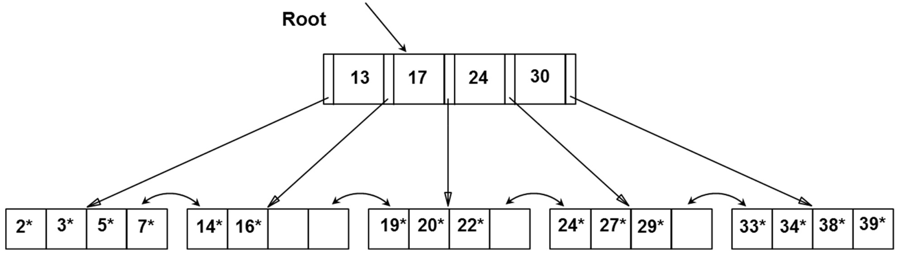
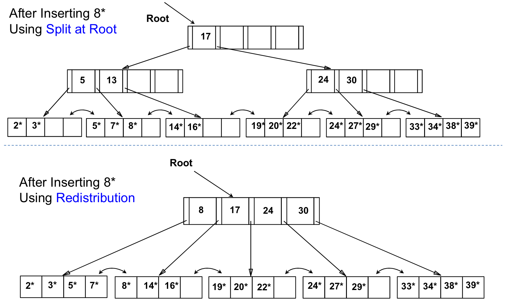

> **이진 트리**는 하나의 부모가 두 개의 자식밖에 가지지 못하고, 편향된다면 탐색 효율이 선형 탐색급으로 떨어진다. 하지만 이진 트리 구조의 간결함과 균형만 맞다면 탐색, 삽입, 삭제 모두 $O(logN)$의 성능을 보이는 장점이 있다.

## 🧷 B Tree
데이터베이스, 파일 시스템에서 널리 사용되는 트리 자료구조의 일종이다. 이진 트리를 확장하여 **더 많은 수의 자식**을 가질 수 있게 일반화시킨 트리 자료구조이다. (**이진 트리는 아니다!**)
- 자식 수에 대한 일반화를 진행하면서, 하나의 레벨에 더 저장할 수 있는 것뿐 아니라 트리의 균형을 자동으로 맞춰주는 로직 또한 갖추었다.
  - 따라서, **균형 트리**의 장점과 **효율적인 데이터 로드**의 장점을 갖추었다.

> **레벨에 더 많은 저장이 가능하다는 것의 장점**
> 
> 대량의 데이터 처리 시, 검색 구조의 경우 하나의 노드에 많은 데이터를 가질 수 있다는 것은 큰 장점이다. 대량의 데이터는 메모리보다 블럭 단위로 입출력하는 HDD or SSD에 저장해야 하기 때문이다.
> - ex. 한 블럭이 1024바이트면, 2바이트를 읽으나 1024바이트를 읽으나 똑같은 입출력 비용이 발생한다. 따라서 하나의 노드를 모두 1024바이트로 꽉 채워서 조절할 수 있다면 효율적일 것이다.
>
> B Tree는 이러한 장점을 토대로 많은 DB 시스템의 인덱스 저장 방법으로 애용하고 있다.

### 🪚 규칙
- 노드의 자료수가 N개이면, 자식 수는 N + 1이어야 한다.
- 각 노드의 자료는 정렬된 상태여야 한다.
- 루트 노드는 적어도 2개 이상의 자식을 가져야 한다.
- 루트 노드를 제외한 모든 노드는 적어도 M/2개의 자료를 가지고 있어야 한다.
- 외부 노드로 가는 경로의 길이는 모두 같다.
- 입력 자료는 중복이 없어야 한다.

---

## 🧷 B+ Tree

데이터의 빠른 접근을 위한 **인덱스 역할만 하는 비단말 노드가 추가로 있는** 트리 자료구조이다. 기존의 B Tree와 데이터의 연결리스트로 구현된 색인 구조이다.
- B Tree의 변형 구조로, index 부분과 leaf 노드로 구성된 순차 데이터 부분으로 이루어진다. 인덱스 부분의 key 값은 leaf에 있는 key 값을 직접 찾아가는데 사용한다.
- `p` (fanout) 이라는 값으로 한 node에 몇 개의 entry가 채워져야 하는지를 나타낸다.

### 🪚 장점
- 블록 사이즈를 더 많이 사용할 수 있다. (key 값에 대한 HDD 접근 주소가 없기 때문이다.)
- leaf 노드끼리 연결 리스트로 연결되어 범위 탐색에 매우 유리하다.

### 🪚 단점
- B Tree의 경우 최상 케이스에서는 루트에서 끝날 수 있지만, B+ Tree는 무조건 leaf 노드까지 내려가봐야 한다.
  - **탐색 비용이 트리의 높이에 비례**하게 된다!

### 🪚 삽입
- 삽입하려는 entry가 위치할 곳을 찾는다.
- 해당 node가 충분한 공간이 있다면 삽입하고 종료한다.
- 그렇지 않은 경우, **해당 node를 분리**한다.
  - node의 엔트리들을 분배하고, `middle key` 를 **COPY UP**한다.

> PUSH UP하면, `middle key` 에 대한 Data pointer가 손실되기 때문이다.

### 🪚 삽입 이후 ...

B+ Tree에 node를 삽입한 이후 트리의 높이가 증가하지 않을 수도 있고, 증가할 수도 있다.
- B+ Tree의 탐색 비용은 트리의 높이에 비례한다.
- **트리를 재분배**함으로써, 높이를 낮출 수 있다!

> 재분배를 통해 탐색 비용을 낮출 수는 있지만, 평균 I/O 바용을 증가시킨다.

### 🪚 삭제
- 루트부터, 해당 entry가 존재하는 leaf node를 찾는다.
- 해당 node에서 entry를 지워도 채워져야 하는 `p` 를 만족한다면 그대로 삭제한다.
- 지운 후 node의 entry 수가 `p - 1` 이라면, 주변 leaf node(같은 부모를 가지는 주변 node)로부터 entry를 빌려와 `p` 를 만족시킨다.
  - 이는 `middle key` 의 변경을 유발한다.
  - 만약 주변 leaf node로부터 빌려올 수 없다면, 그 **leaf node와 결합**한다.
    - 결합이 발생하면, **둘 중 한 node는 제거**한다.
    - 결합을 통해 **트리의 높이가 감소**할 수도 있다.

---

## 🧷 B Tree와 B+ Tree 비교
- B Tree는 각 노드에 데이터가 저장된다.
- B+ Tree는 index 노드와 leaf 노드로 분리되어 저장된다. (또한 leaf 노드는 서로 연결되어 있어 임의 접근이나 순차 접근 모두 성능이 좋다.)

- B Tree는 각 노드에서 key와 data 모두 들어갈 수 있고, data는 disk block으로 포인터가 될 수 있다.
- B+ Tree는 각 노드에서 key만 들어갈 수 있다. 따라서 data는 모두 leaf 노드에만 존재한다.
  - B+ Tree의 삽입과 삭제는 모두 leaf 노드에서만 발생한다.

---

## 📕 참고
- [Tech Interview for developer](https://gyoogle.dev/blog/computer-science/data-structure/B%20Tree%20&%20B+%20Tree.html)