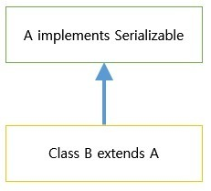
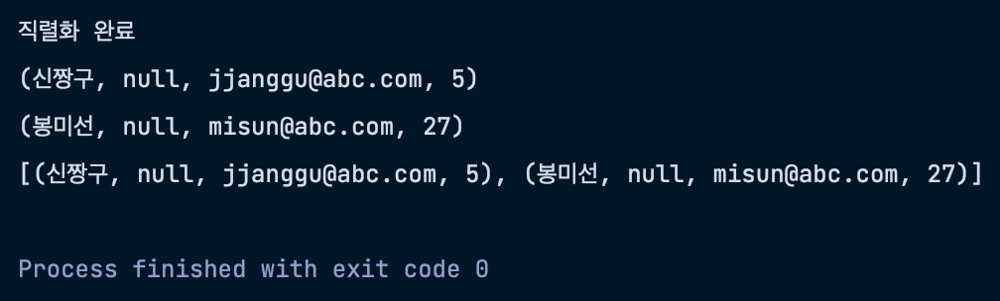

네이버 D2 블로그를 읽던 중 역직렬화라는 개념을 발견했다. 그래서 자바의 직렬화와 역직렬화가 무엇인지에 대해 정리하려 한다.

## 📍 직렬화와 역직렬화
### 📝 직렬화
"객체를 직렬화하여 전송 가능한 형태(byte)로 만드는 것"을 의미한다. 객체들의 데이터를 연속적인 데이터로 변형하여 스트림을 통해 데이터를 읽도록 해준다.
- 주로 객체들을 통째로 파일로 저장하거나 전송할 때 사용한다.
- 또한 JVM의 메모리에 상주(힙 또는 스택)되어 있는 객체 데이터를 바이트 형태로 변환하는 기술이라고도 한다.

### 📝 역직렬화
"직렬화된 파일 등을 역으로 직렬화하여 다시 객체의 형태로 만드는 것"을 의미한다. 저장된 파일을 읽거나 전송된 스트림 데이터를 읽어 원래 객체의 형태로 복원한다.

---

## 📍 직렬화 가능한 클래스
직렬화를 하기 위해서는 전제조건이 있다. 바로 **"직렬화가 가능한 클래스를 먼저 만드는 것"** 이다.
- 그리고 이는 `Serializable` 을 통해 정할 수 있다.

```java
public class A {

}

// 이러한 형태라면

public class A implements Serializable {

}
```

- 위와 같이 직렬화가 가능한 클래스 A에 **`Serializable` 인터페이스를 implements**하면 된다.
  - 하지만 단순히 인터페이스를 구현한다고 해서 직렬화 대상이 되는 것은 아니다.
  - 여러 상황에 따라 직렬화 가능한 클래스와 데이터가 결정된다.

### 📝 Serializable 인터페이스를 implements
이는 위 예시와 같이 `Serializable` 인터페이스를 구현하는 클래스로 만드는 것이다.

### 📝 Serializable 없는 경우
보통의 경우는 직렬화가 불가능하다. 하지만 클래스들간의 관계를 고려해보면, 가능한 경우도 있다. 
- 바로 **`Serializable` 인터페이스를 구현한 클래스를 상속받은 경우**이다.



- 클래스 A는 `Serializable` 인터페이스를 구현하고 있고, 클래스 B는 이를 상속받고 있다.
- **클래스 B는 직렬화 가능한 클래스가 된다.**

### 📝 transient를 이용하여 직렬화 대상에서 제외하기
보통 클래스의 멤버변수 전부 직렬화 대상에 해당된다. 하지만 보안 등의 이유로 일부 변수를 제외해야 할 경우가 있다.
- 이때, `transient` 를 통해 이를 지정할 수 있다.

```java
public class User implements Serializable {
  private String id;
  private String password;
  private String email;

  ...
}

// 비밀번호는 중요한 정보이므로 직렬화에서 제외하고 싶다.

public class User implements Serializable {
  private String id;
  private transient String password;
  private String email;

  ...
}
```

### 📝 다른 객체를 멤버 변수로 가지고 있는 경우
`int`, `long`, `String` 등 기본 자료형 뿐 아니라 다른 객체를 멤버 변수로 사용하는 경우가 많다. 이런 경우는 어떨까

```java
public class User implements Serializable {
  private String id;
  private transient String password;
  private String email;

  ItemInfo itemInfo;
  Calendar regDate;

  ...
}
```
- 아이템정보를 가지고 있는 `ItemInfo` 클래스와 가입일자를 나타내는 `Calendar` 클래스의 멤버 변수를 가지고 있다.
- 이때 두 클래스들 중 **`Serializable` 인터페이스를 구현한 클래스가 하나라도 없다면 직렬화할 수 없다.**

> `Calendar` 클래스는 `java.util` 의 기본 제공 클래스로, `Serializable` 를 구현한 클래스이다. 따라서 `User` 클래스는 직렬화가 가능하다.

---

## 📍 직렬화 구현
**사용할 클래스**
```java
public class User implements Serializable{
    private String name;
    private transient String password;
    private String email;
    private int age;
    
    public User(String name, String password, String email, int age) {
        this.name = name;
        this.password = password;
        this.email = email;
        this.age = age;
    }
    
    public String toString() {
        return "(" + name + ", " + password + ", " + email + ", " + age + ")";
    }
}
```

**직렬화와 역직렬화**
- `ObjectOutputStream` 객체와 `ObjectInputStream` 객체를 사용한다.

```java
public class Main {
  private static final String USERINFO_SER = "user.ser";

  public static void main(String[] args) {
    conductSerializing();
    conductDeserializing();
  }

  private static void conductSerializing() {
      try (FileOutputStream fos = new FileOutputStream(USERINFO_SER);
            BufferedOutputStream bos = new BufferedOutputStream(fos);
            ObjectOutputStream out = new ObjectOutputStream(bos)) {
          User u1 = new User("신짱구", "1234", "jjanggu@abc.com", 5);
          User u2 = new User("봉미선", "5678", "misun@abc.com", 27);

          ArrayList<User> list = new ArrayList<>();
          list.add(u1);
          list.add(u2);

          out.writeObject(u1);
          out.writeObject(u2);
          out.writeObject(list);
          System.out.println("직렬화 완료");
      } catch (Exception e) {
          e.printStackTrace();
      }
  }

  private static void conductDeserializing() {
      try (FileInputStream fis = new FileInputStream(USERINFO_SER);
              BufferedInputStream bis = new BufferedInputStream(fis);
              ObjectInputStream in = new ObjectInputStream(bis)) {
          User u1 = (User) in.readObject();
          User u2 = (User) in.readObject();
          ArrayList<User> list = (ArrayList<User>) in.readObject();

          System.out.println(u1.toString());
          System.out.println(u2.toString());
          System.out.println(list.toString());
      } catch (Exception e) {
          e.printStackTrace();
      }
  }
}
```

결과는 다음과 같다.



- `conductSerializing()` 에서 직렬화를 수행하여 `user.ser` 파일을 생성하고, 이를 읽어서 바로 역직렬화를 수행한다.
  - 역직렬화 결과를 보면, 직렬화한 순서가 그대로 출력되고 있다. **즉, 직렬화와 역직렬화는 순서를 보장한다.**
  - 순서가 맞지 않다면, 역직렬화에 실패한다.

---

## 📍 SerialVersionUID, 클래스의 버전관리
직렬화를 수행하면, 내부에서 자동으로 `SerialVersionUID` 라는 고유의 번호를 생성하여 관리한다. 
- 이는 직렬화와 역직렬화 시 중요한 역할을 수행한다.
- 이 값이 맞는지 확인한 후 처리를 수행하기 때문이다. 일치하지 않다면 `java.io.InvalidClassException` 예외가 발생한다.

소스 상에서 UID를 선언하지 않아도 내부에서 자동으로 생성하여 관리한다. 하지만 생성 당시의 UID와 변경한 이후의 UID가 맞지 않아 예외가 발생하는데, 서비스 배포 후 객체의 변경은 수도 없이 발생할 것이고, 그때마다 컴파일하고 배포한다면, 매우 불편할 것이다!

따라서 Java에서는 **`SerialVersionUID` 를 직접 선언하고 관리하는 방식을 적극 권장**한다.

### 📝 SerialVersionUID를 추가
```java
class User implements Serializable {
  private static final long serialVersionUid = 1L;

  private String name;
  private transient String password;
  private String email;
  private int age;

  public User(String name, String password, String email, int age) {
      this.name = name;
      this.password = password;
      this.email = email;
      this.age = age;
  }

  public String toString() {
      return "(" + name + ", " + password + ", " + email + ", " + age + ")";
  }
}
```
- `1L` 은 각자 변경하면 되고, 이렇게 선언한다면 추후 `User` 클래스에 변경이 생길지라도 UID가 여전히 1이므로 역직렬화를 성공적으로 할 수 있다.
 
---

## 📍 직렬화를 주로 어디에 사용하는가
JVM의 메모리에만 상주되어 있는 객체 데이터를 그대로 **영속화(persist)** 할 때 사용한다.
- 시스템이 종료되어도 없어지지 않는 장점을 가지며 영속화된 데이터이기 때문에 네트워크로 전송도 가능하다.
- 필요할 때 직렬화된 객체 데이터를 가져와서 역직렬화하여 객체를 바로 사용할 수 있게 된다.

**서블릿 세션**
- 서블릿 세션은 대부분 세션의 Java 직렬화를 지원하고 있다. 
- 단순히 세션을 서블릿 메모리 위에서 운용한다면 직렬화가 필요없지만, 파일로 저장하거나 세션 클러스터링, DB를 저장하는 옵션 등을 선택하게 되면 세션 자체가 직렬화된 채로 저장되어 전달된다.

**캐시**
- 주로 DB를 조회한 후 가져온 데이터 객체 같은 경우 실시간 형태로 요구하는 데이터가 아니라면 저장소를 이용해 데이터 객체를 저장한 후 동일한 요청이 오면 DB를 다시 요청하는 것이 아니라 저장된 객체를 찾아 응답하게 하는 형태를 캐시를 사용한다고 한다.
- 캐시를 이용하면 DB 리소스를 절약할 수 있어 자주 활용되고, 이렇게 캐시할 부분을 자바 직렬화된 데이터를 저장해서 사용된다.
 
## 📕 참고
- [Java 객체 직렬화(Serialization) 와 역직렬화(Deserialization)](https://flowarc.tistory.com/entry/Java-%EA%B0%9D%EC%B2%B4-%EC%A7%81%EB%A0%AC%ED%99%94Serialization-%EC%99%80-%EC%97%AD%EC%A7%81%EB%A0%AC%ED%99%94Deserialization)
- [Java 직렬화를 하는 이유가 무엇일까?](https://velog.io/@sa1341/Java-%EC%A7%81%EB%A0%AC%ED%99%94%EB%A5%BC-%ED%95%98%EB%8A%94-%EC%9D%B4%EC%9C%A0%EA%B0%80-%EB%AC%B4%EC%97%87%EC%9D%BC%EA%B9%8C)