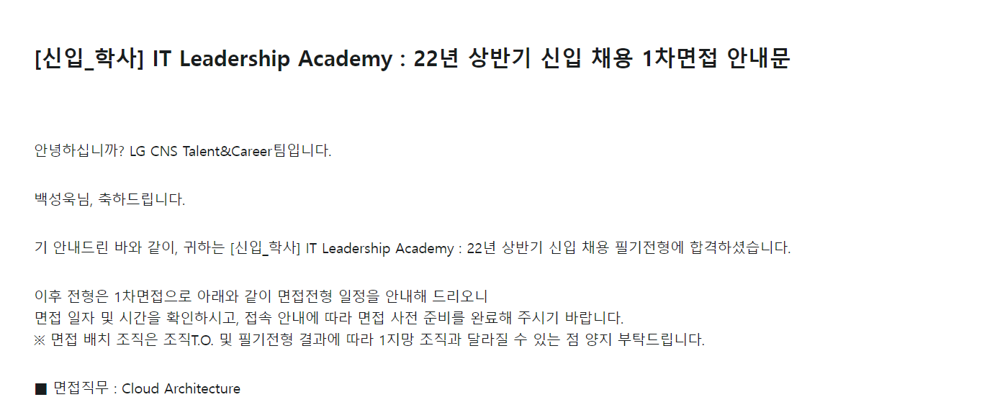

## 😁 인적성 검사 및 코딩 테스트 합격 ..?

와 이거 뭐지 .. ???

내가 합격이라고 ?

필기 전형을 붙어버렸다 ... 올해 첫 정식 지원에 바로 면접까지 갈 줄은 정말 꿈에도 몰랐다. 너무 기쁘기도 하지만, 예상치 못한 합격에 이제 발등에 불 떨어졌다. 남은 1주일 안에 면접 준비를 해야 한다 ... !!

## 😁 면접 후기
후 ... 첫 면접이 끝났다.

10시 40분부터 접속해서 대기하고 있다가 한 50분 넘어서 입장했다. 면접관 3분이 앉아계셨고, 생각했던 것보다는 좀 덜 딱딱해보이는 분위기였다.

지원자는 나 포함 2명이었고, 간단한 자기소개부터 시작했다. 상당히 떨려서 생각한 소개말이 조금 꼬였던 것 같다. 

질문들은 자소서에서 기반해서 많이 나왔던 같고, 제출한 자소서를 보고 예상 질문을 많이 생각해봤어서 크게 예상을 벗어난 질문들은 없었던 것 같다. 하지만 한 2개 정도 생각도 못해본 질문들을 받아, 순간의 대처로 대답을 하긴 했지만, 만족스러운 대답이 되진 못했던 것 같다.

또한, 같이 면접을 본 다른 지원자분이 스펙만 따졌을 때는 나보다는 경험이 많은 것 같아 처음에는 조금 비교당하지 않을까 했는데, 내가 생각한 면접에서는 해서 좋을 것 없어보이는 말들을 .. 좀 하시는 것 같아 시간이 지날수록 긴장이 많이 풀렸던 것 같다 .. ㅋㅋㅋ

다시 생각해보면 아쉬운 것들도 좀 있었지만, 처음 치고는 매우 잘했다고 생각한다. 물론 그렇다고 합격할 것 같다 ! 는 절대 아니지만 ㅎㅎ.. 기대를 안해야 실망도 안하니까 기대하지 않을 것이다.

1차 면접이 합격해야 인턴십과 2차 면접으로 이어지는 아직 확실히 모르겠다. 아마 다른 지원자들에 대한 면접이 모두 끝나고 나면 연락이 오지 않을까 .. 그때까지는 잊고 살아야겠다 ! ㅋㅋ

혹시나 또 좋은 소식이 온다면, 다음 포스트에서 후기를 이어나갈 것이다. 일단은 화이팅 !