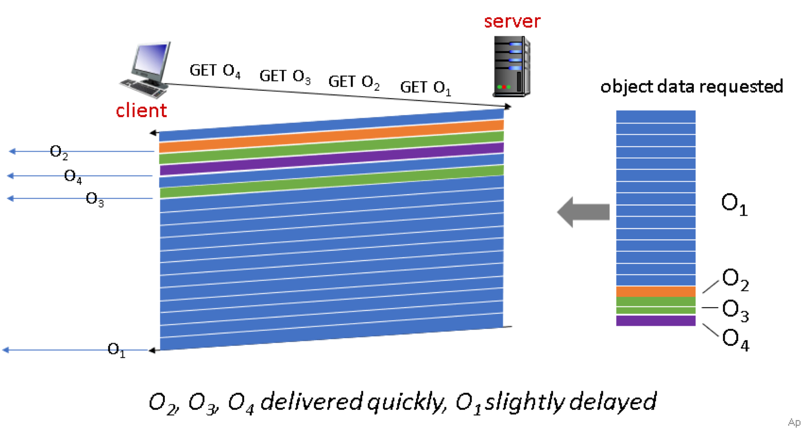
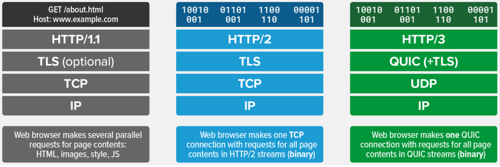
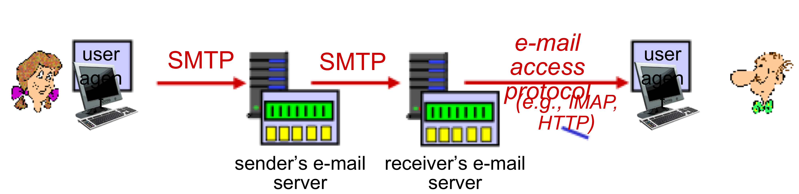

> **OSI 7 계층은 왜 나누는 것일까?**
> - OSI 7계층은 네트워크 통신을 구성하는 요소를 7개의 계층으로 표준화한 것으로, 이를 통해 통신이 일어나는 과정을 단계별로 파악할 수 있고, 문제 발생 시 해당 문제를 파악하고 해결하기 용이해진다.

> **OSI 7계층과 TCP/IP 5계층**
> - OSI 7계층 중 `Presentation` & `Session` 계층은 TCP/IP의 `Application` 계층에 속한다.
> - OSI 7계층이 표준이 되기는 하지만, 실질적인 통신은 TCP/IP 5계층을 사용한다!

## 🧷 Application Layer
TCP/IP 네트워크 프로토콜 스택에서 가장 상위 계층을 담당하고 있다. 이름대로, **여러 End System에게 여러 서비스를 제공하거나 받는 부분**을 책임진다. **응용 계층**이라고도 한다.

> **"이메일, 웹 서핑 등과 같은 서비스를 제공하고 받기 위해 어떤 형식으로 메시지를 주고 받아야 하는지의 프로토콜들이 정의되어 있는 계층"**

### 🪚 구조
대부분의 응용 계층들은 **"Client - Server" 구조**로 이루어져 있다.
- **Client**는 서비스를 제공받는 호스트를 의미한다.
  - `Dynamic IP 주소` 를 가질 수 있으며, Client끼리는 직접 통신이 불가능하다.
- **Server**는 서비스를 제공해주는 호스트를 의미한다.
  - `always-on host` 로, Client의 요청을 대기한다.
  - `Permanent IP 주소` 를 가져야 한다. (항상 할당되어있어야 함)

"Client - Server" 구조 외에, **P2P 구조**도 있다. 이는 임의의 `End System` 끼리 통신하는 방식이다.
- Client, Server의 구분이 없다.
- Peer는 다른 Peer에게 서비스를 요청한다.
- `No always-on Server`
- P2P File sharing이 이 방식을 이용한다.

### 🪚 Process Communicating
프로그램과 프로그램 간의 통신은 사실 해당 프로그램들의 **프로세스의 통신**이다.
- 같은 호스트에서 두 프로세스는 **IPC(Inter-process Communication) 방식**을 이용하여 통신이 가능하다.
- 서로 다른 호스트에서는 **message**를 통해 통신이 가능하다.
  - 여기서도 Client, Server를 구분할 수 있는데,
    - Client process: Communication 시작
    - Server process: Client의 요청 대기

### 🪚 Sockets
TCP/IP 프로토콜 스택에서는 총 5개의 계층이 존재하고, 이들간의 패킷(데이터) 송수신이 이뤄진다.

Application 계층을 제외한 **나머지 4계층은 모두 OS에 구현**되어 있다.
- 개발자에겐 보여지지 않는 부분이고, 내부적으로 알아서 패킷을 생성하고 주고 받는다.
- 그렇다면, Application 계층과 나머지 4계층의 제일 윗단인 Transport 계층은 어떻게 메세지를 주고 받을 수 있을까?

이때, **Socket**이라는 일종의 통로를 사용한다. 
- 이는 Application 계층과 Transport 계층 사이에 위치하여 Application 계층의 process에게 **Socket API나 함수를 제공**하여 메세지를 송수신할 수 있도록 돕는다.

### 🪚 Addressing Processes
메세지를 주고 받는 방법은 알았다. 하지만, 여러 Program이 있고, 그만큼 여러 Process가 존재할텐데, 어떤 Process가 메세지를 보냈는지 알아야 한다.
- 이를 위해서는 Process를 식별할 수 있는 **식별자**가 필요하다.
- 그리고 하나의 호스트에는 많은 process가 동작 가능하기에, **IP 주소만으로는 식별이 불가능**하다.

따라서 **IP 주소 + Port #** 을 식별자로서 사용한다.
- Port #은 아래와 같이 대표적으로 사용되는 예가 있다.
  - HTTP server: 80
  - HTTPS server: 443
  - Mail server: 25
  - Well Known Port #: 0 ~ 1024

### 🪚 Application Layer Protocol Defines
응용 계층 프로토콜의 규정이다. 아래에 대한 규정이 있어야 한다.

1. Types of message exchange
: message는 **요청** 또는 **응답**일 수 있다. (request or response)

2. Message Syntax
: message의 어느 field가 어떻게 기술되어야 하고, 각각의 field는 어떻게 구분되는지에 대한 정보

3. Message Semantics
: 각 field에 담긴 정보의 의미

4. Rules
: 언제, 어떻게 process들이 요청하고 응답해야 하는지에 대한 정보

### 🪚 Transport Layer가 제공하는 Service
응용 계층은 전송 계층과 통신한다. 전송 계층은 2가지 종류의 서비스를 제공할 수 있는데, 아래와 같다.
- **Reliable한 Service**
  - 데이터의 Write와 Read가 동일하게 발생하여 Sync가 맞다.
  - ex. File transfer
- **Unreliable한 Service**
  - 데이터를 바로바로 전송하여 딜레이가 적다.
  - ex. Audio

### 🪚 Application Layer Protocols
인터넷은 응용 계층에 2개의 전송 프로토콜을 제공한다. TCP(Transmission Control Protocol)과 UDP(User Datagram Protocol)이다.
- 이는 응용 계층이 아니라 전송 계층의 프로토콜이다!

### 🪚 TCP
Transmission Control Protocol, 이름 그대로 전송을 제어하는 프로토콜이라고 생각할 수 있다.
- **Reliable**하다.
- `3-way handshake` 를 통해 초기 연결을 설정한다.
- **Flow control(흐름 제어)**: 수신측의 상태를 확인하면서 전송을 이어간다.
  - 수신 데이터를 담는 `Buffer` 는 유한한 자원이므로, **Overflow**가 발생할 수 있다.
  - 따라서 수신측의 `Buffer` 가 수용 가능한 만큼을 전송한다.
- **Congesting control(혼잡 제어)**: 네트워크 상태를 확인하면서 전송을 이어간다.
  - 네트워크가 혼잡하다면, 보내는 패킷 양을 제어하여 전송한다.
- Timing, Security, Minimum Throughput guarantee를 제공하지 않는다.
- **Connection-Oriented**: 물리적 연결이 아닌 논리적 연결로, **순서에 맞게 손실 없이 데이터를 전송**한다.

모든 TCP 연결은 `Full-duplex`, `Point to Point` 방식이다.
- `Full-duplex` 는 전송이 양방향으로 동시에 일어날 수 있음을 의미하고,
- `Point to Point` 는 각 연결이 정확히 2개의 목적 포인트를 가짐을 의미한다.
  - 따라서 **TCP는 멀티캐스팅이나 브로드캐스팅을 지원하지 않는다.**

> 인터넷은 기본적으로 **Best-Effort Service**로, 신뢰성을 보장하지 않는다.

### 🪚 UDP
User Datagram Protocol
- **Unreliable**하다.
  - Network 계층의 data를 응용 계층으로 바로 전달하기에 매우 단순한 구조이다.
- **Connection-Less** (비연결형 프로토콜)
- IP 데이터그램을 **캡슐화**하여 보내는 방법과, **연결 설정 없이** 보내는 방법을 제공한다.
- **빠른 데이터 처리**를 요구하는 경우 사용할 수 있다.
- TCP에서 필요했던 초기 연결 설정 메세지보다 적은 메세지를 요구한다.

---

## 🧷 HTTP
HTTP (Hyper Text Transfer Protocol)
: 웹의 응용 계층 프로토콜이다.

- 이는 클라이언트 프로그램과 서버 프로그램으로 구현된다.
- 서로 다른 end system에서 수행되는 클라이언트와 서버 프로그램은 **HTTP 메세지를 통해 통신**한다.
  - 기본적으로, 클라이언트는 **어떠한 자원(object)을 요청**하고, 서버는 이를 찾아 **응답**하는 형태이다.
- 그리고 이는 신뢰성을 필요로 하므로, **TCP 프로토콜을 사용**한다.
  - 통신은 "연결 초기화(클라이언트) -> 연결 수락(서버) -> HTTP 메세지 교환 -> 연결 종료"
- HTTP는 **State-less**하다. 따라서, 과거 정보에 대한 관리를 하지 않는다.

이러한 HTTP 연결에는 **두 가지 타입**이 존재하는데, 아래와 같다.

**Non-persistent HTTP**
- 이름 그대로, 영구적이지 않다. 
- 여러 객체의 교환을 위해서는 여러 개의 연결을 필요로 한다. (일회성 연결을 여러 번 사용)

**Persistent HTTP**
- 동일한 서버와 여러 번 통신하는 경우, 불필요하게 일회성 연결을 반복하는 것을 막고자 한다.
- 연결 하나를 고정적으로 열어두고 사용한다.

HTTP 프로토콜을 사용한 통신의 `response time` 을 구하기 위해 간단한 `Non-persistent HTTP` 에 대한 예제를 살펴본다.

- RTT(Round Trip Time): 클라이언트와 서버 간 패킷이 갔다 오는데 걸리는 시간
- 그림에서 볼 수 있듯, 연결을 초기화하고, 자원 요청한 후 이를 받는데 걸리는 시간은 **2RTT + file transmission rate**이다.

### 🪚 HTTP methods
HTTP는 요청 메소드를 정의하여 주어진 자원에 수행하길 원하는 행동을 나타낸다. 주요 메소드는 아래와 같다.

**GET**
: 특정 자원의 표시를 요청한다. 이를 사용하는 요청은 오직 데이터를 받기만 한다.

**HEAD**
: GET 요청과 동일한 응답을 요청하지만, 응답 본문을 포함하지 않는다.

**POST**
: 특정 자원에 객체(엔티티)를 제출할 때 사용된다. 이는 서버의 상태 변화를 일으킬 수 있다.

**PUT**
: 요청 payload를 사용해 새로운 자원을 생성하거나, 기존의 자원을 수정하는 데 사용된다.

**PATCH**
: PUT은 자원 자체의 교체를 요구하지만, PATCH는 자원의 부분적인 수정만을 요청할 때 사용된다.

### 🪚 GET & POST?
두 메소드 모두 서버에 무엇인가를 요청할 때 사용하는 메소드이다. 하지만 HTTP 메소드의 목적은 특정 자원에 수행하길 원하는 행동을 명시하는 것이므로, 혼용되어서는 안된다. 따라서 두 메소드의 차이점을 알아본다.

**GET**
- 요청하는 데이터가 `HTTP Request Message` 의 `Header` 부분에 담겨서 전송된다. 
  - 때문에 `url` 상에서 `?` 뒤에 데이터가 붙어 요청을 보내게 되는 것이다. 
  - 이러한 방식은 `url` 에 요청하는 데이터가 담겨가기 때문에 **전송할 수 있는 데이터의 크기가 제한적**이다. 
  - 또한 **보안**이 필요한 데이터에 대해서는 데이터가 **그대로 노출되므로 적절하지 않다.** (ex. 비밀번호)
- GET 요청은 캐싱될 수 있고, 브라우저 히스토리에 남는다.
- 아스키 코드만 전송할 수 있다.

**POST**
- 요청하는 데이터가 `HTTP Request Message` 의 `Body` 부분에 담겨서 전송된다.
  - **전송할 수 있는 데이터의 크기가 GET 방식보다 크고, 보안면에서 조금 더 낫다.** (하지만 암호화를 하지 않는다면, 언제든 노출될 수 있다.)
- POST 요청은 캐싱될 수 없고, 브라우저 히스토리에 남지 않는다.
- 데이터 타입에 구애받지 않는다. **이진 데이터 또한 가능**하다.

GET은 **데이터를 가져와서 보여주는 용도**로 사용한다. 즉, **서버에 어떤 변경사항을 발생시키지 않는다.** 하지만 POST는 **서버의 값이나 상태를 변경하기 위해 사용**한다.

또한, GET 요청은 캐싱될 수 있다고 했다. 그러므로, 기존에 캐싱되었던 데이터가 또다시 응답될 가능성이 있다. POST 방식으로 요청해야 할 데이터를 크기가 작다는 이유로 GET 방식으로 요청한다면, 목적에 맞지 않는 응답을 받을 가능성이 있다!

### 🪚 HTTP response status code
HTTP 응답 상태 코드는 특정 HTTP 요청(위에서 다룬 요청들)이 성공적으로 완료되었는지, 혹은 어떠한 문제가 발생했는지 알려준다. 응답은 총 5개의 그룹으로 나눠진다.
- 정보를 제공하는 응답(1xx)
- 성공적인 응답(2xx)
- 리다이렉트(3xx)
- 클라이언트 에러(4xx)
- 서버 에러(5xx)

그리고 흔하게 볼 수 있는 코드는 다음과 같다.

**200**: 요청이 성공적으로 처리되었다. 그리고 이 성공이라는 의미는 HTTP 메소드에 따라 다르다.
- GET: 자원을 불러와서 message body에 전송되었다.
- HEAD: header가 message body에 있다.
- PUT or POST: 수행 결과에 대한 자원이 message body에 전송되었다.

**400**: 이 응답은 잘못된 문법으로 인해 서버가 요청을 이해할 수 없음을 의미한다.

**401**: 비인증을 의미한다. 클라이언트는 요청한 응답을 받기 위해 스스로를 인증해야 한다.

**404**: 서버는 요청받은 자원을 찾을 수 없다. 
- 서버들은 비인증 클라이언트로부터 자원을 숨기기 위해 이 응답을 403 대신에 전송할 수도 있다.

**418**: 서버는 커피를 찻 주전자에 끓이는 것을 거절한다.

**500**: Internal Server Error, 서버가 처리 방법을 모르는 상황이 발생했음을 의미한다.
- 서버 개발자라면 가장 많이 볼 수 있을 코드이다...

---

## 🧷 HTTP/2
이전까지 언급한 HTTP/1.1은 Persistent HTTP로, TCP 통신 1개당 요청 1개를 고정적으로 처리해야 하는 구조였다.
- 하지만 여러 요청이 있고, 제일 먼저 처리되는 요청의 요청량이 매우 많은 경우, 뒤의 요청들은 대기해야 한다.
  - 이를 **Head-Of-Line Blocking 문제**라 한다. 그리고 이는 HTTP/2에서 해결하고 있다.

### 🪚 HTTP/2: HOL blocking 해결

요청에 대한 응답을 **frame이라는 단위로 쪼개어 전송**한다.
- 위 그림에서, 비교적 요청량이 적은 O2, O3, O4의 응답 속도는 빨라지고, O1은 비교적 느리게 응답받을 것이다.

---

## 🧷 HTTP/3
HTTP/2는 HOL blocking 문제를 해결한 듯하다. 하지만, TCP 프로토콜을 사용하는 이상, TCP 패킷이 네트워크 경로상에서 손실된다면 입력 스트림에 공백이 생겨 그 다음에 오는 데이터(바이트)도 **재전송**으로 인해 지연이 발생한다. (TCP는 전송 제어 프로토콜이므로, 재전송을 수행)
- 특히, HTTP/2는 **여러 개의 HTTP 스트림을 하나의 TCP 연결로 처리**하기에 손실에 대해 더 크게 영향을 받는다.

따라서, HTTP/3가 등장하게 되었고, 이는 TCP가 아닌 **UDP를 사용**한다.
- 정확하게는 **QUIC**라는 프로토콜 위에서 돌아가는 HTTP이다.
  - QUIC(Quick UDP Internet Connection)

TCP는 3-way-handshake, 연결 종료 시 사용하는 4-way-handshake 등 오버헤드와 HOL blocking 문제를 피할 수 없다. 하지만 **QUIC는 TCP handshake 과정을 최적화하는 것에 초점을 맞춰 설계**되었다.
- 기본적으로 UDP는 데이터그램 방식을 사용하기에 각 패킷 간의 순서가 존재하지 않는 **독립적인 패킷**이다.

아래는 각 HTTP 버전에 대한 간략한 그림이다.

---

## 🧷 HTTP & HTTPS

### 🪚 HTTP의 문제점
- HTTP는 평문 통신이므로 도청이 가능하다.
- 통신 상대를 확인하지 않아 위장이 가능하다.
- 완전성을 증명할 수 없어 변조가 가능하다.

> 위의 문제들은 암호화를 사용하지 않는 모든 프로토콜에도 적용되는 문제점이다.

각 문제점을 하나하나 살펴보면,

❗️**TCP/IP는 도청 가능한 네트워크다.**
- TCP/IP 구조의 통신은 전부 통신 경로 상에서 엿볼 수 있다. 패킷을 수집하는 것만으로도 도청이 가능하다. 따라서 **암호화**의 과정이 필요하다.

> 보완방법
1. 통신 자체를 암호화 `SSL(Secure Socket Layer)` 또는 `TLS(Transport Layer Security)` 프로토콜과 조합함으로써 HTTP의 통신 내용을 암호화할 수 있다. 
   1. SSL을 조합한 HTTP를 **HTTPS(HTTP Secure)** 또는 **HTTP over SSL**이라 한다.
2. 콘텐츠를 암호화한다. 말 그대로 HTTP를 사용해서 운반하는 내용인 **HTTP message에 포함되는 콘텐츠만 암호화**한다. 수신측에서는 이를 **복호화하는 과정이 필요**하다.

❗️**통신 상대를 확인하지 않아 위장이 가능하다.**
- HTTP에 의한 통신은 상대방을 확인하는 처리가 없어 누구든지 요청을 보낼 수 있다. IP 주소나 포트 등에서 그 웹 서버에 접근 제한이 없는 경우, 요청이 오면 무조건 응답을 반환해야 한다. 그렇기에 아래와 같은 문제점을 유발한다.

1. 요청을 보낸 곳의 웹 서버가 원래 의도한 응답을 보내야 하는 웹 서버인지 확인 불가능하다.
2. 응답을 반환한 곳의 클라이언트가 원래 의도한 요청을 보낸 클라이언트인지 확인 불가능하다.
3. 통신하고 있는 상대가 접근이 허가된 상대인지 확인 불가능하다.
4. 어디에서 누가 요청을 보낸 것인지 확인 불가능하다.
5. 의미없는 요청 또한 수신하여 DoS 공격을 방지할 수 없다.

> 보완 방법
1. 위에서 언급한 `SSL` 은 상대를 확인하는 수단으로 **증명서**를 제공한다. 증명서는 신뢰할 수 있는 **제 3의 기관에 의해 발행**되는 것이기에 서버나 클라이언트를 증명할 수 있다. 그리고 이를 이용해 통신 상대가 내가 통신하고자 하는 서버임을 나타낼 수 있고, 이용자는 개인 정보 누설 등의 위험성이 줄어들게 된다. (또한 클라이언트는 이 증명성를 이용해 본인 확인을 하고, 웹 사이트 인증에서도 사용할 수 있다.)

> **DoS(Denial-of-Service) Attack**
> : 시스템을 악의적으로 공격해 해당 시스템의 자원을 부족하게 하여 원래 의도된 용도로 사용하지 못하게 하는 공격이다.
> - 대량의 패킷을 통신망으로 보내고, 특정 서버에 수많은 접속 시도를 하는 등으로 정상적인 서비스 제공을 하지 못하게 한다. 
> - **통신 상대를 확인하지 않는 HTTP 통신의 특성상 이를 방지할 수 없다.**

❗️**완전성을 증명할 수 없어 변조가 가능하다.**
- 완전성은 정보의 정확성을 의미한다. "서버 또는 클라이언트에서 수신한 내용이 송신측에서 보낸 내용과 일치한다는 것을 보장할 수 없다"는 것이다. 
- 요청이나 응답이 발신된 후, 상대가 수신하기 전까지 누군가에 의해 변조되더라도 이 사실을 알 수 없다. 이와 같이 공격자가 요청이나 응답을 가로채 변조하는 공격을 **중간자 공격, Man in the middle**이라 한다.

> 보완 방법
1. `MD5`, `SHA-1` 등의 해시 값을 확인하는 방법과 디지털 서명을 확인하는 방법이 존재하지만, 이는 확실한 방법은 아니다. 
2. 확실한 방지를 위해서는 **HTTPS**를 사용해야 한다. 왜냐면, `SSL` 에는 인증이나 암호화, 메세지 다이제스트(해시) 기능을 제공하고 있기 때문이다.

> **메세지 다이제스트**
> : **메세지(데이터)의 해시값**(다이제스트 값)을 계산하여 데이터와 함께 전송한다. 중간자 공격이 발생하더라도, 다이제스트 값을 확인함으로써 데이터의 변조 사실을 확인할 수 있다.
> - 데이터의 무결성을 보장해주는 방법이다.

> **SSL과 TLS**
> : SSL은 TLS은 이전 버전의 프로토콜이다. 혼합되어 많이 사용한다.

### 🪚 HTTPS
이는 HTTP에 암호화와 인증, 그리고 완전성 보호를 더한 것이다. 

HTTPS는 **SSL을 덮어쓴 HTTP**라고 할 수 있다. 새로운 응용 계층의 프로토콜은 아니다.
- HTTP 통신하는 소켓 부분을 `SSL(Secure Socket Layer)` 또는 `TLS(Transport Layer Security)` 라는 프로토콜로 대체한 것이다.
- HTTP는 TCP와 직접 통신했지만, **HTTPS에서는 HTTP는 SSL과 통신하고, SSL이 TCP와 통신**하게 된다.

❓**모든 웹 사이트에서 HTTPS를 사용해도 될까?**
- 당연하게도, 평문 통신에 비해 암호화된 통신은 더 많은 자원을 요구한다. 통신마다 이러한 추가 자원 소비는 서버 한 대당 평균 요청 처리량을 감소시킨다.
- 하지만 최근에는 하드웨어의 발달로 HTTPS 통신에서의 속도 저하가 거의 일어나지 않으며, 새로운 표준인 HTTP 2.0을 함께 이용하면 오히려 HTTP보다 더 빠르게 동작한다.
- 따라서 현재는 모든 웹 페이지에서 HTTPS를 적용하는 방향으로 바뀌어 가고 있다.

> **HTTPS와 구글**
> - 구글은 2014년, 모든 웹 사이트에 HTTPS를 요구했고, SSL 보안 사이트에 대해 높은 검색 순위로 보상했다. 
> - 이후 2018년에는 검색 순위 보상이 아닌, SSL 인증서가 없는 사이트에 대한 불이익을 가했다. (해당 사이트는 Chrome 브라우저에 "안전하지 않음"이라 표시된다.)

---

## 🧷 SMTP
Simple Mail Transfer Protocol의 약자로, 인터넷에서 이메일을 보내기 위해 사용되는 프로토콜이다.
- Port #은 25
- TCP를 사용하여, 송신측의 내용과 수신측의 내용이 같아야 한다.

### 🪚 SMTP & HTTP
**HTTP**
- 요청을 하면 데이터를 전송한다. (pull)
- 아스키 코드를 사용한 요청과 응답, 상태 코드 존재
- content type이 한 type으로만 전송 가능하다.

**SMTP**
- 요청과 상관없이 데이터를 전송한다. (push)
- 아스키 코드를 사용한 요청과 응답, 상태 코드 존재
- content type이 한 가지로 제한되지 않고, 여러 type으로 전송 가능하다.

### 🪚 Mail Access Protocols

Mail Access Protocol: 사용자 요청에 대한 응답을 처리하기 위해 메일 서버가 사용하는 프로토콜로, IMAP, POP3가 있다.

1. 발신자가 메일 전송을 요청하면, SMTP를 이용해 발신자의 메일 서버에 메일을 push한다.
2. 발신자의 메일 서버에서 수신자의 메일 서버로 해당 메일을 다시 push한다.
3. 수신자의 메일 서버에서는 이를 가지고 있다가, 수신자가 메일 확인을 요청하면, IMAP or POP3와 같은 Mail Access Protocol을 사용해 응답을 보낸다.

---

## 🧷 DNS
Domain Name System의 약자로, 응용 계층의 프로토콜이다. **여러 Name Server의 계층 구조로 구현된 분산 데이터베이스**이다. 
- IP 주소와 그에 해당하는 Name을 매핑시키기 위해 DB에 이를 저장하는데, 1개의 DB로는 많은 요청에 대한 처리가 불가능하기에 분산 DB를 사용한다.

### 🪚 DNS Services
- Host Name -> Name 변환
- Host Aliasing
- Mail Server Aliasing
- Load Distribution(하나의 이름을 가진 여러 IP 주소가 가능하게 함으로써, 한 서버로 요청이 몰리지 않게 분산)

### 🪚 DNS Round Robin 방식
**문제점**
1. 서버의 수만큼 공인 IP 주소가 필요하다. 
   1. 서버 부하의 분산을 위해 서버의 수를 늘리기 위해서는 그만큼의 공인 IP가 필요하다.
2. 균등하게 분산되지 않는다. 
   1. 모바일 사이트와 같은 경우, 스마트폰의 접속은 "캐리어 게이트웨이"라는 프록시 서버를 경유한다. 프록시 서버에서는 이름 변환 결과가 일정 시간동안 캐싱되어, 같은 프록시 서버를 경유하는 접속은 캐싱이 남아있는 동안 같은 서버로 접속된다.
   2. 또한, PC용 웹 브라우저도 DNS 질의 결과를 캐싱하기에 균등한 부하 분산이 제대로 이루어지지 않는다. 
3. 서버가 다운되어 확인이 불가하다.
   1. DNS 서버는 웹 서버의 부하나 접속 수 등의 상황에 따라 질의결과를 제어할 수 없다. 즉, 웹 서버의 부하가 높아 응답이 느려지거나, 접속 수가 가득 차서 접속을 처리할 수 없는 상황이어도 이를 감지하지 못한다. 
   2. 이는 사용자들에게 다운된 서버로 연결시키기도 한다.

따라서 Round Robin 방식을 기반으로 다른 SW와 조합해서 관리해야 한다. 아래는 그러한 **DNS 스케줄링 알고리즘**이다.

- **Weighted Round Robin(WRR)**
  - 각각의 웹 서버에 가중치를 부여하여 분산 비율을 변경한다. 물론 가중치가 큰 서버일수록 빈번하게 선택되므로 처리능력이 높은 서버는 가중치를 높게 설정하는 것이 좋을 것이다.
- **Least Connection**
  - 접속 클라이언트 수가 가장 적은 서버를 선택한다. 로드밸런서에서 실시간으로 connection 수를 관리하거나 각 서버에서 주기적으로 알려주는 것이 필요하다.
   
---

## 🧷 웹 통신의 큰 흐름
### 🪚 주소창에 특정 URL 값을 입력시키면 어떤 일이 일어날까?

**브라우저**
1. URL에 입력된 값을 브라우저 내부에서 파싱한다. (프로토콜, URL, Port #)
   1. Port #를 명시하지 않아도 브라우저에 설정된 기본값으로 지정한다.(HTTP: 80, HTTPS: 443)
2. 조사된 의미에 따라 HTTP 요청 메세지를 만든다.
3. 만들어진 메세지를 웹 서버로 전송한다.

이때 만들어진 메세지 전송은 브라우저가 하는 것이 아닌 OS에 의뢰하여 전송한다. (브라우저는 메세지를 네트워크에 송출하는 기능이 없다.)
- 단, OS에 의뢰할 떄는 도메인명이 아닌 **IP 주소**로 메세지를 받을 상대를 지정해야 하는데, 이 과정에서 **DNS 서버를 조회**한다.

**프로토콜 스택, LAN 어댑터**
1. 프로토콜 스택이 브라우저로부터 메세지를 받는다.
2. 브라우저로부터 받은 메세지를 패킷 속에 저장한다.
3. 수신처 주소 등의 제어 정보를 덧붙여 패킷을 LAN 어댑터에 넘긴다.
4. LAN 어댑터는 다음 Hop의 MAC 주소를 붙인 프레임을 전기 신호로 변환한다.
5. 신호를 LAN 케이블에 송출한다.

프로토콜 스택은 통신 중 오류가 발생했을 때, 이 제어 정보를 사용해 고쳐 보내거나, 각종 상황을 조절하는 등 다양한 역할을 하게 된다.

**허브, 스위치, 라우터**
1. LAN 어댑터가 송신한 프레임은 스위칭 허브를 경유해 인터넷 접속용 라우터에 도착한다.
2. 라우터는 패킷을 프로바이더(통신사)에게 전달한다.
3. 인터넷으로 접속한다.

**액세스 회선, 프로바이더**
1. 패킷은 인터넷의 입구에 있는 액세스 회선(통신 회선)에 의해 POP(Point of Presence)까지 운반된다.
2. POP를 거쳐 인터넷의 핵심부로 들어간다.
3. 수 많은 고속 라우터들 사이로 패킷이 목적지로 흘러간다.

**방화벽, 캐시서버**
1. 패킷은 인터넷을 통과하여 웹 서버측의 LAN에 도착한다.
2. 기다리고 있던 방화벽이 도착한 패킷을 검사한다.
3. 패킷이 웹 서버까지 가야하는지 가지 않아도 되는지를 판단하는 캐시 서버가 존재한다.

굳이 서버까지 가지 않아도 되는 경우는 다음과 같다. 액세스한 페이지의 데이터가 캐시서버에 있으면 웹 서버에 의뢰하지 않고 바로 그 값을 읽을 수 있다. 페이지 데이터 중 다시 이용할 수 있는 것이 있으면 이는 캐시 서버에 저장된다.

**웹 서버**
1. 패킷이 물리적인 웹 서버에 도착하면 웹 서버의 프로토콜 스택은 패킷을 추출해 메세지를 복원하고, 웹 서버 애플리케이션에 넘긴다.
2. 메세지를 받은 웹 서버 애플리케이션은 요청 메세지에 따른 데이터를 응답 메세지에 넣어 클라이언트로 전송한다.
3. 왔던 방식의 반대로 응답 메세지가 클라이언트에 전달된다.

> ❓ **주소창에 http 나 https와 같은 프로토콜을 명시하지 않아도 자동으로 해당 프로토콜이 붙는 이유?**
> - 브라우저에서 제공하는 기능으로, 도메인만 입력받은 경우 브라우저는 **기본값으로 HTTP 프로토콜**을 사용해 접속을 시도한다. (Port #: 80)
> - HTTPS가 적용된 페이지라면, HTTP 접속 시도 시 301, 302 상태 코드를 반환해 **리다이렉트하라는 메세지**를 브라우저로 보낸다. 이를 받은 브라우저는 HTTPS로 다시 접속하게 된다.
> - 한 번이라도 HTTPS로 접속한 적이 있다면, HTTP를 허용하지 않고 HTTPS를 사용하는 연결만 허용하는 기능인 **HSTS(HTTP Strict Transport Security)** 목록에 저장된다. 이후 접속 시에는 곧바로 HTTPS 요청을 하게 된다.

---

## 📕 참고
- [OSI 7 Layer vs TCP/IP 5 Layer](https://velog.io/@osk3856/TCP-Updated-Model)
- [Application Layer 개요](https://ddongwon.tistory.com/71)
- [Part 1-3 Network](https://github.com/JaeYeopHan/Interview_Question_for_Beginner/tree/master/Network)
- [HTTP 요청 메서드](https://developer.mozilla.org/ko/docs/Web/HTTP/Methods)
- [HTTP 2, HTTP 3](https://woojinger.tistory.com/85)
- [서비스 거부 공격](https://ko.wikipedia.org/wiki/%EC%84%9C%EB%B9%84%EC%8A%A4_%EA%B1%B0%EB%B6%80_%EA%B3%B5%EA%B2%A9)
- [SSL이란 무엇인가요?](https://www.cloudflare.com/ko-kr/learning/ssl/what-is-ssl/)
- [브라우저에 URL을 입력했을 때 발생하는 일들](https://deveric.tistory.com/97)