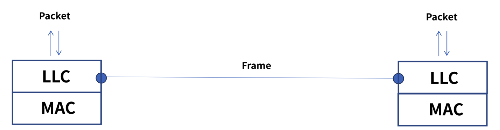
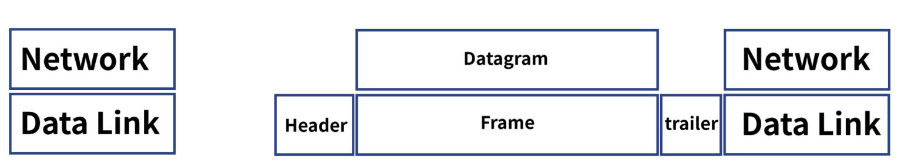
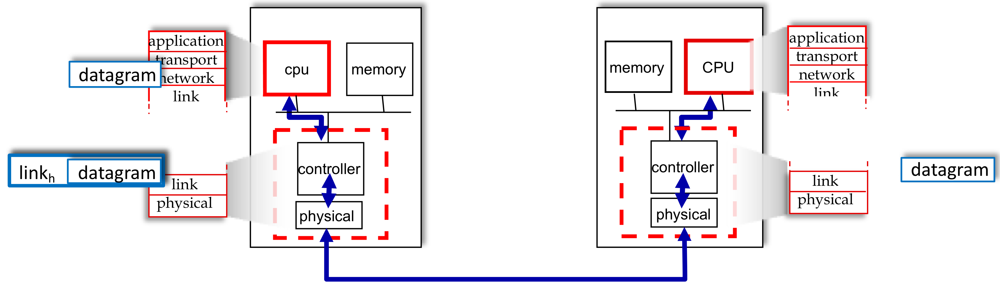
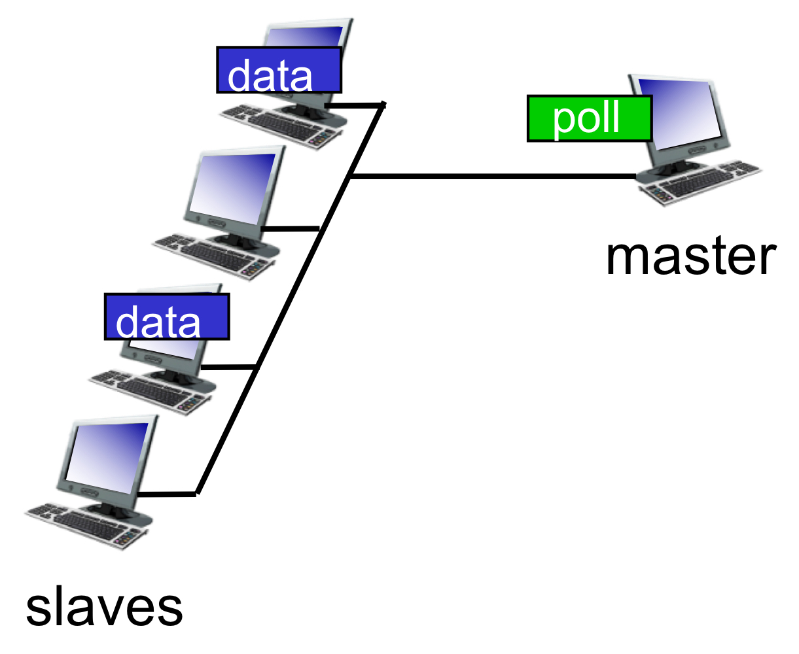
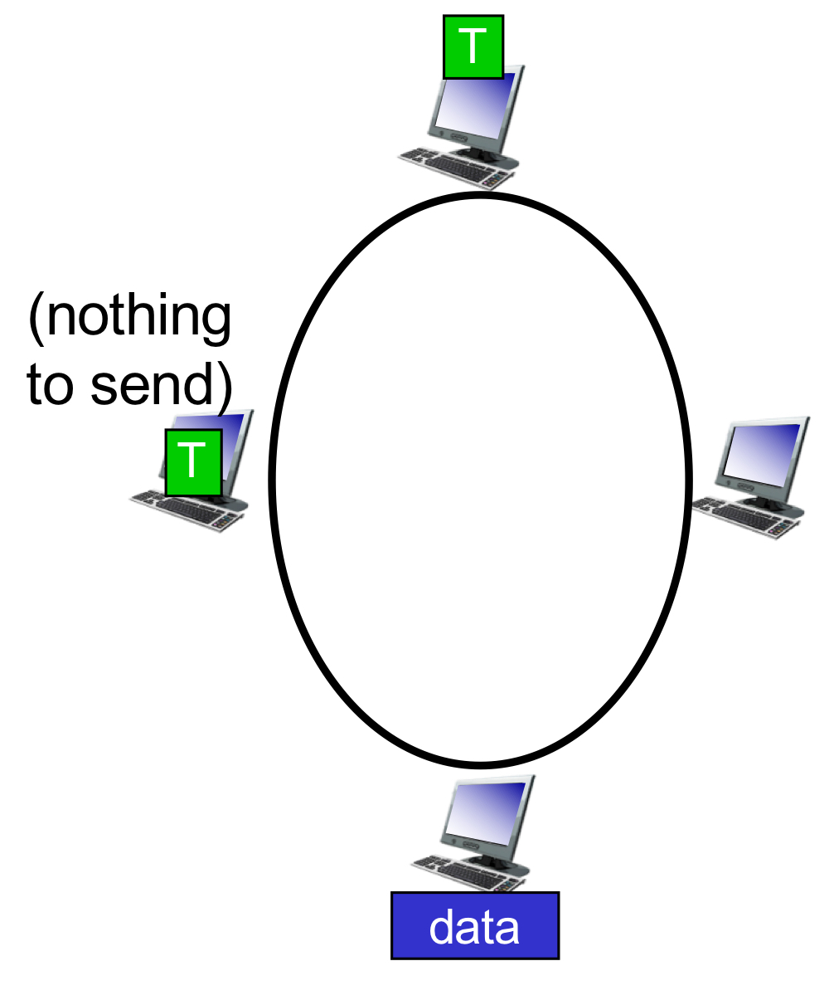
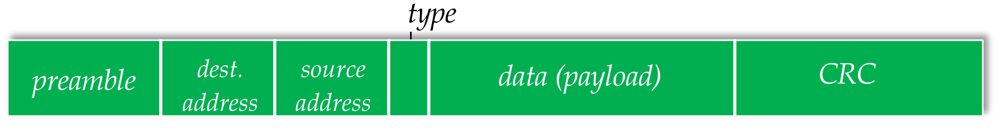
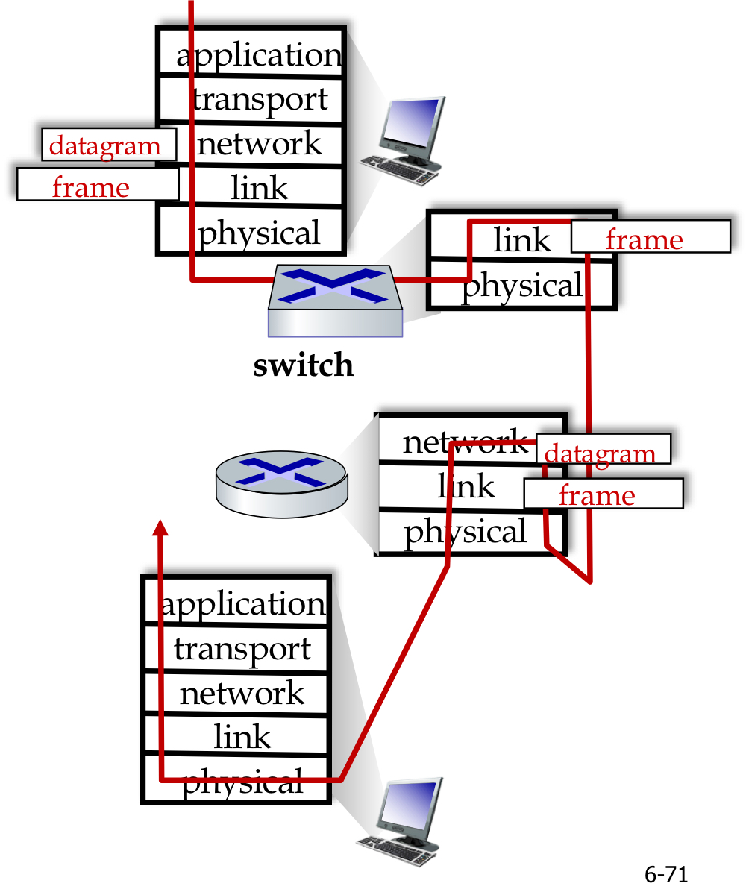
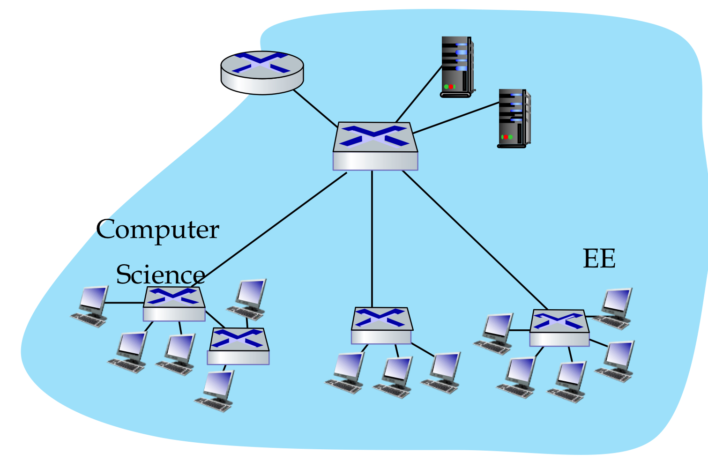
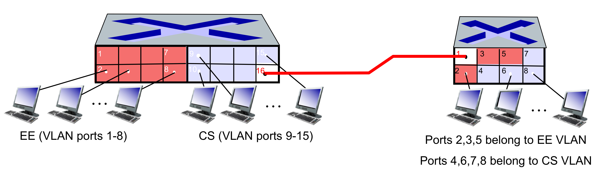

## 🧷 Link Layer
이전에 다룬 Transport Layer의 바로 하단에 위치하는 계층이다. 이 계층에서는 1계층인 물리 계층에서 발생할 수 있는 오류를 감지하고 수정하는 기능(**Error Detection & Correction**)을 수행한다.
- 대표적인 프로토콜로 `Ethernet` 이 존재한다.
- Correction -> 재전송, Forward Error
- 그리고 링크 계층의 주소는 물리적 주소이므로 변경이 불가능하다. (IP 주소는 논리적 주소이므로 변경이 가능했다.)

링크 계층은 통신에 참여하는 장비인 node들이 존재한다. link는 이 node들을 연결한다.
- link는 wired, wireless, LANs가 있다.
- 그리고 이 계층에서는 패킷을 frame이라 한다. 물리적으로 인접한 node에게 link를 통해 전달된다.

또한 링크 계층은 2개의 부 계층으로 구성된다.

하나는 **MAC**, 물리적 부분으로 매체간의 연결 방식을 제어하고 1계층과 연결되어 있다. 
- 48-bit (6byte)로 구성되어 있고, 각 바이트마다 16진수로 표현된다.
  - 그 중 앞 3자리는 OUI(Organization Unique Identifier)로 제조사 식별 코드가 있고, 

### 🪚 Services
**Framing, link access**
 

- 네트워크 계층에서 받아온 데이터그램을 프레임이라는 단위로 만들고, header와 trailer를 추가한다.
- header: 목적지, 출발지 주소(MAC 주소), 데이터 내용에 대한 정의
- trailer: 비트 에러 감지

**Reliable delivery**
- 비트 에러 감지를 통한 전송 보장
- 왜 링크 계층과 엔드-엔드 모두 reliability를 따질까?
  - 모든 링크 레벨에서 reliable한 것이 아니고, 엔드 포인트만이 얼마만큼의 reliability가 요구되는지 알기 때문이다.

**Flow control**
- 수신측의 overflow를 방지하기 하기 위함
- Stop & Wait 방식이라고도 한다.

**Error detection & correction**
- 신호적 감쇄나 잡음으로 인해 프레임에 에러가 발생할 수 있다.
- 수신자는 에러를 감지하고, 재전송을 요구하거나 해당 프레임을 드롭한다.
- 또는 재전송 없이 비트 에러를 수정한다.

- 전체적인 통신 흐름이다.
- 송신측은 데이터그램을 framing하여 물리 계층으로 전달하고, 수신측에서는 데이터그램을 추출하여 상위 계층으로 전달한다.

---

## 🧷 Error Detection, Correction
### 🪚 Error Detection
에러의 감지를 위해 EDC를 사용한다. 
- EDC: Error Detection and Correction bits로, 전체 Frame의 정보가 유효한지 판단하는 기준이 된다.
- 하지만 **EDC 또한 전송 과정에서 변형될 수 있어 100% 정확한 것은 아니다.**

### 🪚 Error Detection - Parity Checking
첫 번째로 정확성을 확인하는 방법으로 **Parity checking**이 있다.

- 전송되는 비트 수가 `d` bits라고 하자. **짝수 Parity checking**은 `d + 1` bits를 보낼 때, 1의 개수가 짝수가 되도록 추가적인 비트를 붙인다.
  - 마찬가지로 홀수는 홀수가 되도록 추가 비트를 붙인다. 
- 하지만 이는 **하나의 비트가 변형되는 오류는 검출할 수 있지만, 짝수 개의 오류는 검출할 수 없다**는 특징이 있다.

그리고 이를 보완한 방법으로 **Two-dimensional bit parity**가 있다. 이는 보내는 비트를 행렬로 표현한 뒤, 각각의 행과 열마다의 Parity checking을 수행한다.

- 하지만 이 또한, 같은 행과 열에 오류가 발생하는 것은 검출하지 못한다.

### 🪚 Error Detection - Internet Checksum
이전에도 다룬 적이 있는 **Checksum**이다.
- UDP 세그먼트를 16bit의 정수로 변환한 뒤, 이들의 합을 구한다.
- 합의 1의 보수 형태가 checksum이 된다.

### 🪚 Error Detection - Cyclic Redundancy Check (CRC)
Parity Checking보다 더 성능이 향상되었고, 회로 구현이 쉽다는 장점이 있는 CRC이다.

- 전송하려는 D(Data bits)를 $2^{송수신측\ 모두가\ 알고\ 있는\ Divisor의\ 자릿수\ -\ 1}$만큼 곱한다.
- D(Data bits)를 Divisor로 나눈다. 
- 나눈 후 나머지(r bits)를 D 뒤에 붙여 D + (r + 1) bits를 전송한다. 
- 수신측에서는, 받은 D를 알고 있는 Divisor로 나눈다.
- 이때 나머지가 0이라면, 수신한 데이터에 오류가 없다는 의미이고, 데이터에서 나머지 부분을 제외하고 수용한다.
- 나머지가 0이 아니라면, 오류가 있는 데이터라고 판단하고 드롭한다.

> 하지만 CRC 또한, 실제 보낸 데이터가 `10010` 이고, 붙여진 CRC가 `000` 인데, `10010000` 이 `10011001` 로 오류가 발생한 채로 전송되었다면, 이또한 나머지가 0이기 때문에 오류 검출을 하지 못하는 경우가 발생할 수 있다.

---

## 🧷 Multiple Access Protocols
Link의 종류에는 Point-to-Point와 Broadcast로 2가지가 있다. 그 중 Broadcast는 공유된 자원을 사용하는 방식이기에, media(자원) access에 대한 제어가 필요하다.

**Multiple Access Protocols이 필요한 이유**는 여러 명의 사람이 대화를 하는데, 다 같이 동시에 말하면 각자의 말이 다 섞여 알아듣기 어렵다. 이를 네트워크에서는 **Collision**이라 하는데, 이를 해결하기 위해 Multiple Access Protocol이 등장했다.
- 노드가 채널을 어떻게 나눠 가질지 결정하는 분산 알고리즘이다.
  - 즉, 언제 노드가 전송할 지 결정하는 알고리즘이다.
  - 매체를 여러 노드가 사용할 수 있도록 접근 제어, 순서 제어를 해주는 프로토콜이다.

> **분산 알고리즘**
> - 중앙 판단이 아닌 각각의 노드가 자율적으로 판단하는 알고리즘

예를 들어, 어떤 매체(broadcast channel)에 Rbps만큼 보낼 수 있다고 가정하자. 이때 필요한 특징으로는 다음과 같다.
- 노드가 하나뿐이라면, R만큼을 다 사용할 수 있다.
- 만약 M개의 노드가 있다면, 가능한 한 각각 평균 R/M만큼 사용할 수 있어야 한다.
- 중앙 집중화가 있어선 안되므로, 전송을 관리하는 노드가 있어서는 안된다.
- 보내는 타이밍을 관리하는 clock이나 slot이 있으면 안된다.

그리고 이를 이루기 위해 필요한 것이 MAC protocol이다. 이는 Media Access Control의 약자로, 크게 3 종류로 나뉜다.
- **Channel Partitioning** : 채널을 여러 작은 조각들(time slots, frequency, code)로 나눠 분배한다. 즉 각 노드마다 독점 사용을 위해 할당하는 것이다.
- **Random Access** : 채널을 나누지 않고, 원할 때마다 보내는 것이다. 당연히 Collision이 발생할테고, 이를 수용해 그냥 다시 보낸다. 채널에 속한 노드의 수가 적을 때 택할 수 있다.
- **Taking turns** : 돌아가면서 보낼 수 있도록 한다. 동일한 시간을 분배해주는 것이 아니라 보낼 데이터가 많은 노드의 경우 더 많은 시간을 사용할 수 있다. token을 사용해, token이 있는 경우만 전송이 가능하도록 하여 충돌을 방지한다.

### 🪚 Channel Partitioning - TDMA
TDMA(Time Division Multiple Access)의 약자로, 이름 그대로 time slot으로 분할하여 각 time slot에 보낼 노드가 할당되는 방식이다. 

- 하지만 이러한 방식은 할당량에 비해 실 사용량이 적어 비효율적일 수 있다.

### 🪚 Channel Partitioning - FDMA
FDMA(Frequency Division Multiple Access)의 약자로, 주파수 대역을 다르게 하여 전송하는 방식이다.

- 동일한 시간대에 여러 노드가 보낼 수 있다는 장점이 있긴 하지만, 쓰이지 않는 주파수 대역이 있다면, 즉 사용하는 노드의 수가 적다면 이 또한 비효율적일 수 있다.

> 따라서 Channel Partitioning 방식은 네트워크에 있는 노드의 수가 정해져 있고, 각각 처리량이 많을 때 유용하다고 할 수 있다.

### 🪚 Random Access Protocol
이는 결국 랜덤하게 자원 접근을 허용하는 방식이다. 따라서 Collision이 발생할 수 밖에 없고, 이를 **어떻게 발견하고 복구할 것인가**에 대한 처리가 필요하다.

### 🪚 Random Access Protocol - ALOHA
섬 간 통신을 위해 개발된 ALOHA는 다른 말로는 unslotted ALOHA, pure ALOHA라고도 한다. 이는 보내고 싶을 때 보내기 때문에, Collision 발생이 잦다.
- 한 프레임을 거의 다 보냈을 때에 다른 프레임을 전송하려 하면, Collision이 발생하기에 매우 비효율적이었다.

### 🪚 Random Access Protocol - Slotted ALOHA
ALOHA의 문제를 해결하기 위해, 시간을 slot으로 나누어, 하나의 data는 무조건 하나의 slot을 통해 전송되도록 강제했다.
- 두 개 이상의 노드가 전송한 경우, 모든 단말은 Collision을 인지한다.
- 노드가 프레임을 전송할 때, 충돌이 발생하지 않았다면 다음 slot에 프레임을 더 전송하고, 충돌이 발생했다면 각 노드가 측정한 성공확률에 따라 다음 slot에 프레임을 전송할 지 결정했다.

pure ALOHA보다는 일정한 규칙을 성립해 충돌로 인한 데이터 전송 실패를 해결해 성능이 좋다는 이점이 있었다. 하지만 여전히 **충돌은 존재했고, 낭비되는 slot**이 많고, **충돌 감지 신호가 도착했음에도 전송 중지가 되지 않았으며 clock synchronization이 정확하지 않았다.**

### 🪚 Random Access Protocol - CSMA
Slotted ALOHA의 문제를 해결하기 위해 CSMA(Carrier Sense Multiple Access)는 계속해서 채널의 상태를 확인하면서, 
- 채널이 idle하다면, 전송을 수행했고
- 채널이 busy하다면, 전송을 연기시켰다.

> CSMA 프로토콜은 충돌이 발생하기 전, 채널의 상태를 확인함으로써 충돌을 피하는 반면, ALOHA는 충돌이 발생한 후에만 채널이 사용 중임을 감지한다.

이렇게 채널을 미리 감지함으로써 CSMA는 충돌이 발생하지 않을 것 같지만, Propagation Delay(전달 지연)로 인해 충돌이 발생할 수 있다.
- 노드가 다른 노드의 전송을 감지하지 못했을 수도 있다는 것이다. 예로는 눈치 게임 시에 아무도 1을 외치지 않아 여러 명이 동시에 1을 외치는 상황과 비슷하다.
- CSMA에서는 이와 같이 충돌이 발생할 수 있는 시간을 `Vulnerable time` 이라 한다.

- A가 t1의 시점에 전송한다고 신호를 보냈을 때, D가 이를 감지하는 시점은 t1 + tp이다. 이때 tp가 `propagation delay` 를 의미하고, 노란색 부분이 `Vulnerable time` 이다.
  - 이때 B, C, D 중 누구라도 신호를 보내면, 충돌이 발생한다.

### 🪚 Random Access Protocol - CSMA/CD
CSMA/CD는 CSMA에서의 충돌을 방지하기 위해 만들어졌다. 이때 CD는 Collision Detection을 의미한다. 
- 이는 신호의 세기를 측정하고, 전송된 신호와 수신된 신호를 비교함으로써 충돌이 발생했는지를 판단한다. 하지만 이러한 판단 특성 때문에 무선 환경에서는 충돌 감지가 쉽지 않고, 이를 보완하고자 CSMA/CA가 만들어졌다.

Ethernet CSMA/CD 알고리즘을 살펴보면 다음과 같다.
- 먼저 이더넷 카드(NIC)가 네트워크 계층으로부터 데이터그램을 받아 프레임을 생성한다.
- NIC가 채널을 감지했을 때, idle하면 프레임 전송을 시작하고, 그렇지 않으면 채널이 idle할 때까지 대기한 후 전송을 시작한다.
- 만약 NIC가 충돌 없이 프레임 전체를 전송했다면, 제대로 전송했다는 의미고 다음 프레임 전송을 준비한다.
  - 프레임을 전송하자마자 바로 신호를 수신한다. 수신한 신호가 보낸 것과 다르다면, 충돌이 발생했다고 감지한다.
- 충돌이 감지되었다면, 전송을 중단하고, jam signal을 전송한다.
  - jam signal : 다른 노드들에게 충돌이 발생했음을 알리기 위한 신호
- 중단 이후, NIC는 **binary (exponential) backoff**를 수행한다.
  - m번째 충돌 이후, NIC는 {0,1,2,3, ... , $2^{m - 1}$} 중 랜덤한 k를 선택하고, k * 512bit times를 대기한 후 다시 채널 sensing을 수행한다.
  - m이 커질 수록, (충돌 횟수가 많아질수록) 같은 k를 고를 확률이 감소하기에 충돌 확률이 줄어든다.

### 🪚 Taking turns MAC protocols
Taking turns 방식은 channel partitioning의 "채널을 효율적이고 공평하게 분배"한다는 장점과 random access의 "load가 낮을 때의 효율성"이라는 장점을 모두 갖춘 방식이다.

### 🪚 Taking turns MAC protocols - polling

- 마스터 노드가 다른 노드들에게 전송을 돌아가면서 시키는 것이다.
- 마스터 노드가 모든 노드들에게 전송할 것인지 물어보는 delay(polling delay)와, 각 노드들은 자기 차례를 위해서는 한 바퀴를 기다려야 하는 delay가 있다.

### 🪚 Taking turns MAC protocols - token passing

- 한 노드가 다음 순서의 노드에게 token을 전달하고, token을 받은 노드가 전송을 수행한다.
- token을 주고받는 데 드는 overhead와, 자기 차례를 기다려야 하는 latency, token 또한 한 메시지의 일종이므로 손실 발생이 가능하다는 특징이 있다.

---

## 🧷 ARP: Address Resolution Protocol
이는 논리적 주소인 IP를 물리적 주소인 MAC으로 변환하는 프로토콜이다. 그렇다면 RARP는 물리적 주소를 논리적 주소로 변환하는 프로토콜이 되겠다.

그리고 이 변환을 위해 필요한 것이 ARP Table이다. 이는 IP 주소에 해당하는 MAC 주소를 관리하는 테이블로, `<IP address; MAC address; TTL>` 의 형태로 저장하고 있고, TTL이 지난 이후는 해당 정보는 드롭된다.
- 따라서 테이블에 없다면, ARP 과정을 거쳐 다시 테이블에 저장된다.

### 🪚 ARP protocol in action
A가 B에게 데이터그램을 전송하려 한다. 하지만 A의 ARP Table에는 B의 MAC 주소에 대한 정보가 없다. 이때 ARP를 사용해 B의 MAC 주소를 얻는다.
- A는 B의 IP 주소를 포함한 ARP query를 broadcast한다.
- 이때 B는 본인에게 해당하는 IP 주소이므로, 본인의 MAC 주소를 포함한 response를 A에게 전송하고, 이를 수신한 A는 ARP Table을 완성한다.

---

## 🧷 Ethernet
데이터 링크 계층에서 사용하는 프로토콜 중 하나로, CSMA/CD 방식을 이용하여 여러 개의 컴퓨터가 공유 매체를 사용할 수 있도록 제어하며, 스위치에서 MAC 주소를 이용해 데이터를 필요로 하는 컴퓨터에게만 전달할 수 있도록 한다.

### 🪚 Ethernet frame structure

- `preamble` : 이더넷 프레임의 동기화와 시작을 알리는 신호
- `type` : 어떤 유형의 프로토콜인지를 명시 (IPv4, IPv6, ARP, RARP, SNMP over Ethernet)
- `CRC` : 프레임의 에러 체크

### 🪚 Ethernet: unreliable, connectionless
`Connectionless` : 연결이 없기 때문에, handshaking 과정 또한 없다.

`unreliable` : ACK이나 NAK을 전송하지 않는다. 에러 체크로 에러를 감지하면, 해당 데이터는 버린다.

Ethernet의 MAC protocol은 **unslotted CSMA/CD**를 사용하고, **binary backoff**를 수행한다.

---

## 🧷 Switches & Routers

- **둘 다 store-and-forward를 수행한다.**
  - routers: 네트워크 계층의 장비에 대한 처리, data gram을 저장
  - switches: 링크 계층의 장비에 대한 처리, frame을 저장
- **둘 다 forwarding table을 가진다.**
  - routers: routing algorithm을 통해 테이블을 계산하고, IP 주소에 대해 처리한다.
  - switches: flooding, learning을 통해 테이블을 학습하고, MAC 주소에 대해 처리한다.

---

## 🧷 VLANs(Virtual LANs)

- 위 그림에서 여러 PC들이 연결되어 있는 구역을 LAN이라 한다.
- 만약 LAN 간 host의 이동이 발생한다면, 물리적으로는 이동하지만, 논리적으로는 이동하지 않은 것처럼 행동해야 하고, 이를 위해 VLAN이 필요하다.

### 🪚 VLANs spanning multiple switches

- multiple physical switches에 정의된 VLANs간 프레임을 주고 받음으로써 논리적 이동을 수행한다.
  - 이때, VLAN ID 정보를 주고 받는다.

---

## 🧷 MPLS(Multiprotocol label switching)
IP routing의 경우, 목적지 주소 정보만을 가지고 routing을 진행하기에 **매번 상위 계층까지 이동해 주소를 확인해야 하는 과정**이 필요해 느리다. 따라서 **추가적인 고정된 크기의 label 정보**를 이용해 바로바로 routing을 수행할 수 있는 MPLS가 등장했다.
- IP routing은 목적지로 가는 경로는 목적지 주소 하나만으로 결정된다.
- MPLS routing은 출발지 주소와 목적지 주소를 기반으로 경로가 결정된다.
  - fast reroute: 링크 failure를 대비해 backup routes를 미리 계산한다.

---

## 📕 참고
- [[네트워크] 데이터 링크 계층(Data Link Layer) - 역할과 기능](https://velog.io/@redgem92/%EB%84%A4%ED%8A%B8%EC%9B%8C%ED%81%AC-%EB%8D%B0%EC%9D%B4%ED%84%B0-%EB%A7%81%ED%81%AC-%EA%B3%84%EC%B8%B5Data-Link-Layer-1)
- [컴퓨터 네트워크_34_ Link layer protocol(Error Detection)](https://team00csduck.tistory.com/156)
- [컴퓨터 네트워크_35_ Multiple access protocols](https://team00csduck.tistory.com/157?category=846437)