## 🧷 Network Layer
이전에 다룬 Transport Layer의 바로 하단에 위치하는 계층으로, 컴퓨터 네트워크의 핵심이라고 할 수 있다.

### 🪚 네트워크 계층의 핵심 기능
**Forwarding**
- data plane이 담당한다.
- 패킷이 들어왔을 때, 이를 내보내는 기능을 수행한다.

**Routing**
- control plane이 담당한다.
- 들어온 패킷을 어디로 내보낼 지 판단하는 기능을 수행한다.

### 🪚 Data plane & Control plane
**Data plane**
- 라우터 내부 local로 범위가 한정되고, 각각의 라우터마다 동작한다.
- **들어온 패킷이 어떻게 forwarding**될 지 결정한다.

**Control plane**
- 네트워크 전체에 대한 범위를 가진다.
- forwarding table(라우터들이 사용하는 표)를 이용해 결정하는 **전통적인 방식**과, 중앙 서버를 활용하는 **SDN 방식**이 존재한다.
  - 전통 방식은 라우터들끼리 라우팅 프로토콜에 의해 정보를 주고받으며 생성하는 방식
  - SDN 방식은 중앙 서버 (Remote Controller) 에서 RT를 생성한 후, 이를 라우터들에게 전달해주는 방식

> **네트워크 서비스 모델**
> - 개별 패킷에 대한 서비스 요구가 가능해야 한다.
> - 연속적으로 패킷을 전송할 수 있어야 한다.

---

## 🧷 라우터 내부 구조

- 라우팅을 담당하고 관리하는 SW형태의 routing processor와, Forwarding을 담당하는 HW형태의 high-speed switching fabric이 존재한다.
- routing processor는 패킷의 목적지 주소를 가지고 RT를 참고한다. 이후 다음 라우터를 결정한다.
- 패킷은 router input ports에서 목적지 주소를 확인하고, 버퍼링된다. 
- 또한 **Forwarding은 2가지 방식**이 존재한다.
  - destination-based forwarding: 목적지 주소에 기반한 forwarding
    - longest prefix matching: 목적 주소와 일치하는 address prefix 중 가장 긴 것과 매칭시키는 것, TCAMs를 이용한다.
  - generalized forwarding: header fields 값에 기반한 forwarding

> **TCAMs** (Ternary Content Addressable Memories)
> : 메모리에 모두 로드한 후 매칭하는 방식
> - Content-addressable: TCAMs에 의해 테이블 크기에 상관없이 금방 결과를 찾을 수 있게 된다.

### 🪚 Switching fabrics
패킷을 input ports에서 적절한 output port로 이동시키는 기술이다. 아래와 같은 방식들이 있다.

**Switching via a memory**
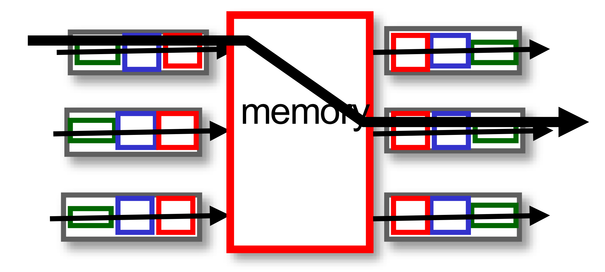

- 이동수단으로서 **메모리를 이용**하는 방식이다.
- 패킷이 특정 메모리에 복사되고, 이를 특정 output port에서 읽어 이동시킨다.
- **메모리에 load하고, access하는 시간**으로 인해 느리다는 단점이 있다.
  - memory bandwidth만큼으로 제한된다.

**Switching via a bus**
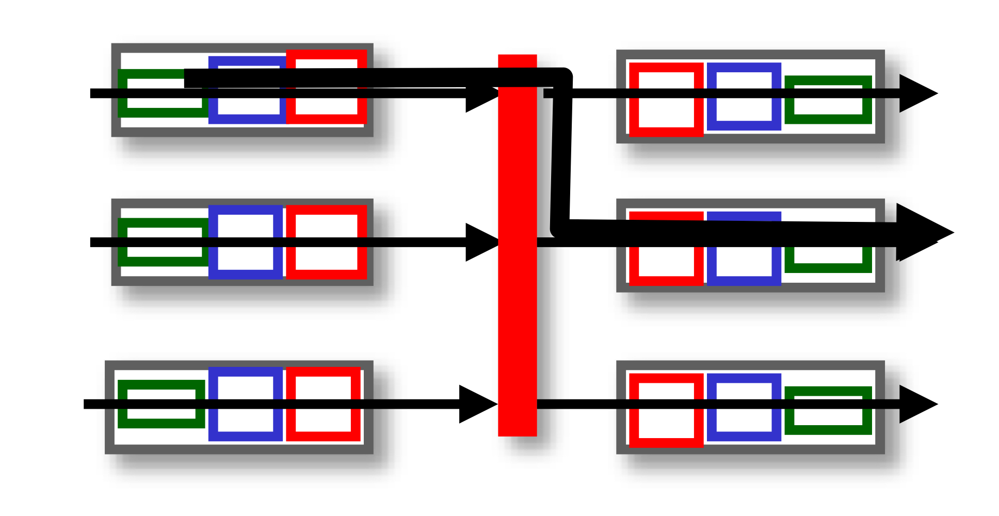

- 이동수단으로서 **bus**를 이용하는 방식이다.
- **버스 사용에 대한 관리가 필요**하다.
  - 동시에 버스를 사용하려는 경우 등

**Switching via a Interconnection Network**
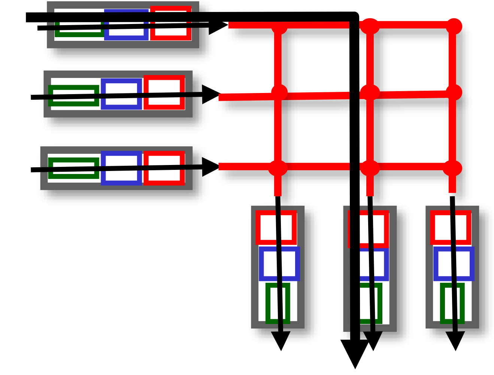

- 그림처럼, 상호 연결된 네트워크 망을 사용한다.
  - 망이 접하는 점은 `crossbar point` 라고 한다.
- 철도길처럼, 패킷은 crossbar point에서 switching하면서 이동이 가능하다.
- 하지만 **네트워크가 증가할수록, point도 증가한다**는 문제가 있다.

**Switching via a multistage switch**
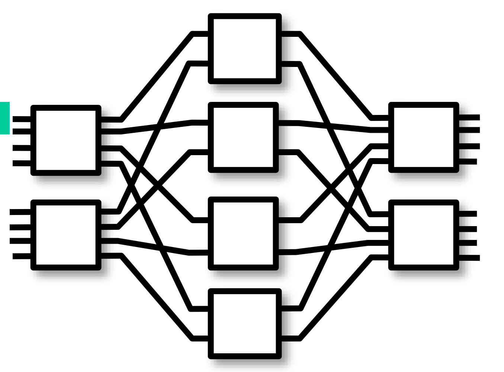

- Interconnection network를 사용했을때의 point가 증가하는 문제를 해결하는 방식이다.
- 패킷(datagram)을 **고정된 길이의 셀 단위로 나누고**, 이를 fabric을 통해 전달한 다음, 목적지에서 이를 **결합하여 사용**한다.
- multistage인 이유는, 각 switch가 n x n crossbar 구조이기 때문이다.

### 🪚 Input port Queuing
Queuing이란 버퍼에 패킷이 저장되는 것을 의미한다. 당연히 버퍼가 가득 차게 된다면 버퍼 오버플로우가 발생한다. 버퍼가 가득 차게 되면, 후에 들어오는 패킷들은 손실될 수 있다.

Queuing delay는 버퍼에 패킷이 저장되면서 발생하는 대기시간을 의미한다. 오버플로우가 발생하게 된다면 Queuing delay가 발생하고, 전송 속도가 저하된다. 

**Head-Of-Line blocking**
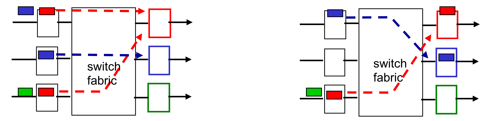

- input port의 버퍼에 패킷들이 대기하고 있다. 
- 3번째 input port의 빨간색 패킷이 1번째 output port로 가기 위해 대기하고 있다고 가정하자.
  - 이때, 그 뒤에 있는 초록색 패킷은 빨간색 패킷과 목적지 output port가 다름에도 불구하고, 빨간색 패킷의 처리를 기다려야 한다.

이를 **Head-Of-Line Blocking** 이라고 한다.

### 🪚 Output port Queuing
input port와 마찬가지로, output port 또한 Queuing을 수행한다.
- switching fabric에서 패킷이 전달되는 속도보다, output port에서 패킷을 내보내는 속도가 느릴 경우 Queuing을 수행하고, 버퍼 오버플로우가 발생할 수 있다.

버퍼 오버플로우가 발생한다면, 저장하고 있던 패킷이 아닌 새로 들어오는 패킷은 무조건 손실될 것이다.
- 이에 대한 처리를 위해, Drop Policy를 정의하여 버퍼 오버플로우 발생 시 어떤 패킷을 drop할 지 정해야 한다.
  - 새로 들어오는 패킷을 drop하거나, 우선순위에 따라 drop하는 방식이 있을 수 있다.

**버퍼링**과 함께 중요한 기능 중 하나로 **스케줄링**이 있다.
- 이는 패킷들이 버퍼링되어있을 때, 어떤 패킷을 먼저 내보낼 지에 대한 정의이다.
- 스케줄링 방식에는 아래와 같은 것들이 있다.

1. FIFO 스케줄링
: 기본적인 방식으로, 먼저 들어온 패킷을 먼저 내보낸다.

2. Priority 스케줄링
: 가장 높은 우선순위를 가진 큐에 담긴 패킷부터 먼저 내보낸다. 순위가 낮은 큐는 순위가 높은 큐가 모두 비어야 내보낼 수 있다.
- 이는 계속 우선순위가 높은 큐가 차는 경우, 낮은 우선순위를 가지는 큐의 패킷들은 내보내지지 않는 문제가 발생할 수 있다.

3. Round Robin 스케줄링
: 다수의 큐들이 돌아가면서 각각의 패킷들을 내보낸다.

4. Weighted Fair Queuing
: RR 스케줄링과 유사하나, 각 큐마다 대기 시간이 있다는 차이가 있다. 각 큐는 돌아가면서 패킷을 내보내지만, 전송되는 시간 간격이 정해져 있다. 그리고 이는 가중치에 따라 달라진다.

---

## 🧷 IP: the Internet Protocol
네트워크 계층에서 사용하는 프로토콜 중 하나이다. 네트워크 계층은 아래와 같이 구성되어 있다.

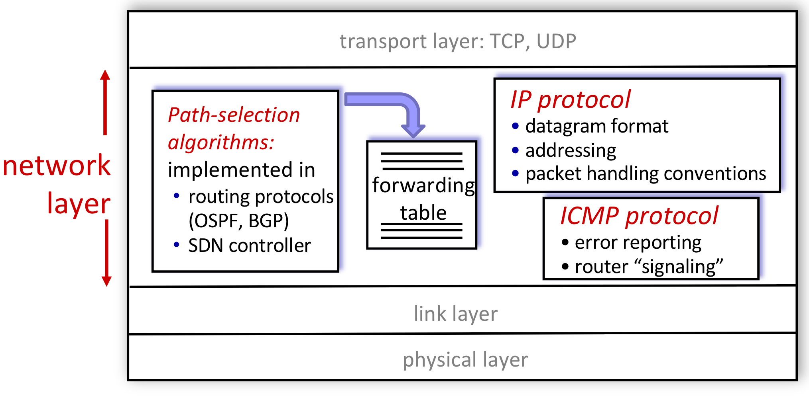

아래는 IP Datagram의 형식이다.

패킷은 IP를 거쳐 **TCP, UDP, ICMP로 전달**된다. 
- 이때, 패킷 헤더의 dest IP를 확인한 후, 본인 주소에 해당한다면 `Upper layer` 정보에 따라 해당 상위 계층으로 전달한다.

또한 Header checksum이라는 정보를 확인할 수 있는데, 이는 header에 대한 checksum이지, data에 대한 checksum은 아니므로 에러가 있는 data가 전달될 수 있다.
- 이는 TCP/UDP에서 detect한다.

### 🪚 Subnet
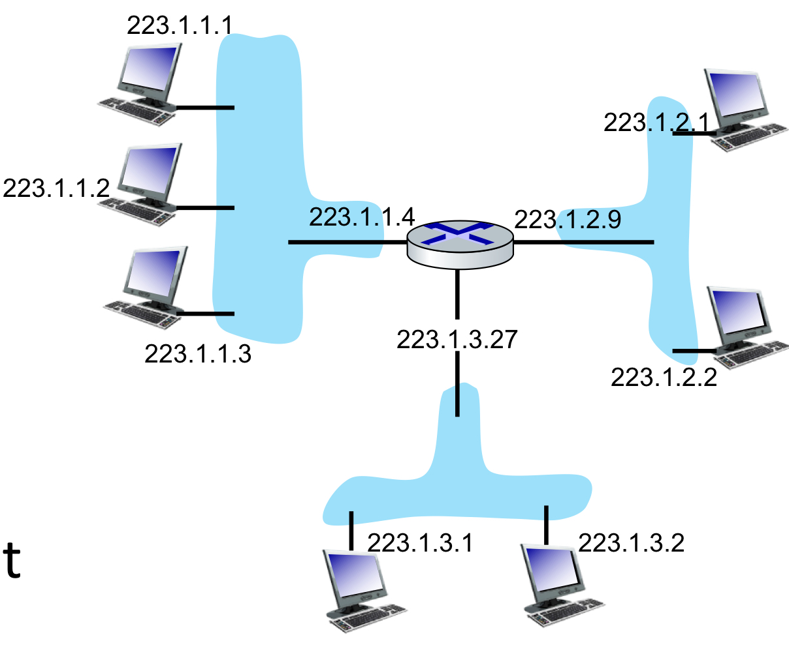

라우터는 여러 개의 인터페이스를 가지고, 인터페이스마다 파란색으로 영역이 나누어진다.
- 이렇게 나누어진 파란색 영역들을 Subnet이라 한다. 
- Subnet이 같은 호스트들은 라우터의 개입 없이 정보를 주고 받을 수 있다.

IP주소는 subnet part와 host part로 나뉜다.
- 여기서 223.1.1.1이라는 IP가 있을 때, 
  - subnet part는 223.1.1 (subnet을 식별)
  - host part는 1 (host를 식별)

> IP주소는 class단위로 부여된다.
> - class A : 1 Network ID + 3 Host ID = $2^8$ + $3 * 2^8$
> - class B : 2 Network ID + 2 Host ID = $2 * 2^8$ + $2 * 2^8$
> - class C : 3 Network ID + 1 Host ID = $3 * 2^8$ + $1 * 2^8$

IP대역에서는 어디까지가 Subnet part이고, host part인지 구분하기 위해 **Subnet mask**라는 것을 사용한다.
- **Subnet mask : /24** , **223.1.1.0/24** 라고 한다면, 
  - 전체 32비트 중, 앞부분 24비트가 Subnet에 해당된다는 의미이다. 
  - 즉, 25 ~ 32 번째 비트까지 값을 쓸 수 있으며(Host로서) 256까지의 경우가 나온다. (총 256개의 호스트를 가질 수 있다.)

### 🪚 CIDR
CIDR(Classless InterDomain Routing)은, 기존의 Class 단위로 할당하여 발생하는 공간 낭비 문제를 해결한다.
- 기존의 방식은 $2^8$, $2^{16}$, $2^{24}$ 중 하나를 선택해야 했기에, 너무 많거나 너무 적은 문제가 발생할 수 있었다.
- CIDR 방식으로, 임의로 subnet mask를 정해 공간 낭비를 막는다.

### 🪚 DHCP
이전에는 시스템 관리자에 의해 IP 주소를 할당받았다. 하지만 사용자가 많아질수록 매우 비효율적인 방법이기에, 현재는 DHCP(Dynamic Host Configuration Protocol) 방식을 사용해 동적으로 IP 주소를 할당받는다.
- 서버의 address pool로부터 IP 주소를 받아온다.

**DHCP client-server**
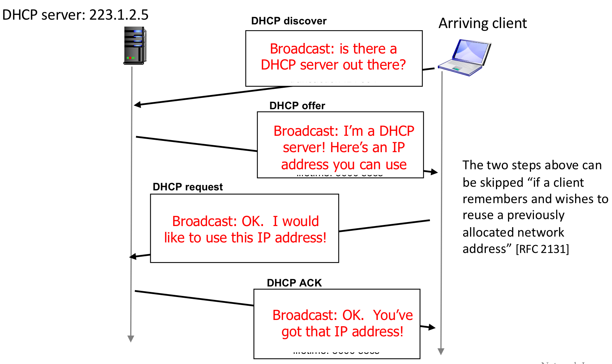

1. DHCP discover : 클라이언트는 Subnet에 도착하면, 브로드캐스트 방식으로 DHCP 서버가 있는지 확인한다.
2. DHCP offer : DHCP 서버가 클라이언트에게 사용할 수 있는 IP를 제공한다.
3. DHCP request : 클라이언트가 서버에게 해당 IP주소를 사용하겠다고 알린다.
4. DHCP ACK : DHCP 서버가 알겠다는 확인 메세지를 보낸다.

DHCP ACK에는 IP 주소뿐만 아니라 다른 정보(first hop of router, DNS server의 이름과 IP 주소 등)도 보낼 수 있다.

> 통신 간에는 모두 255.255.255.255로 브로드캐스트 방식을 사용한다.

### 🪚 NAT(Network Address Translation)
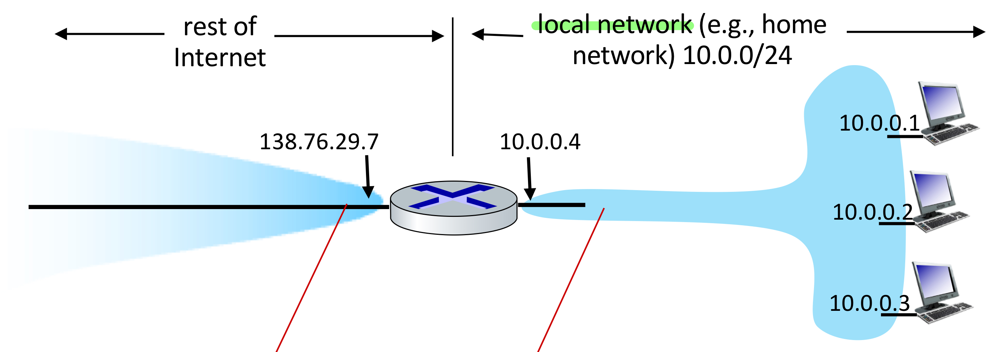

모든 IP 주소는 고유해야 식별이 가능하다. 하지만 모든 컴퓨터에 고유한 IP 주소를 할당하는 것은 부족하기에, `private IP` 를 사용한다.
- 그래서 위 그림에서 볼 수 있듯, 외부로 나갈 때는 `global` 한 IP 주소를 사용하고, 내부에서는 `private` 한 IP 주소를 사용한다.
- 그리고 이를 가능하게 하는 것이 NAT이다.

**NAT 동작 방식**
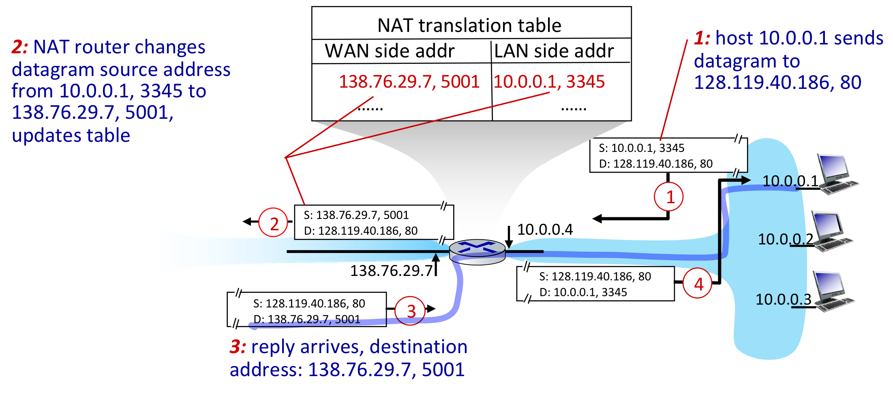

1. Host(10.0.0.1)는 현재 128.119.40.186, 80으로 패킷을 보내려 한다. 이때, host IP에 임의의 포트 번호(3345)를 지정하여 NAT로 전달한다.
2. NAT는 NAT Table을 이용해 10.0.0.1, 3345를 138.76.29.7, 5001로 변경하여 패킷을 목적지로 전송한다.
3. 패킷을 받은 서버(128.119.40.186, 80)는 다시 138.76.29.7, 5001로 패킷을 전송한다.
4. 패킷을 받은 NAT 라우터는 NAT Table에 기록된 LAN side addr를 보고 해당 주소로 패킷을 전송한다.

**Issues**
- router는 3계층까지만 다뤄야 한다.
- 주소 부족 문제
- end-to-end 방식을 해친다. (Port #은 네트워크 계층 디바이스에서 관리한다.)
- NAT traversal: 클라이언트가 NAT 안의 서버에 요청하는 경우, NAT 내부는 외부에서 알 수가 없다.

### 🪚 IPv4 vs IPv6
지금까지 설명한 IP는 IPv4였다. 이는 32비트 IP 주소 체계를 가지고 사용자에게 제공한다. 하지만 사용자가 증가하면서 주소 부족 문제가 발생했고, private IP를 부여함으로써 해결된 줄 알았지만, 여전히 IP가 부족한 문제가 발생하고 있다.

따라서, IPv4가 아닌 IPv6가 탄생했다. 이는 IP address(32bits)의 4배인 128bits 주소를 가진다.
- processing과 forwarding의 속도가 증가했다.
- `flow` 라는 것을 이용한다.

**IPv6 datagram format**
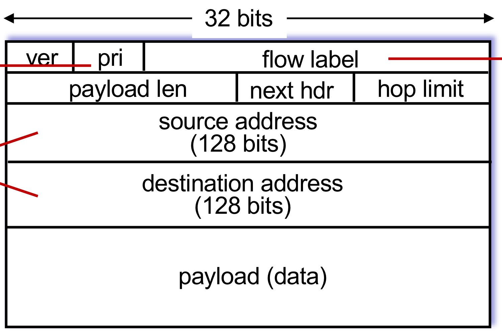

- header의 크기가 40byte로 고정
- flow label : datagram이 같은 flow에 있는지 식별해주는 정보
- next hdr : 추가적인 헤더 정보, options field 제거
- header checksum의 부재 : 라우터에서의 processing 속도 향상을 위해 제거했다.
  - IPv4에서는 라우터간 이동 시 TTL값이 계속 변하기에 라우터에서 header checksum을 계속 계산해야 했기에 processing 속도에 영향을 주었다.
  - 하지만 link의 향상으로, bit error rate이 매우 감소했기에, checksum이 필요없어졌다. (그리고 어차피 end point에서 error check을 수행한다!)

이렇게 효율적인 IPv6를 만들었다고 해도, 한 번에 모두 변경시키는 것은 불가능하다. 따라서 `Tunneling` 이라는 기법이 만들었다.

**Tunneling**
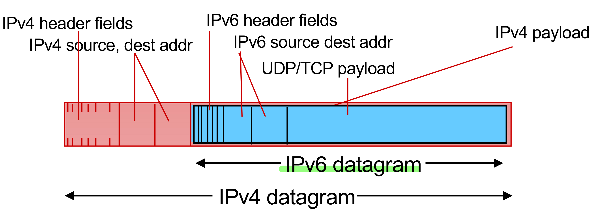

- IPv6 datagram을 IPv4 datagram의 payload로 사용하는 것이다. 

**Tunneling & encapsulation**
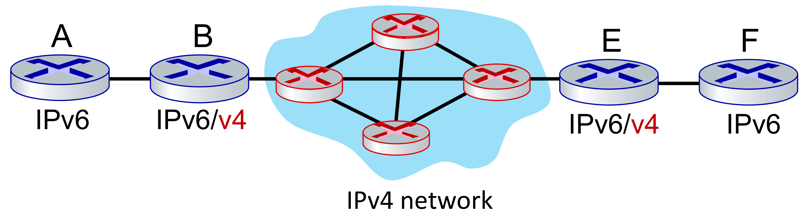

- A - F를 연결하는데, 기존 IPv4 망을 사용한다.
- 이를 위해서는 중간에 있는 라우터가 IPv6와 IPv4 프로토콜 모두를 다룰 수 있어야 한다.
  - 그리고 이 사이의 네트워크 망에서는 Tunneling이 수행된다.
- A로부터 받은 IPv6 패킷을 B에서 encapsulation 과정을 거쳐 IPv4 패킷으로 만든다.
- IPv4 Network 망을 거쳐 E로 전달된 IPv4 패킷은 decapsulation 과정을 거쳐 IPv6 패킷으로 만들어져 F로 전달된다.

--- 

## 🧷 SDN
SDN 방식은 이전에도 언급했듯 Control plane의 remote controller에서 flow table(routing table)을 만들고, 라우터들에게 이를 전달해주어 라우팅에 사용하도록 하는 방식이다.

flow table을 생성할 때, 다음과 같은 사항들을 고려하여 생성한다.
1. pattern: header fields의 패턴과 받은 패턴을 매칭시킨다.
2. action: 받은 패턴에 따라 drop, forward, modify 등의 동작을 수행한다.
3. priority: 패턴이 여러 개라면 우선순위가 높은 순으로 처리한다.
4. counters: 지금까지 받은 패킷의 바이트 수는 몇 개인지 기록한다.

ex)
- src = 1.2.\*.\*, dest = 3.4.5.\* -> drop
- src = \*.\*.\*.\* , dest = 3.4.\*.\* -> forward(2)
- src = 10.1.2.3, dest = \*.\*.\*.\* -> send to controller

이렇게 각 라우터들은 들어온 IP 주소 패턴에 대해 어떤 동작을 수행할지에 대한 flow table을 가지고 있고, 이 동작들을 정의함에 따라 **하나의 SDN 라우터는 Router, Switch, Firewall, NAT와 같은 역할을 수행**할 수 있게 된다.

---

## 🧷 Control Plane
routing table을 생성하는 방식에 따라 control plane의 역할이 달라진다.

**Per-router control plane 방식에서의 역할**
- 현재 사용되는 방식으로 라우터들끼리 상호작용해서 forwarding table을 생성한다.

**SDN(Software Defined Networking)에서의 역할**
- control plane의 Remote controller와 라우터의 control agent가 상호작욤함으로써 적합한 forwarding table을 생성하고, 이를 data plane으로 전달한다.

### 🪚 Routing protocols
routing protocol의 목표는 호스트로부터 다른 호스트까지 최적의 경로를 정하는 것이다.
- 최적의 경로는 최소의 비용을 고려해 가장 빠르게 목적지까지 도달하는 경로
- 그리고 이 경로를 찾기위해 2가지 알고리즘 방식이 사용된다.
- 각 도메인마다(intra-AS) 내부적으로 사용하는 알고리즘 방식(LS or DV)은 달라도 되지만, 도메인간(inter-AS) 사용하는 알고리즘 방식(LS or DV)은 같아야 한다. 

**Link State**
- 모든 라우터들이 다른 link 비용에 대한 정보를 모두 알고 있는 경우이다.
- global한 정보를 알고 알고리즘을 짜기에, 모든 라우터들이 동일한 RT를 가지게 된다.
- 다익스트라 알고리즘을 사용하기에 Table의 값이 바뀔 수 있다.
  - link costs가 네트워크 트래픽 양에 의존한다면, 트래픽 양이 변함에 따라 RT가 변경될 수 있다.
- 자신의 link 정보를 흘려보낸다. 이를 수신한 다른 모든 라우터들이 link 정보를 저장한다.

**Distance Vector**
- Link state와 반대로, 전체적인 정보를 모르는 상태에서 시작한다. 물리적으로 연결된 이웃에 대해서만 알고 있다.
- 반복적인 연산을 통해 정보를 얻게 되며, 전체적인 정보는 벨만 포드 알고리즘을 사용하여 구한다.
- 주변의 RT를 가지고 새로운 RT를 생성하고, 이를 주변 라우터들에게 전달하여 반복한다.

**Link cost의 변동**
1. 노드가 로컬 link cost의 변동을 감지한다.
2. 라우팅 정보를 업데이트하고 local Distance Vector를 다시 계산한다.
3. DV에 변동이 생기면 이를 이웃들에게 알린다.

link costs가 감소하면, 라우터 간 이동이 빨리지는 장점이 있지만, link costs가 증가하면, 이동이 느려지게 되고, count-to-infinity 문제가 발생한다.

### 🪚 Count-to-Infinity
네트워크에 변화가 생겼을 때 모든 RT를 네트워크에 맞게 갱신하는데 오래 걸리는 문제
- 각 라우터들이 어떤 목적지까지 가는 길에 대해, 다음 라우터는 알지만 그 다음을 알지 못해 그 사이에 사이클이 발생하는 경우 문제가 된다.
- hop count에 도달해서야 더 이상 갈 수 없음을 판단하게 되버리는 경우가 발생한다.

**Count-to-Infinity의 해결책**
1. Poisoned reverse
갈 수 없는 라우터에 대해서 비용을 무한대로 표시하여 다른 라우터로 전달한다.

2. Split horizon
갈 수 없는 라우터에 대해서 아예 RT에서 제외시킨 후 전달한다.

3. Triggered update
경로가 끊어짐을 감지하자마자 이를 바로 전달한다.

### 🪚 OSPF(Open Shortest Path First)
- intra AS routing protocol로, AS 내 모든 정보를 교환한다.
- link state 방식을 사용한다.

계층적인 OSPF는 다음과 같다.
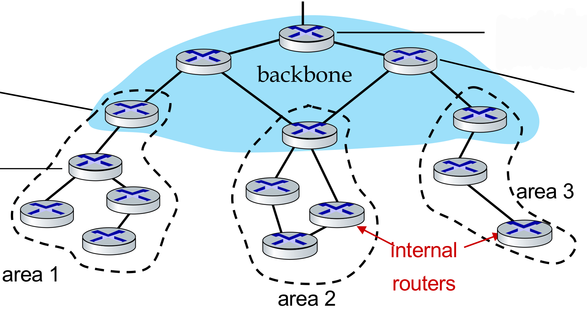

- 크게 local area와 backbone으로 이뤄지고, link state는 local area에서만 사용된다.
- local area와 backbone을 연결하고 있는 area border routers는 자신의 local area의 distance 정보를 요약해서 주위 라우터에게 전달한다.
- backbone router는 자기들끼리의 라우팅을 위해 OSPF를 사용한다.
- 이후 다른 AS와 라우팅을 위해 backbone 끝에 있는 boundary router를 사용한다.

### 🪚 BGP(Border Gateway Protocol)
- ISP 간 라우팅을 하는 프로토콜이다.
- 외부 AS의 라우터와도 정보를 공유할 수 있다.
- eBGP: 주위의 다른 AS로부터 정보를 얻을 때 사용하는 프로토콜
- iBGP: AS 내부의 라우터들에게 정보를 알려줄 때 사용하는 프로토콜

### 🪚 Hot Potato Routing
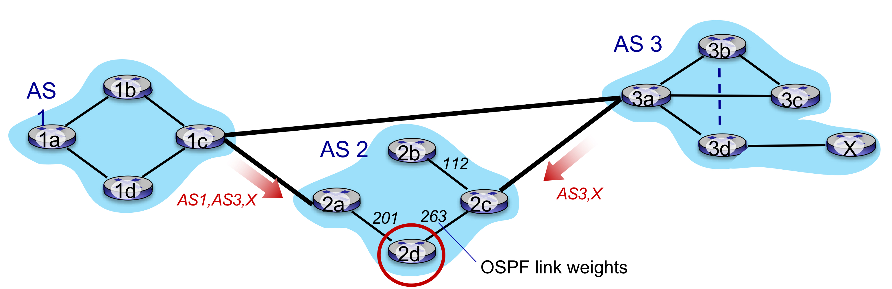

- 2d에서 x까지 가야하는 상황이 있다.
- 이때 2d는 2amㄹㄹ 선택해서 갈 수도 있고, 2c를 선택해서 갈 수도 있다.
- 이 경우, hot potato routing protocol이 사용되며, **원하는 목적지까지 가기 위해 최소 비용을 가지는 경로를 선택**한다.

---

## 🧷 The SDN Control Plane
기존에 사용한 방식은 각각의 라우터에 접근해 테이블을 생성하는 방식으로 네트워크 관리에 어려움이 있었다.

하지만 SDN 방식의 도입으로 logically centralized하여 네트워크 관리를 쉽게 한다.
- 이때 table-based forwarding(open flow api)을 이용해 table 프로그래밍을 쉽게 할 수 있다.
- 또한 Traffic engineering(정해진 경로가 아닌 원하는 경로 사용), load balancing도 가능하게 되었다.
- 이를 통해 Data Plane은 전달받은 RT를 보고 시키는 대로 동작만 하면 된다.

### 🪚 OpenFlow Protocol
controller와 switch 사이에서 동작하는 프로토콜로, TCP를 이용하여 메세지를 주고 받는다.

주고 받는 메세지는 다음과 같은 종류가 있다.
1. controller-to-switch messages

- features: 스위치의 상태 조회
- configure: 스위치의 configuration 세팅에 대해 알아내는 메세지
- modify-state: OpenFlow Table의 entry를 추가, 삭제, 수정하는 과정
- packet-out: 패킷을 스위치로 보냄

2. switch-to-controller messages

- packet-in: 패킷을 컨트롤러로 보냄
- flow-removed: Flow Table에서 지워진 entry를 알림
- port statue: 연결이 잘 되어 있는지 컨트롤러에게 변화를 알림

---

## 🧷 ICMP
Internet Control Message Protocol의 약자로, 호스트와 라우터들이 정보를 주고 받을 때 사용하는 프로토콜이다.

아래와 같은 Type과 Code 정보에 따라 사용되는 ICMP 유형이 결정된다.
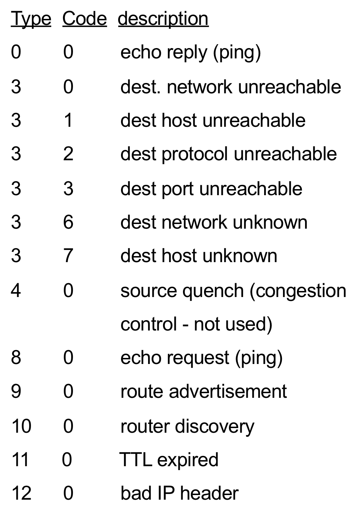

- 대표적으로, 서버가 살아있는지 판단할 때 사용하는 ping이 있다.

### 🪚 Traceroute
자신의 시스템으로부터 목적지까지 경유하는 시스템의 정보와 round trip time을 확인하는 Traceroute 또한 ICMP를 사용한다.
1. source 지점부터 destination지점까지 UDP segment를 전송한다. 이때 TTL을 통해 RTT를 측정한다.
2. 첫번째 set에서는 TTL = 1인 패킷을 세 번 보내 RTT의 평균을 측정한다.
3. 다음 set에서는 TTL = 2인 경우를 세 번 보내고, destination에 도착할 때까지 이를 반복한다.
4. 패킷이 destination에 도착했을 때 수신자는 ICMP 메세지를 반환하지 않기에 송신자는 수신자가 수용할 수 없게 port unreachable를 세팅해서 전송한다.
5. destination은 port #을 수용하지 못하고, ICMP 메세지를 송신자에게 보낸다.

---

## 📕 참고
- [Network layer 개요](https://ddongwon.tistory.com/88)
- [네트워크: Network Layer 정리2(IPv4, DHCP, NAT, SDN...)](https://seungjuitmemo.tistory.com/97)
- [네트워크: Network layer 정리3(routing algorithm, link state, distance vector)](https://seungjuitmemo.tistory.com/98?category=925884)