## 🧷 Security
네트워크 보안은 아래와 같은 것을 보장해야 한다.
- confidentiality: 명시된 수신자와 송신자만이 주고 받는 메세지의 내용을 이해할 수 있어야 한다. 
  - 송신자: 메세지를 암호화
  - 수신자: 메세지를 복호화
- authentication: 수신자와 송신자는 서로의 정체를 확인해야 한다.
- message integrity: 수신자와 송신자는 메세지가 변경되지 않았다는 것을 보장받기를 원한다.

그리고, 두 네트워크 개체 사이의 특정 공격자는 아래와 같은 행위들을 통해 네트워크 보안을 해칠 수 있다.
- eavesdrop: 메세지 인터셉트
  - 메세지에 대한 암호화가 필요
- 연결 중간에 메세지 삽입
- impersonation: 패킷의 목적 주소 또는 패킷의 특정 필드를 변경시켜버림
- hijacking: 송신자 또는 수신자를 본인으로 대체하여 연결을 수행
- denial of service: 서버에 많은 양의 요청을 의도적으로 가해, 다른 처리를 수행하지 못하도록 만드는 것

### 🪚 암호
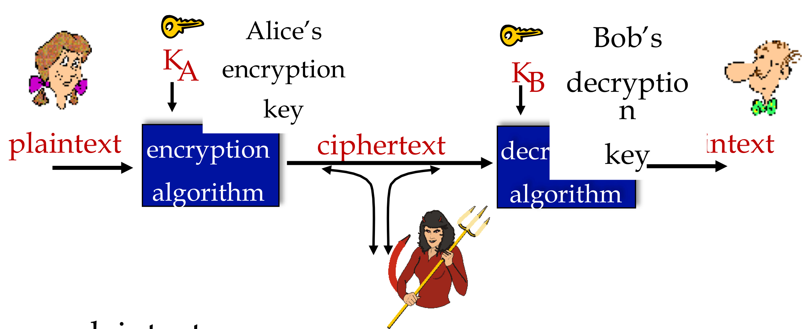

- plain text: 암호화하기 전의 데이터
- $K_A$: A의 키로 특정한 비트 수로 이뤄진 값, 암호화 알고리즘에 사용된다.
- cipher text: 평문과 암호키로 수학적 연산을 수행해 암호화된 데이터
- $K_B$: B의 키로, 암호화된 데이터를 복호화하는 데 사용된다.

---

## 🧷 대칭키 암호 방식
암호화와 복호화에 같은 암호키(symmetric key)를 사용하는 방식
- 공통적 암호 방식이나 비밀키 암호 방식으로도 불린다.
- 미리 송/수신 측이 암호키를 공유하고 있어야 한다.
- 암호키의 공유가 어렵다.
- 주 알고리즘으로 AES가 있다.

### 🪚 암호화 방식
**간단한 encryption scheme**
- substitution cipher
  - 1 문자를 다른 1문자로 대체
  - Encryption key는 26개의 영어 문자를 다른 26개의 영어 문자로 대체하는 map을 가지고 변환

**정교한 encryption scheme**
- n개의 substitution ciphers (M1, M2, M3, ...)
- cycling pattern: n = 4 / M1, M3, M4, M3, M2 ... 와 같이 여러 패턴을 사용하여 하나의 패턴이 뚫리는 경우를 보완한다.

### 🪚 대칭키 crypto: DES
Data Encryption Standard
- 56 bit의 대칭키와, 64 bit의 입력 평문으로 구성된다.
- 복호화는 암호화의 역순이다.
- 현재는 56 bit를 사용하는 대칭키의 안전성이 떨어진다. (빨라진 계산 덕에 하루면 해독이 가능해져버렸다..)
- Feistel 구조

### 🪚 대칭키 crypto: AES
Advanced Encryption Standard
- DES를 대체한 암호 알고리즘으로, 암호화와 복호화 과정에서 동일한 키를 사용하는 대칭 키 알고리즘이다.
- DES에 비해 키 사이즈가 자유로워, 가변 길이의 블록과 가변 길이의 키 사용이 가능하다. (128 bit, 192 bit, 256 bit)
- 속도와 코드 효율성 면에서 효율적이다.
- SPN 구조

### 🪚 Feistel 구조와 SPN 구조
**Feistel 구조**는 암복호화 과정에서 역함수가 필요없다는 장점이 있지만, 구현 시 스왑 단계 때문에 연산량이 많이 소요되며 암호에 사용되는 라운드 함수를 안전하게 설계해야 한다는 단점이 있다.

**SPN 구조**는 암복호화 과정에서 역함수가 필요하도록 설계되어야 한다는 단점이 있지만, 중간에 비트의 이동없이 한번에 암복호화가 가능하기에 Feistel 구조에 비해 효율적인 설계가 가능하다.

---

## 🧷 공개키 암호 방식
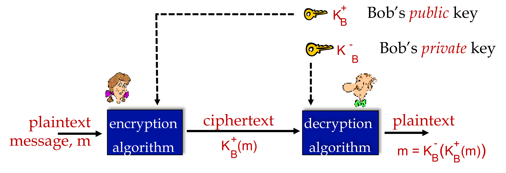

- 비대칭키 암호 방식이라고도 불린다.
- 공개키와 비밀키에는 수학적 연관성이 있다. (공개키로 비밀키를 추론하는 것이 불가능해야 한다.)
- 수신자와 송신자는 비밀키는 공유하지 않는다.
  - 송신자가 공개된 수신측의 공개키로 암호화
  - 수신자가 송신측이 보내온 데이터를 비밀키로 복호화
- 비밀키로 암호화하는 경우
  - 비밀키로 암호화하는 경우, 공개키로 복호화할 수 있다.
  - 송신자 A가 비밀키로 데이터를 암호화
  - 수신자 B가 송신자의 공개키로 데이터 복호화를 수행, 성공 시 송신자가 A임을 확인

### 🪚 RSA 알고리즘
Rivest, Shamir, Adelson 알고리즘으로, 공개키 암호 알고리즘 중 하나이다.
- 인수분해 문제 해결의 높은 난이도를 이용한 가장 대표적인 공개키 암호 알고리즘으로, 암호화뿐 아니라 전자서명의 용도로도 사용된다.
- SSL 프로토콜을 가진 많은 웹 브라우저, 공개키 암호 시스템을 사용하는 정부 시스템 등이 사용한다.
- 모두에게 공개하는 공개키와 개인키(비밀키)로 구성된다.
  - 공개키는 암호화, 개인키는 복호화에 사용된다.

**방식**
1. A가 B에게 정보를 안전하게 보내려 한다. 이때 RSA 알고리즘을 사용하려 한다.
2. B가 공개키와 개인키를 만들어 A에게 공개키를 보낸다. (개인키는 B만 가지고 있다.)
3. A가 B로부터 받은 공개키를 이요해 보낼 정보를 암호화한다.
4. A가 암호화된 정보를 B에게 보낸다.
5. B가 암호화된 정보를 받고 개인키를 이용해 암호를 복호화한다.

> DES는 RSA보다 최소 100배 빠르다. symmetric session key의 교환을 위해 RSA를 사용한다.

---

## 🧷 인증
인증의 궁극적인 목표는 A와 B가 서로를 prove하는 것이다.

**ap 1.0**
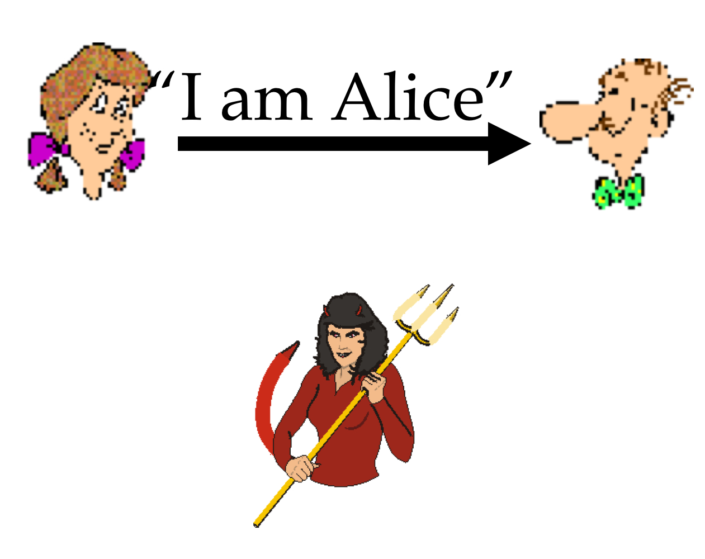

하지만 중간에 공격자가 이러한 인증과정에 끼어들 수 있다.
- 중간 공격자가 자신이 A라고 거짓으로 말하여 인증과정에 끼어들 수 있다.

**ap 2.0**
이를 방지하고자, A가 자신의 IP 주소와 자신이 A라는 패킷을 생성해 보낼 수 있다.
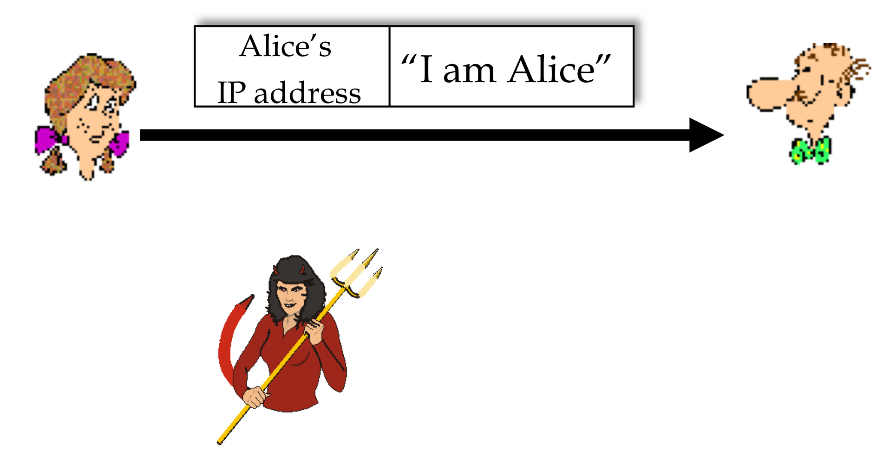

- 하지만 이또한, 중간 공격자가 A인척 A의 IP 주소와 해당 메세지를 담은 패킷을 생성해 보내는 "**스푸핑**"으로 끼어들 수 있다.

**ap 3.0**
이 또한 A가 본인의 비밀 키를 패킷에 함께 담아 보내는 방식으로 방지할 수 있을 듯하다.
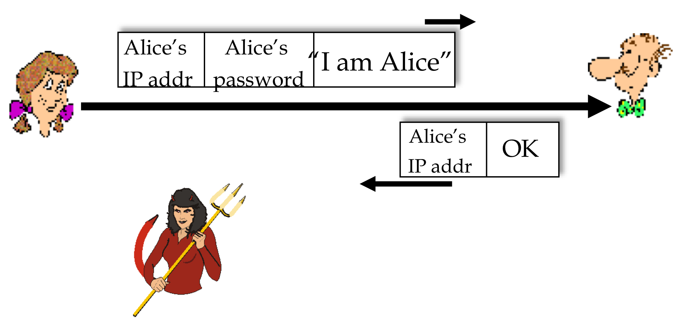

- 중간 공격자가 A의 패킷을 기록하고 있다가, 이를 다시 B에게 보내는 방식으로 뚫릴 수 있다. 그리고 이는 "**playback attack**"이라 한다.
- 그리고 A의 비밀 키를 암호화하여 보낸다해도, playback attack은 여전히 유효하다.

**ap 4.0**
Playback attack을 피하기 위해, `nonce` 라는 개념을 사용한다.
- `nonce` : 생애 한 번만 사용되는 숫자

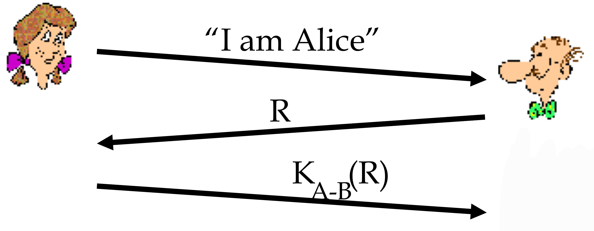

- A는 B에게 A임을 알린다.
- B는 A에게 `nonce` 를 전달한다.
- 그리고 A만 알고 있는 키로 `nonce` 를 암호화하여 B에게 전달한다.
- 이를 수신한 B는 A임을 인증한다.

**ap 5.0**
위 방식은 공유되는 대칭 키가 필요하다. 그렇다면 공개키로 이러한 인증을 수행할 수는 없을까?

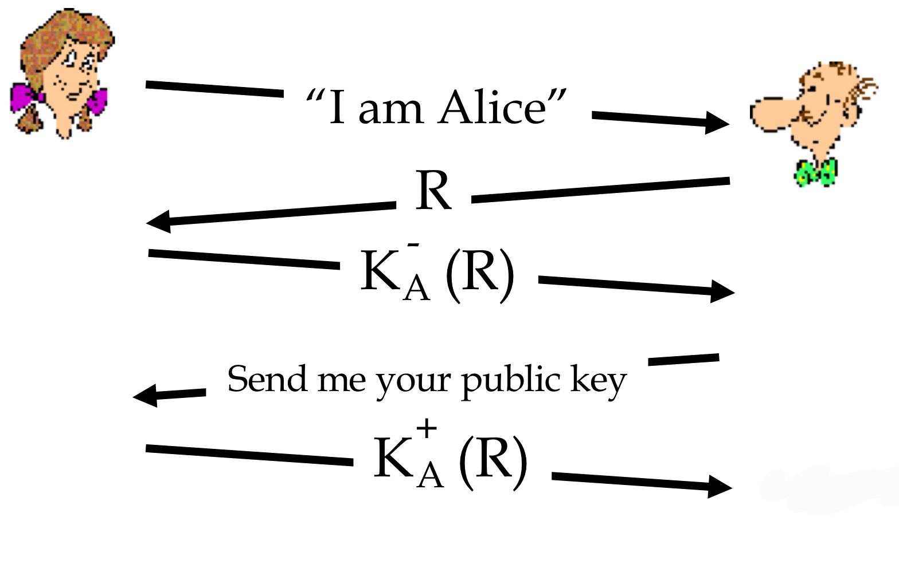

- A는 B에게 A임을 알린다.
- B는 A에게 `nonce` 를 전달한다.
- A의 비밀키로 `nonce` 를 암호화하여 B에게 전달한다.
- B는 A의 공개키를 요구하고, A는 공개키로 암호화한 `nonce` 를 전달한다.

하지만 이러한 방식 또한, **man in the middle attack** 위험이 있다.
- 공격자가 두 사용자 사이에서, 데이터 송수신을 엿듣거나 가로채는 공격이다.
- 공격자는 A 또는 B인 것처럼 행동하여 데이터를 가로챈다.

---

## 🧷 디지털 서명
데이터 송신처와 데이터 변조 여부를 확인하기 위한 인증 장치로, 데이터의 해시 값을 비밀키로 암호화한다.

1. 송신자 A가 보낼 데이터에서 해시값 생성, 송신자의 비밀키로 암호화하여 서명 값을 첨부한다.
2. 수신자 B는 데이터와 서명 값을 받고, A의 공개키로 서명을 복호화한다. 성공 시 A가 맞음을 증명한다.
3. 수신한 데이터로부터 해시 값을 생성하여 복호화된 서명의 해시 값과 비교해 데이터 변조를 판별한다.

### 🪚 Message digests
공개 키로 긴 메세지를 암호화하면 오버헤드가 발생할 수 있다. 따라서 해시 함수를 사용해 짧은 메세지로 변환한다.

해시 함수는 다음과 같은 특성이 있다.
- many-to-1
- 고정된 크기의 메세지를 생성한다.
- 주어진 메세지 x에 대해, $x = H(m)$ 을 만족하는 $m$ 을 찾기 어렵다.

> 이전에 다룬 Internet checksum 또한 해시 함수와 같은 특성을 가지지만, 주어진 해시 값에 대해 같은 해시 값을 가지는 $m$ 을 찾는 게 쉽다는 특성이 있다.

### 🪚 디지털 서명 = 서명된 메세지 다이제스트
위에서 설명한 디지털 서명의 방식을 그림으로 나타낸다.

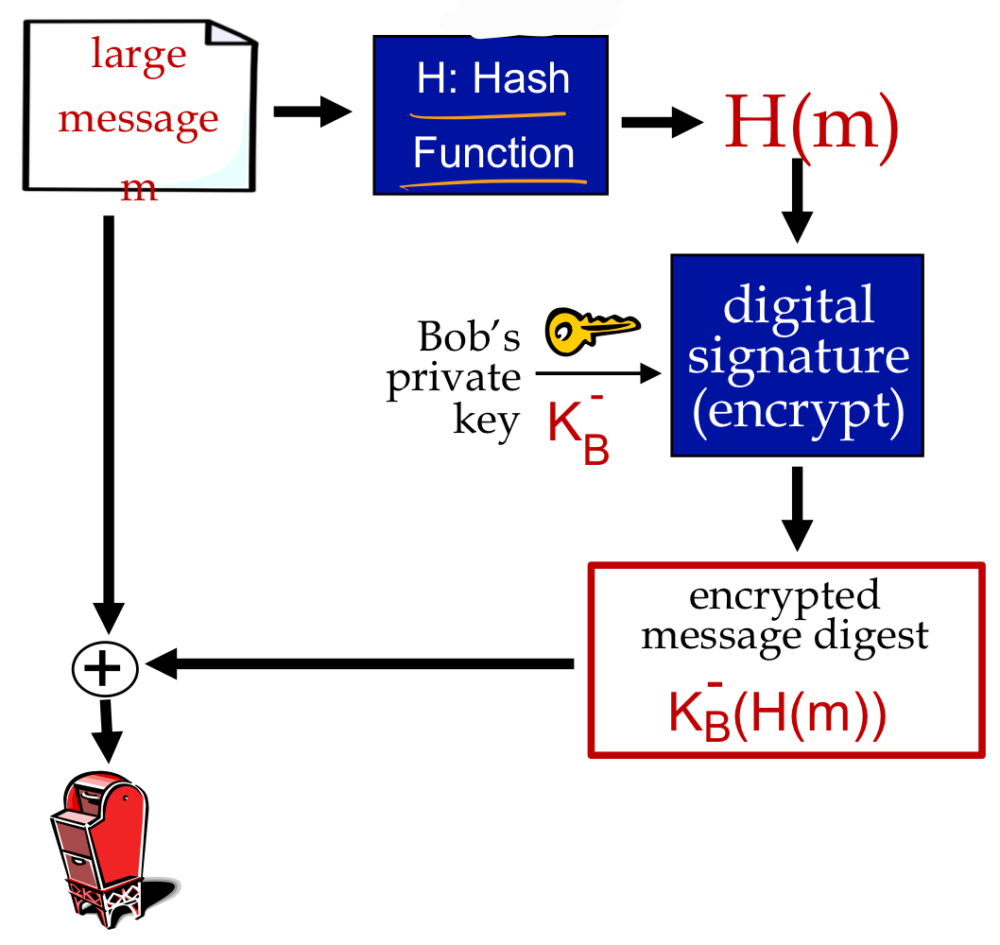

- 송신자는 긴 메세지 m과 이를 디지털 서명 적용한 message digest를 함께 전송한다.

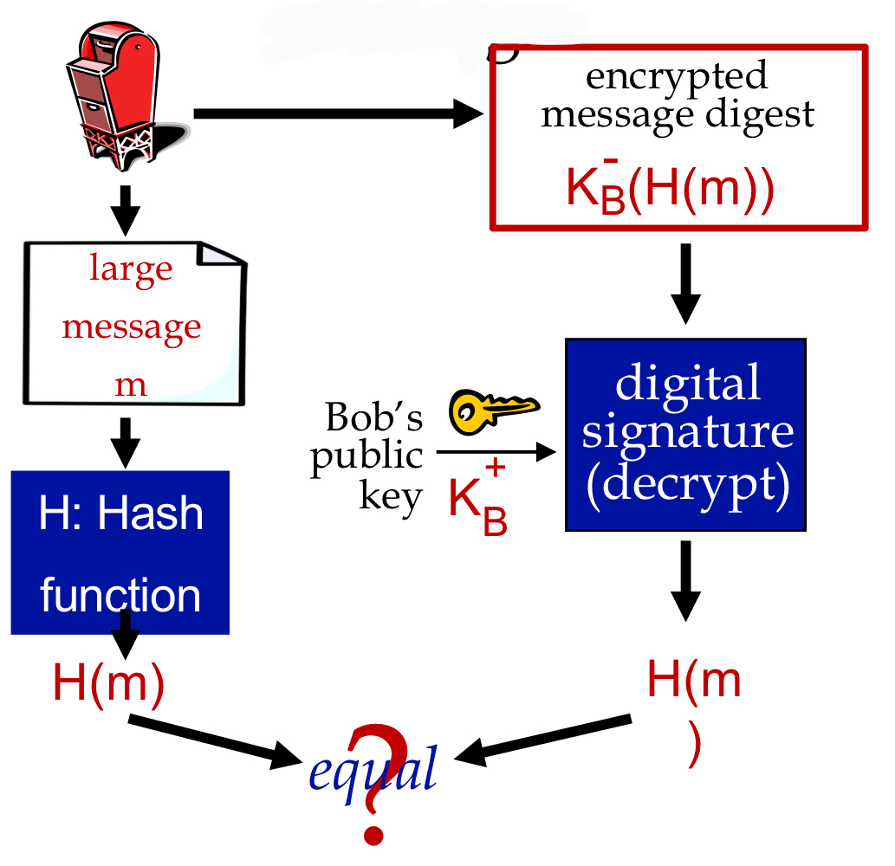

- 수신자는 긴 메세지 m을 해시 함수 적용한 값과 디지털 서명한 값을 송신자의 공개키로 복호화한 값을 비교하여 데이터의 변조 여부를 확인한다.

### 🪚 해시 함수 알고리즘
**MD5**
- 가장 널리 사용되고 있는 알고리즘
- 128bit message digest를 계산한다.

**SHA-1**
- 160 bit message digest

### 🪚 공개 키 CA
CA(Certification Authority): 공개 키를 인증해주는 제 3의 기관이다. 디지털 인증서를 발급해주고, 이는 서버에 설치하여 사용한다.

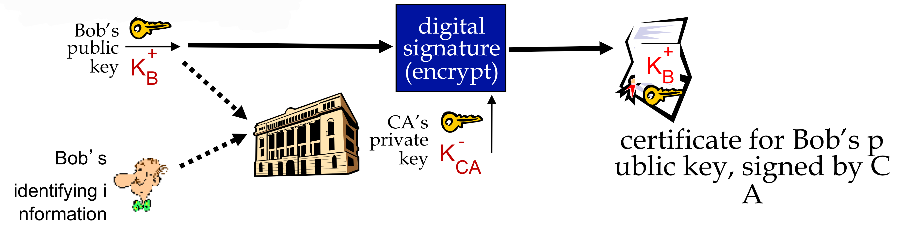

1. 사용자는 공개키와 비밀키를 생성해 비밀키를 안전하게 보관한다.
2. 공개키와 사용자 정보를 CA에 보내 인증서 발행을 신청한다. (CSR: Certificate Signaling Request, 인증서 발행 신청)
3. CA는 요청을 확인하고 심사하여 인증서를 생성하고 회신한다. (인증기관의 비밀키로 서명)
4. 발행된 인증서를 사용자 서버에 설치하여 사용한다.

---

## 🧷 Secure Email
### 🪚 e-mail: Confidentiality
Message integrity와 authentication은 제공하지 않는다.

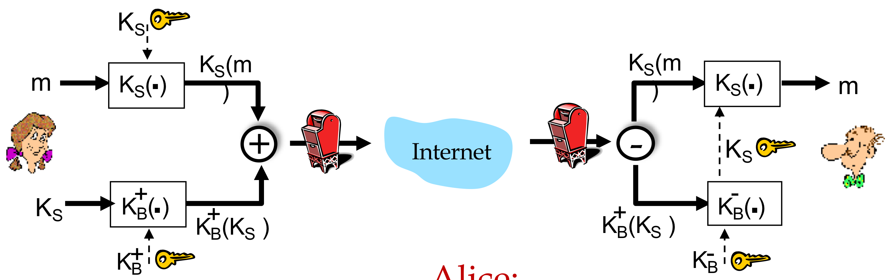

송신자는,
- 메세지와 symmetric key를 전송한다.
- 메세지는 대칭키로 암호화하여 전송하고, 대칭키는 수신자의 공개 키로 암호화하여 전송한다.

수신자는,
- 암호화된 대칭키를 자신의 비밀키로 복호화하여 추출한다.
- 추출한 대칭키를 이용해 메세지를 복호화하여 추출한다.

### 🪚 e-mail: integrity, authentication
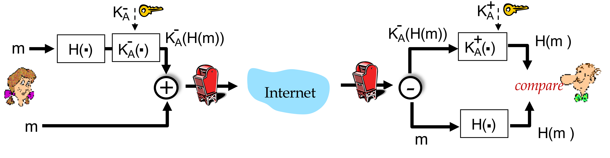

송신자는,
- 메세지와, 메세지를 해시 함수에 적용하고 본인의 비밀키로 암호화한 것을 전송한다.

수신자는,
- 수신한 메세지를 해시 함수에 적용한 것과,
- 수신한 암호화된 데이터를 송신자의 공개키로 복호화한 것을 비교하여 사용한다.

> confidentiality, integrity, authentication 모두 제공하기 위해, integrity, authentication을 제공하는 방법으로 데이터를 생성하고, 생성한 데이터와 대칭키를 사용해 confidentiality를 제공할 수 있다.

---

## 🧷 TLS
Transport-layer security로, 아래와 같은 것을 제공한다.
- Confidentiality: 대칭키 암호화를 통해 제공
- Integrity: 해싱을 통해 제공
- Authentication: 공개키 암호화를 통해 제공

TLS를 위해서는 아래와 같은 것들이 필요하다.
- handshake: 두 사용자가 서로의 인증서를 주고 받으며 존재를 인증해야 하기에!
- key derivation: 두 사용자는 secret을 공유하면서 키를 파생시켜야 한다.
- data transfer: 한 번의 트랜잭션이 아닌 연속적인 데이터의 공유가 필요하다.
- connection closure

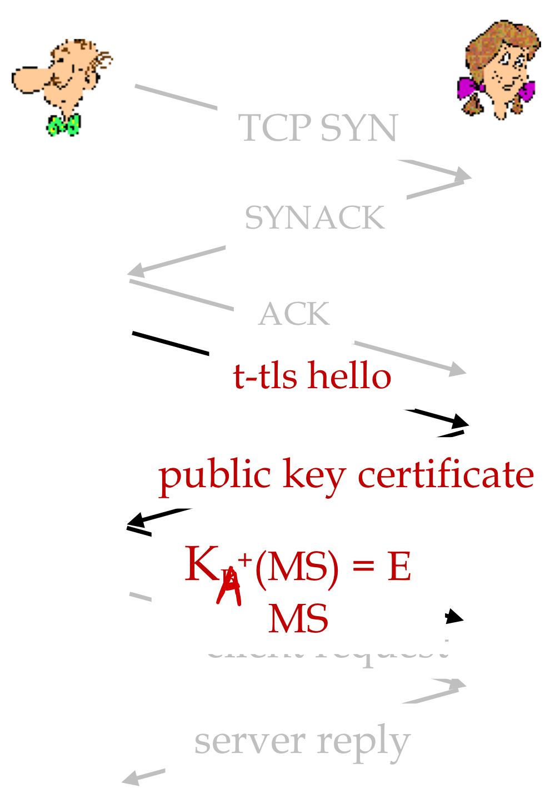

- handshaking 과정을 통해 연결을 수행한다. 이후 공개키 인증으로 B를 확인한다.
- A는 Master secret key(MS)를 전송하고, 이를 이용해 key derivation을 수행한다.

---

## 🧷 IP Sec
Datagram(Packet) level에서 security(encryption, authentication, integrity)를 제공하기 위해 사용한다. 그리고 이에는 두 가지 모드가 있다.

**Transport mode**
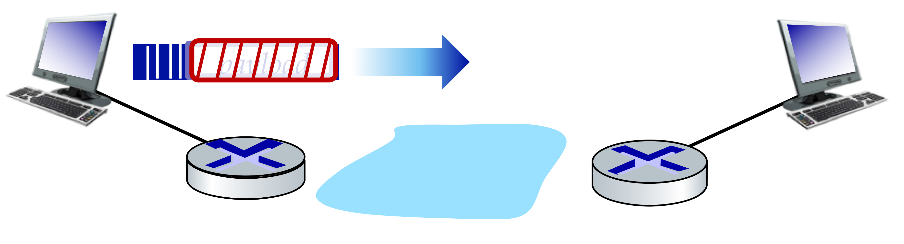

- datagram payload만 암호화하고, 인증한다.

**Tunnel mode**
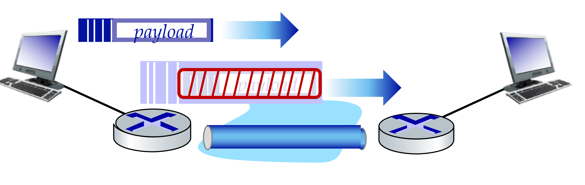

- datagram 전체 다 암호화하고, 인증한다.
- IP header가 더해져 새로운 datagram으로 캡슐화된다.

### 🪚 두 가지 IP Sec 프로토콜
**Authentication Header protocol**
- 출발지 인증과 data integrity는 보장하지만, confidentiality는 제공하지 않는다.

**Encapsulation Security protocol**
- 출발지 인증과 data integrity, confidentiality 모두 제공하고, 많이 사용된다.

---

## 🧷 Firewall
외부로부터 내부 네트워크를 보호하고, 반대로 내부에서 허용되지 않는 데이터 전송을 막을 수 있다. 
- DoS(Denial of Service)를 막는다.
  - SYN flooding: 공격자가 매우 많은 TCP 연결을 수행해, 실제 필요한 연결에서 사용할 자원이 없도록 만든다.
- illegal modification / access of internal data를 막는다.

방화벽에는 3가지 종류가 있다.
- stateless packet filters: 상태 관리를 하지 않고 패킷 하나하나에 대해 모두 검사한다.
- stateful packet filters: 패킷에 대해 이미 허용된 연결에서 온 패킷인지 확인하고, 그렇지 않은 경우 drop
- application gateways

---

## 📕 참고
- [기술면접을 위한 Network 개념정리 08 - 네트워크 보안](https://8iggy.tistory.com/224)
- [AES 암호 알고리즘(Advanced Encryption Standard)](https://www.crocus.co.kr/1230)
- [[암호학] 비대치킹 암호 - RSA(공개키 암호시스템)](https://yjshin.tistory.com/entry/%EC%95%94%ED%98%B8%ED%95%99-%EB%B9%84%EB%8C%80%EC%B9%AD%ED%82%A4-%EC%95%94%ED%98%B8-RSA-%EC%95%94%ED%98%B8%EC%8B%9C%EC%8A%A4%ED%85%9C?category=738196)