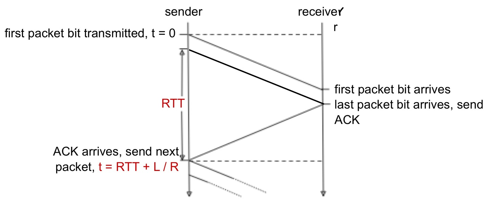
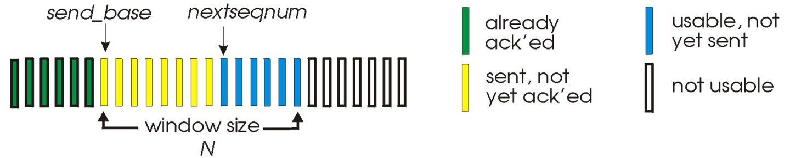

## 🧷 Transport Layer
이전에 다룬 Application Layer의 바로 하단에 위치하는 계층이다.

### 🪚 전송 계층의 역할
전송 계층의 역할은 크게 2가지로 나뉜다.
1. **출발지로부터 도착지까지 패킷이 정상적으로 전송될 수 있도록 한다.**
2. **응용 계층에서 만든 데이터를 일정한 크기로 분할한다.**

그리고 전송 계층은 대표적으로 2가지의 프로토콜이 있다. 하나는 TCP이고, 다른 하나는 UDP이다.

### 🪚 Multiplexing & Demultiplexing
애플리케이션들이 전송 계층의 프로토콜을 위해서는 프로세스마다 **Socket을 사용**해야 한다. 
- 컴퓨터에서는 여러 개의 애플리케이션들이 돌아가고, 각 애플리케이션들은 하나 이상의 Socket을 생성할 수 있다.
- 그렇다면 전송 계층 입장에서는 여러 개의 Socket들로부터 데이터가 쏟아지는 형태가 된다.

이때, 여러 애플리케이션의 Socket들이 데이터를 송, 수신하기 위해 필요한 개념이 Multiplexing과 Demultiplexing이다.

**Multiplexing**
- 여러 애플리케이션의 Socket들로부터 들어오는 데이터를 수집해 패킷으로 만들어 하위 계층으로 전달하는 것이다.
- 이때 Transport Header를 붙인다.

**Demultiplexing**
- 하위 계층으로부터 수신된 패킷을 올바른 Socket으로 전송해 올바른 애플리케이션으로 전달하는 것이다.
- 이때 애플리케이션의 식별을 위해 **Port #을 이용**한다.
  - 패킷 헤더에 src port #와 dest port #가 존재한다.

이때, TCP와 UDP는 Socket 식별을 위해 사용하는 정보에 차이가 있다.

**TCP**는 식별 시에 **4-tuple**을 사용한다.
- src IP address
- src port #
- dest IP address
- dest port #

IP 주소는 컴퓨터 정보, port #는 응용 계층에 대한 정보이다. 하나라도 다르다면, 다른 연결로 인식하게 된다.

**UDP**는 식별 시 **dest port #만을 사용**한다.

---

## 🧷 TCP
Transmission Control Protocol, 이름 그대로 전송을 제어하는 프로토콜이라고 생각할 수 있다.
- 일반적으로 TCP와 IP를 함께 사용하는데, IP가 데이터의 배달을 처리한다면, TCP는 패킷을 추적 및 관리한다.
- **Reliable**하다.
- `3-way handshake` 를 통해 초기 연결을 설정한다.
- **Flow control(흐름 제어)**: 수신측의 상태를 확인하면서 전송을 이어간다.
  - 수신 데이터를 담는 `Buffer` 는 유한한 자원이므로, **Overflow**가 발생할 수 있다.
  - 따라서 수신측의 `Buffer` 가 수용 가능한 만큼을 전송한다.
- **Congesting control(혼잡 제어)**: 네트워크 상태를 확인하면서 전송을 이어간다.
  - 네트워크가 혼잡하다면, 보내는 패킷 양을 제어하여 전송한다.

> 이러한 제어과정때문에 **UDP보다 전송 속도가 느리다**는 단점이 있다.

- Timing, Security, Minimum Throughput guarantee를 제공하지 않는다.
- **Connection-Oriented**: 물리적 연결이 아닌 논리적 연결로, **순서에 맞게 손실 없이 데이터를 전송**하는 연결 지향형 프로토콜이다.
- 주로 **웹 HTTP 통신, 이메일, 파일 전송**에 사용된다.

> **패킷(Packet)**
> : 인터넷 내에서 데이터를 보내기 위한 경로 배정(라우팅)을 효율적으로 하기 위해 데이터를 여러 개의 조각으로 나누어 전송을 하는데, 이때 각 조각을 패킷이라 한다. 

모든 TCP 연결은 `Full-duplex`, `Point to Point` 방식이다.
- `Full-duplex` 는 전송이 양방향으로 동시에 일어날 수 있음을 의미하고,
- `Point to Point` 는 각 연결이 정확히 2개의 목적 포인트를 가짐을 의미한다.
  - 따라서 **TCP는 멀티캐스팅이나 브로드캐스팅을 지원하지 않는다.**

> ❓ **TCP에서는 패킷을 추척 및 관리한다**고 한다. 그렇다면 이는 어떻게 이루어지는 것일까

한 줄로 서야 하는 A, B, C라는 사람(패킷)이 서울(출발지, 송신측)에서 출발해 부산(목적지, 수신측)으로 가야한다고 가정한다.
- A, B, C가 순차적으로 가는 상황에서 B가 길을 잘못 들어 분실되었다.
- 하지만 목적지에서는 A, B, C 모두가 필요한지 모르고 A, C만 보고 모든 사람(패킷)이 왔다고 판단할 수 있다.
- 이를 방지하고자 A, B, C라는 패킷에 **1, 2, 3과 같은 번호를 부여**해 **패킷의 분실 확인 처리를 수행**한다.
  - 이후 **목적지에서는 이를 가지고 패킷을 재조립**한다.

### 🪚 Flow Control
송신측과 수신측 사이의 데이터 처리 속도 차이(흐름)을 해결하기 위한 기법이다. 만약 **송신측의 전송량보다 수신측의 처리량이 적을 경우**, 전송된 패킷은 수신측의 큐(버퍼)를 넘어 **손실**될 수 있기에 송신측의 패킷 전송량을 제어한다.

1. **Stop & Wait(정지 - 대기)**
매번 전송한 패킷에 대한 **확인 응답**을 받고, 그 다음 패킷을 전송한다.
- 이 대기 시간은 RTT를 기준으로 지정한다.
- 수신측과 송신측 간 이용할 데이터의 경로를 만들어두었지만, **대기하는 과정때문에 이에 대한 활용도가 떨어져 비효율적**이다.

효율성을 계산해보면, 실제로 **송신측과 수신측을 왔다갔다하는 동안 겨우 1개의 패킷만을 전송**하는 것을 확인할 수 있다.

2. **Sliding Window(슬라이딩 윈도우)** (or Pipelining)
Stop & Wait 방식의 비효율성을 개선한 기법이다. 수신측에서 설정한 **윈도우** 크기만큼 송신측에서 확인 응답 없이 패킷을 전송할 수 있도록 하여 **데이터의 흐름을 동적으로 조절**하는 기법이다.

> **윈도우**
> : 송신, 수신 양쪽에서 만든 버퍼의 크기
> - 윈도우에 있는 데이터는 응용 계층에서 사용하기 전까지 계속 남아있다.

해당 기법에서 패킷은 다음과 같이 분류된다.
- 송신측에서는 ACK을 수신하지 않더라도 여러 개의 패킷을 연속적으로 전송할 수 있다.
- 수신측으로부터 ACK을 수신하게 되면, 해당 seq #에 해당하는 만큼 송신측의 윈도우가 오른쪽으로 이동하게 된다.

### 🪚 Error Control

### 🪚 Congestion Control

---

## 🧷 UDP
User Datagram Protocol
- **Unreliable**하다.
  - Network 계층의 data를 응용 계층으로 바로 전달하기에 매우 단순한 구조이다.
- **Connection-Less** (비연결형 프로토콜)
- IP 데이터그램을 **캡슐화**하여 보내는 방법과, **연결 설정 없이** 보내는 방법을 제공한다.
- **빠른 데이터 처리**를 요구하는 경우 사용할 수 있다.
- TCP에서 필요했던 초기 연결 설정 메세지보다 적은 메세지를 요구한다.

> 인터넷은 기본적으로 **Best-Effort Service**로, IP(Network)에서 제공되는 서비스를 그대로 이용하기에 신뢰성을 보장하지 않는다.
> - 따라서 UDP segment는 손실 혹은 순서가 맞지 않을 수 있다. (**lost or out-of-order delivery**)

> **사용하는 이유?**
> - 데이터의 안전한 전송보다 **속도가 중요한 경우**를 위해 사용한다.
> - streaming multimedia applications에 사용한다.
>   - **loss에는 관대**하지만, **rate에 민감**한 애플리케이션의 경우
> - SNMP는 네트워크 상태에 대한 query를 보내고, 이에 대한 응답을 받는다.

### 🪚 UDP checksum

UDP 패킷의 헤더를 보면, `checksum` 이라는 정보가 있다. 이는 패킷에 **error의 유무를 저장하는 정보**로, 에러가 있는 경우 해당 패킷을 삭제할 수 있도록 한다.
- **UDP에서 왜 error를 확인할까?**: 이는 전송하려는 Data 자체의 error인지, 전달해주려는 port #의 error인지 모르기 때문에 error에 대한 확인을 수행한다.

그렇다면 이 `checksum` 은 어떻게 계산할까?
- **송신측**에서는 UDP segment(header와 data 모두)의 내용물을 모두 16-bit integer의 연속으로 취급하여 모두 더한다.
  - 이후 **결과에 대한 1의 보수**를 취한 것이 `checksum` 이 된다.
  - 결과에 올림이 발생한다면 이 또한 더한다.
- **수신측**에서는 송신측과 동일하게 받은 segment에 대한 `checksum` 을 계산한다.
  - 받은 segment의 checksum과 다르다면, error가 감지된 것이고, 해당 segment를 삭제한다.
  - 같다면, 해당 segment를 수용한다.

### 🪚 3-way handshake & 4-way handshake
**연결 성립**

1. 클라이언트는 서버에 접속을 요청하는 `SYN` 패킷을 전송한다. (그리고 해당 패킷의 `seq #` 는 M이라 한다.)
2. 서버는 `SYN` 패킷을 받아 클라이언트에게 요청을 수락한다는 의미의 `ACK(M + 1)` 패킷과, `SYN(N)` 을 전송한다.
3. `ACK(M + 1)` 을 받은 클라이언트는 서버에게 `ACK(N + 1)` 패킷을 보냄으로써 연결이 성립된다.

**연결 해제**

1. 클라이언트가 연결을 종료하겠다는 `FIN` 플래그를 전송한다.
2. 서버는 클라이언트의 연결 종료 요청 (`FIN`)을 받고, 확인용으로 `ACK` 를 전송한다.
   1. 이후 남은 데이터를 모두 보낼 때까지 잠깐 **TIME OUT**된다.
3. 데이터를 모두 보내고, 통신이 끝났다면 연결이 종료되었다고 클라이언트에게 `FIN` 플래그를 전송한다.
4. 클라이언트는 `FIN` 메세지를 확인했다는 `ACK` 을 전송한다.
5. 클라이언트의 `ACK` 을 받은 서버는 소켓 연결을 종료한다.
6. 클라이언트는 아직 서버로부터 받지 못한 데이터가 있을 것을 대비해 일정 시간 동안 잉여 패킷을 기다린다. (**WAITING TIME**)

---

## 📕 참고
- [Transport Layer 개요 (Multiplexing, Demultiplexing)](https://ddongwon.tistory.com/79)
- [[TCP] 3-way-handshake & 4-way-handshake](https://asfirstalways.tistory.com/356)
- [TCP와 UDP](https://github.com/WooVictory/Ready-For-Tech-Interview/blob/master/Network/)
- [TCP 패킷](https://evan-moon.github.io/2019/11/10/header-of-tcp/)
- [UDP 소개](https://www.joinc.co.kr/w/Site/TCP_IP/IntroUDP)