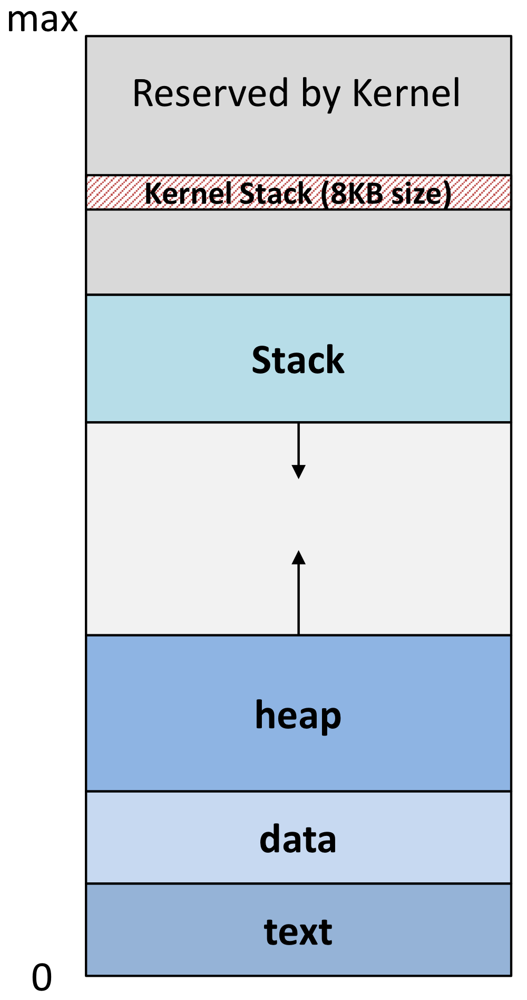
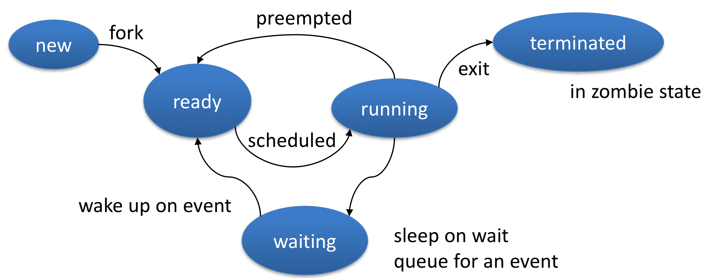

## 🧷 Process
프로세스는 실행 중인 프로그램이다. (프로세스는 active하고, 프로그램은 passive하다.)

> 하나의 프로그램 안에는 여러 개의 프로세스가 존재할 수 있다.

### 🪚 Process Memory Layout
프로세스를 메모리 공간을 어떻게 사용할까?

- 32bit라고 가정하여 각 프로세스에는 위와 같은 형태의 가상 메모리가 4GB($2^{32}$ = 4GB) 할당된다.
- 먼저, 프로세스의 메모리는 크게 **User space**와 **Kernel space**로 나뉜다.
  - Kernel space는 **모든 프로세스가 공유하는 공간**으로, 시스템콜이 필요한 경우 이 영역을 거쳐 커널에 작업을 요청한다.
  - User space는 공유되지 않는 공간으로, 시스템콜(Kernel space)을 거치지 않고, 직접 접근하게 되면 Segmentation fault가 발생한다.
- Kernel space에는 1GB, User space에는 3GB가 할당된다.

**Kernel Stack**
- 각 프로세스에 할당되는 스택으로, 시스템콜을 호출하여 Kernel로 이동했을 때, 파라미터, 반환 값을 저장하기 위한 영역으로 사용된다.

**Stack area**
- 호출되는 함수의 파라미터, 지역 변수, 반환 값을 저장하는 영역이다.
- max를 기준으로 사용될 때마다 아래로 공간이 사용된다.

**Heap area**
- 동적 할당 메모리를 처리하는 영역이다.
- 스택과 반대방향으로 공간이 사용된다.

> Stack과 Heap은 오버플로우 발생 시 서로의 영역을 침범할 수도 있다.

**Data segment**
- 전역 변수가 저장되는 영역이다.
- 매우 작은 공간을 가진다.

**Text segment**
- 프로그램 code(Binary)가 위치하는 영역이다.
  - 소스 코드를 실행하면 이 영역으로 복사된다.
- Program Counter는 이 영역 안에서 이동한다.

### 🪚 Process State
Process Life Cycle이라고도 한다. 프로세스는 아래의 5가지 상태를 가질 수 있다.

**new**
- 새로운 프로세스가 생성됨, 하지만 아직 Process Pool로의 진입이 허용되지 않은 프로세스

**ready**
- ready queue(process pool)에서 프로세서에 할당되기를 대기하는 상태

**running**
- ready queue에서 OS가 특정 알고리즘에 의해 한 프로세스를 동작
- single core의 경우 어느 한 시점에서나 항상 1개의 프로세스만을 실행

**waiting**
- 이벤트의 발생을 기다리는 프로세스, wait queue에서 대기
- 특히 I/O completion을 기다리는 프로세스가 위치

**terminated**
- 종료(중단)된 프로세스

**preempted**
- 한 프로세스가 일정 시간 이상 CPU를 사용하여 다른 프로세스의 동작을 위해 다시 ready queue로 이동

### 🪚 Process Control Block
PCB: 프로세스를 표현하는 커널 안의 자료구조이다.
- 주요 역할은 수행 프로세스를 인터럽트한 후 나중에 그 인터럽트가 발생되지 않은 것처럼 프로세스 수행을 재개할 수 있도록 충분한 정보를 유지하는 것이다.
- 따라서, 스위칭이 되어도 그 전 상태를 기억하고 재개할 수 있다.

 

**process state**
- 위에서 다룬 프로세스의 상태

**PID**
- 유일한 프로세스 식별자

**PC**
- 프로그램에서 다음 수행할 명령어의 주소

**Registers**
- CPU 레지스터, 범용 레지스터 등의 정보

**CPU Scheduling info**
- 스케줄링 및 프로세스 우선 순위

**Accounting info**
- CPU time usage, Job와 같이 계속 추적하며 저장하는 정보

---

## 🧷 Thread

---

## 📕 참고
- [[OS 운영체제] 프로세스(Process)란?](https://iingang.github.io/posts/OS-process/)