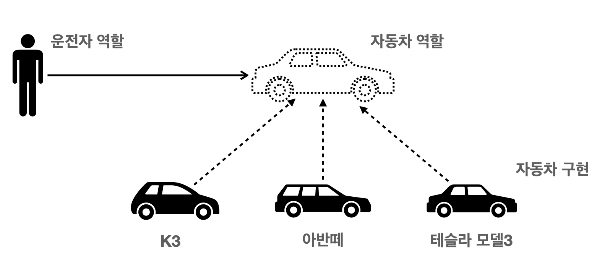

<em><strong>[스프링 핵심 원리 - 기본편](https://www.inflearn.com/course/%EC%8A%A4%ED%94%84%EB%A7%81-%ED%95%B5%EC%8B%AC-%EC%9B%90%EB%A6%AC-%EA%B8%B0%EB%B3%B8%ED%8E%B8/dashboard)을 들으며 정리하는 POST입니다.</strong></em>

## 🎯 EJB?
옛날에는 자바 진영의 표준 기술인 **Enterprise Java Beans**라는 기술을 많이 사용했다. 그래서 당시에는 기술 영업 시에 이를 가지고 많이 했다.
- 자바 표준 기술이니까!

하지만, EJB는 **매우 어렵고, 복잡하고, 느리다**는 문제가 있었다. 
- EJB를 사용하기 위해서는 인터페이스 구현, 의존적인 구현이 필요했다. (EJB 지옥이라는 말이..)

그래서, 원초적으로 돌아가자, "오래된 방식의 간단한 자바를 사용하자"는 측면에서 **POJO(Plain Old Java Object)** 라는 용어도 등장했다.

EJB의 단점으로 인해, 두 명의 개발자가 오픈 소스 프로젝트를 시작했고,
- 그것이 바로 **스프링 프레임워크와 하이버네이트**의 시초가 되었다.
- **스프링 프레임워크는 EJB 컨테이너를 대체**하고, **하이버네이트는 EJB Entity Bean 기술을 대체**했다. 
  - 하이버네이트를 이용해 **현재의 JPA라는 표준 인터페이스를 만들었다.** (인터페이스의 구현을 하이버네이트, EclipseLink와 같은 구현체들이 담당)

---

## 🎯 스프링의 역사
2002년 Rod Johnson이 EJB의 문제점을 지적하는 책을 출간했고, 이 책이 스프링의 시초가 되었다.
- EJB 없이도 고품질의 애플리케이션 개발이 가능함을 보이고,
- 지금의 스프링의 핵심 개념과 코드들을 다루었다.
- 또한, `BeanFactory` , `ApplicationContext` , `POJO` , `IoC` , `DI` 에 대해서도 다루었다.

### 🪔 스프링이란?
스프링은 단순히 한 기술을 말하는 것이 아닌, 여러 기술의 복합체라고 할 수 있다.
- 스프링 프레임워크, 스프링 부트
- 스프링 데이터, 세션, 시큐리티, Rest Docs, 배치, 클라우드 등

### 🪔 스프링 프레임워크
스프링 프레임워크는 또한 아래와 같은 기술들로 구성된다.
- **핵심 기술**: 스프링 DI 컨테이너, AOP, 이벤트, 기타
- 웹 기술: 스프링 MVC, 스프링 WebFlux
- 데이터 접근 기술: 트랜잭션, JDBC, ORM, XML 지원
- 기술 통합: 캐시, 이메일, 원격접근, 스케줄링
- 테스트: 스프링 기반 테스트 지원
- 언어: 코틀린, 그루비

### 🪔 스프링 부트
스프링을 굉장히 편리하게 사용할 수 있도록 돕는 기술이다.
- 단독으로 실행할 수 있는 스프링 애플리케이션을 쉽게 생성
- 톰캣 같은 웹 서버를 내장해 별도의 웹 서버 설치가 필요없음
- 손쉬운 빌드 구성을 위해 starter 종속성 제공
- 스프링과 써드 파티 라이브러리 자동 구성
- 메트릭, 상태 확인, 외부 구성 같은 프로덕션 준비 기능 제공
- 관례에 의한 간결한 설정

### 🪔 스프링을 만든 이유?
**스프링의 핵심 개념**
- 자바 언어 기반의 프레임워크
  - 가장 큰 특징 - **객체 지향 언어**
- 스프링은 이 특징을 살려내는 프레임워크

"**좋은 객체 지향 애플리케이션을 개발할 수 있도록 도와주는 프레임워크**"

> "EJB는 객체 지향의 장점을 살리지 못하는 기술이었다!"

---

## 🎯 객체 지향의 특징
추상화, 캡슐화, 상속, **다형성** 

객체 지향 프로그래밍은 컴퓨터 프로그램을 **객체들의 모임**으로 보기에, **프로그램을 유연하고 변경이 용이**하게 만들 수 있다.

---

## 🎯 다형성의 실세계 비유
세상을 **역할과 구현**으로 구분한다!

### 🪔 운전자 - 자동차

자동차의 **역할**을 서로 다른 3개의 모델이 **구현**을 하고 있다.
- 운전자는 K3를 타다가, 아반떼로 갈아타도 운전이라는 **역할을 수행**할 수 있다.
  - 단지 **구현이 변경**된 것뿐이고, 운전자에게는 영향이 없다.

이는 **자동차의 역할의 인터페이스를 따라 각 모델이 구현**했기 때문이다.
- 운전자는 자동차의 역할에 대해서만 인지하고 있다.
- 그리고 이는 운전자(클라이언트)를 위함이다.
  - 운전자는 내부 구현의 변경은 영향이 없고, 알 필요가 없다.
- 따라서 이러한 다형성을 통해 **클라이언트에 영향을 주지 않고 새로운 기능(자동차)을 제공할 수 있게 된다.**

### 🪔 역할과 구현을 분리
역할과 구현으로 구분하면 세상이 **단순**해지고, **유연**해지며 **변경**도 편리해진다.

장점
- 클라이언트는 대상의 역할(인터페이스)만 알면 된다.
- 클라이언트는 구현 대상의 **내부 구조를 몰라도** 된다.
- 클라이언트는 구현 대상의 **내부 구조가 변경되어도 영향을 받지 않는다.**
- 클라이언트는 **구현 대상 자체를 변경**해도 영향을 받지 않는다. (테슬라 -> K3)

### 🪔 자바에서의 다형성 차용
- 자바 언어의 다형성 활용
  - 역할 = 인터페이스
  - 구현 = 구현 클래스(객체)
- 객체 설계 시 **역할과 구현을 명확히 분리**
- 객체 설계 시 **역할(인터페이스)을 먼저 부여**하고, 해당 역할을 수행하는 구현 객체 생성 (역할이 더 중요하다!)

## 📌 중요한 개념

## 📕 참고
- [스프링 핵심 원리 - 기본편](https://www.inflearn.com/course/%EC%8A%A4%ED%94%84%EB%A7%81-%ED%95%B5%EC%8B%AC-%EC%9B%90%EB%A6%AC-%EA%B8%B0%EB%B3%B8%ED%8E%B8/dashboard)