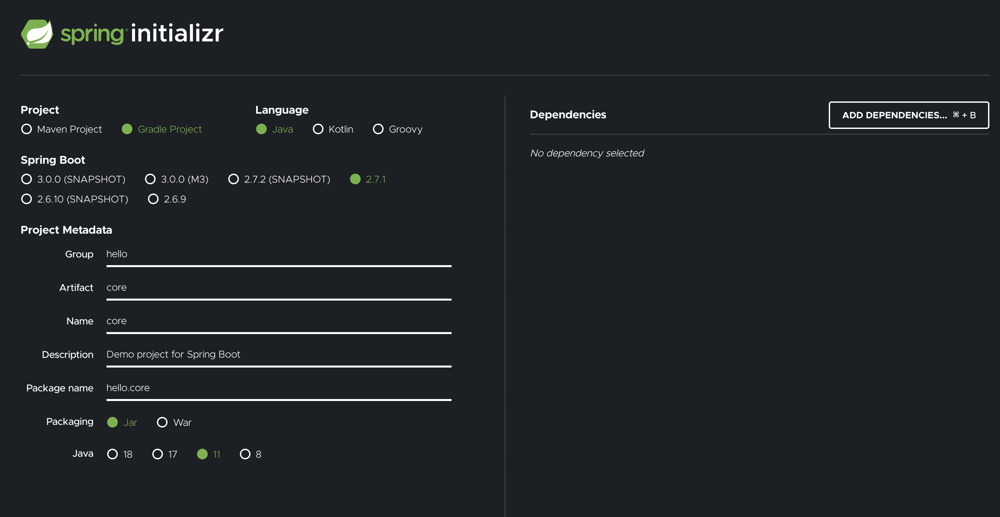
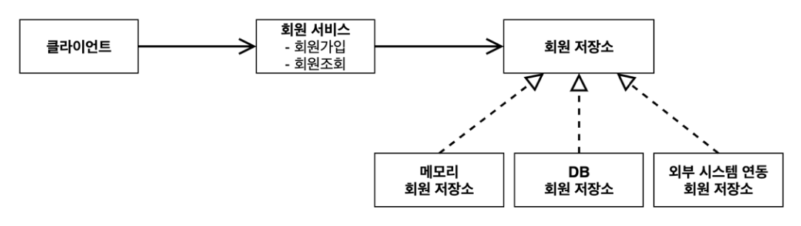
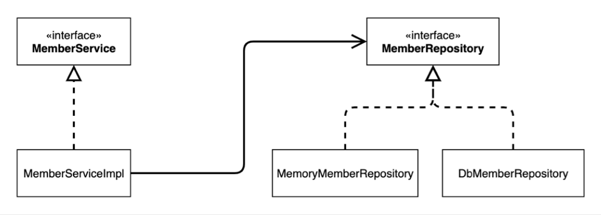
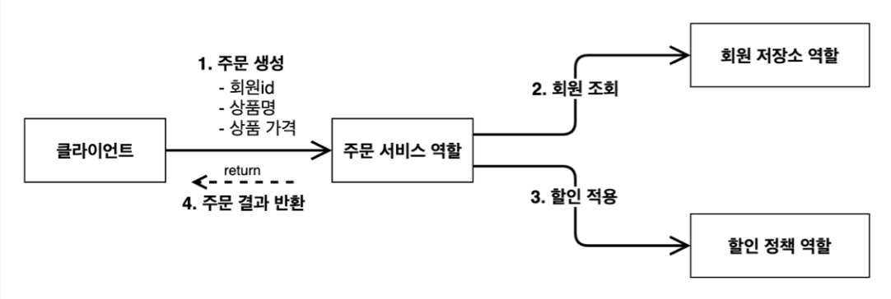
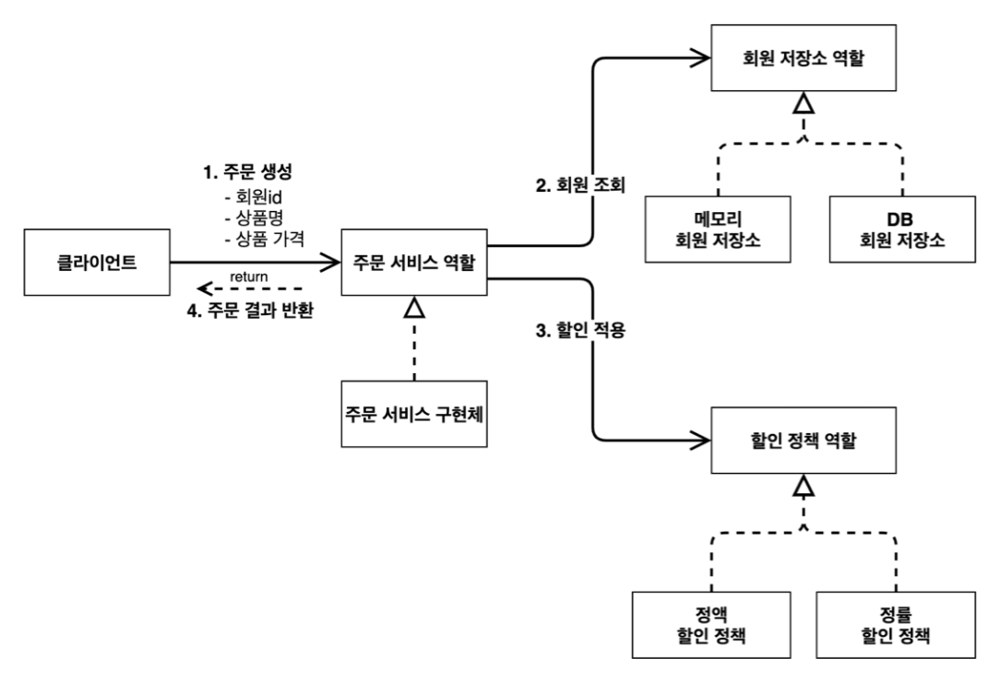
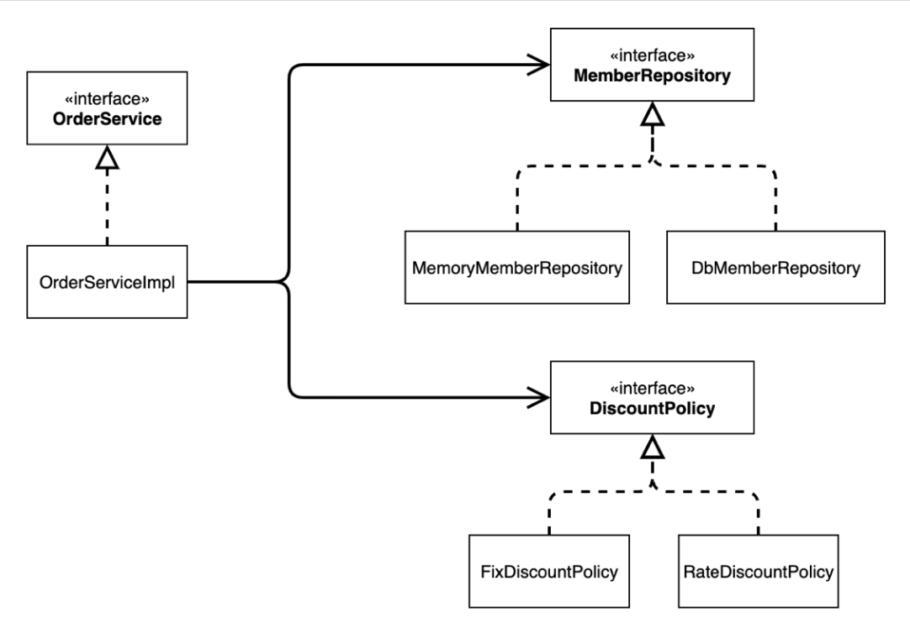
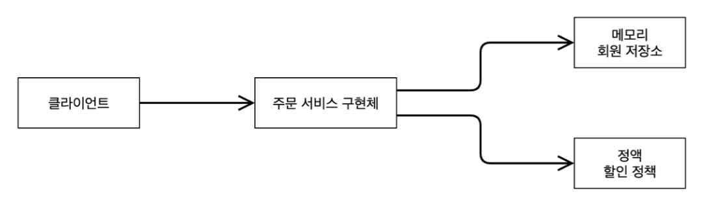
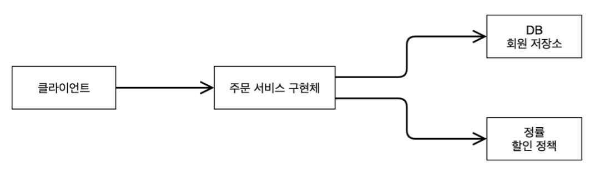

<em><strong>[스프링 핵심 원리 - 기본편](https://www.inflearn.com/course/%EC%8A%A4%ED%94%84%EB%A7%81-%ED%95%B5%EC%8B%AC-%EC%9B%90%EB%A6%AC-%EA%B8%B0%EB%B3%B8%ED%8E%B8/dashboard)을 들으며 정리하는 POST입니다.</strong></em>

## 🎯 프로젝트 생성
[start.io](https://start.spring.io/) 사용



---

## 🎯 비즈니스 요구사항과 설계
### 🪔 회원
- 회원을 가입하고 조회할 수 있다.
- 회원은 일반과 VIP 두 가지 등급이 있다.
- 회원 데이터는 자체 DB를 구축할 수 있고, 외부 시스템과 연동할 수 있다. (미확정)

### 🪔 주문과 할인 정책
- 회원은 상품을 주문할 수 있다.
- 회원 등급에 따라 할인 정책을 적용할 수 있다.
- 할인 정책은 모든 VIP는 1000원을 할인해주는 고정 금액 할인을 적용해달라. (나중에 변경 될 수 있다.)
- 할인 정책은 변경 가능성이 높다. 회사의 기본 할인 정책을 아직 정하지 못했고, 오픈 직전까지 고민을 미루고 싶다. 최악의 경우 할인을 적용하지 않을 수 도 있다. (미확정)

> 현재는 스프링 없이 순수 자바로만 개발을 진행한다. 프로젝트 환경설정을 위해 start.io를 사용했다.

---

## 🎯 회원 도메인 설계
### 🪔 회원 도메인 협력 관계


- 회원 서비스에서는 회원 가입과 회원 조회 기능이 있다.
- 회원 데이터에 접근하는 계층을 따로 생성한다.
  - 회원 저장소라는 인터페이스를 생성해 미확정된 구현체에 대해 맞출 수 있다.

### 🪔 회원 클래스 다이어그램 (정적)


- `MemberService` 라는 인터페이스를 만들고 이에 대한 구현체인 `MemberServiceImpl` 클래스를 생성한다.
  - 이 역할은 `MemberRepository` 에 접근하는 로직을 수행한다.

### 🪔 회원 객체 다이어그램 (동적)


- 객체간 참조 관계를 표현하고 있다.
- 클래스가 실제 사용하는 인스턴스끼리의 참조 관계이다.

---

## 🎯 회원 도메인 개발
### 🪔 회원 엔티티
회원 엔티티 개발을 위해 `member` 라는 패키지를 생성한다.

**회원 등급**
회원 등급 정보를 관리할 `Grade` 클래스를 만드는데, 이는 `Enum` 클래스로 생성한다.

```java
package hello.core.member;

public enum Grade {
    BASIC,
    VIP
}
```

- 회원 등급은 일반과, VIP가 있다.

**회원 엔티티**
회원 엔티티 클래스를 생성한다.

```java
package hello.core.member;

public class Member {
    private long id;
    private String name;
    private Grade grade;

    public Member(long id, String name, Grade grade) {
        this.id = id;
        this.name = name;
        this.grade = grade;
    }

    public long getId() {
        return id;
    }

    public String getName() {
        return name;
    }

    public Grade getGrade() {
        return grade;
    }

    public void setId(long id) {
        this.id = id;
    }

    public void setName(String name) {
        this.name = name;
    }

    public void setGrade(Grade grade) {
        this.grade = grade;
    }
}
```

- 생성자와 Getter & Setter를 생성한다.

### 🪔 회원 저장소
회원 저장소를 담당할 인터페이스와 구현 클래스를 생성한다.
- 아직 데이터베이스가 확정되지 않아 우선 메모리 회원 저장소를 사용한다.

**회원 저장소 인터페이스**

```java
package hello.core.member;

public interface MemberRepository {

    void save(Member member);

    Member findById(Long memberId);
}
```

**메모리 회원 저장소 구현체**

```java
package hello.core.member;

import java.util.HashMap;
import java.util.Map;
import java.util.concurrent.ConcurrentHashMap;

public class MemoryMemberRepository implements MemberRepository {

    private static Map<Long, Member> store = new ConcurrentHashMap<>();

    @Override
    public void save(Member member) {
        store.put(member.getId(), member);
    }

    @Override
    public Member findById(Long memberId) {
        return store.get(memberId);
    }
}
```

- `HashMap` 은 동시성 이슈가 발생할 수 있어, `ConcurrentHashMap` 을 사용해야 한다.

### 🪔 회원 서비스
이제 회원 가입과 회원 조회 기능을 구현할 회원 서비스를 생성한다.
- 회원 서비스 인터페이스와 이를 구현할 회원 서비스 구현체를 생성한다.

**회원 서비스 인터페이스**

```java
package hello.core.member;

public interface MemberService {
    
    void join(Member member);
    
    Member findMember(Long memberId);
}
```

**회원 서비스 구현체**

```java
package hello.core.member;

public class MemberServiceImpl implements MemberService {
    
    private final MemberRepository memberRepository = new MemoryMemberRepository();
    
    @Override
    public void join(Member member) {
        memberRepository.save(member);
    }

    @Override
    public Member findMember(Long memberId) {
        return memberRepository.findById(memberId);
    }
}
```

- 위에서 생성한 메모리 회원 저장소에 접근해 회원 가입 및 조회가 가능하기에 `MemberRepository` 인터페이스가 필요하다.
- 그리고 이에 대한 구현체는 `MemoryMemberRepository` 가 담당하고 있다.

---

## 🎯 회원 도메인 실행과 테스트
### 🪔 회원 도메인 - 회원 가입 main
회원 가입 기능의 확인을 위해 `MemberApp` 클래스를 생성한다.

```java
package hello.core;

import hello.core.member.Grade;
import hello.core.member.Member;
import hello.core.member.MemberService;
import hello.core.member.MemberServiceImpl;

public class MemberApp {
    public static void main(String[] args) {
        MemberService memberService = new MemberServiceImpl();

        Member member = new Member(1L, "memberA", Grade.VIP);
        memberService.join(member);

        Member findMember = memberService.findMember(1L);
        System.out.println("new Member = " + member.getName());
        System.out.println("findMember = " + findMember.getName());
    }
}
```

- 실행 결과는 동일한 `Member` 의 이름이 나올 것이다.

### 🪔 회원 도메인 - 회원 가입 test
기능에 대한 테스트를 위와 같은 방식으로 하는 것은 비효율적이고, 이를 위해 **JUnit**이라는 테스트 프레임워크를 사용한다.

```java
package hello.core.member;

import org.assertj.core.api.Assertions;
import org.junit.jupiter.api.Test;

public class MemberServiceTest {

    MemberService memberService = new MemberServiceImpl();

    @Test
    void join() {
        // given
        Member member = new Member(1L, "memberA", Grade.VIP);

        // when
        memberService.join(member);
        Member findMember = memberService.findMember(1L);

        // then
        Assertions.assertThat(member).isEqualTo(findMember);
    }
}
```

### 🪔 회원 도메인 설계의 문제점
- 다른 저장소로 변경 시 OCP 원칙을 잘 준수하는가?
- DIP를 잘 지키고 있는가?
- 의존관계가 인터페이스 뿐만 아니라 구현까지 모두 의존하는 문제점이 있다.
  - `MemberServiceImpl.class` 에서 `private final MemberRepository memberRepository = new MemoryMemberRepository();`
  - 주문까지 만들고나서 문제점과 해결 방안을 설명

---

## 🎯 주문과 할인 도메인 설계
### 🪔 주문과 할인 정책
- 회원은 상품을 주문할 수 있다.
- 회원 등급에 따라 할인 정책을 적용할 수 있다.
- 할인 정책은 모든 VIP는 1000원을 할인해주는 고정 금액 할인을 적용해달라. (나중에 변경 될 수 있다.)
- 할인 정책은 변경 가능성이 높다. 회사의 기본 할인 정책을 아직 정하지 못했고, 오픈 직전까지 고민을 미루고 싶다. 최악의 경우 할인을 적용하지 않을 수 도 있다. (미확정)

**주문 도메인 협력, 역할, 책임**


1. **주문 생성**: 클라이언트는 주문 서비스에 주문 생성을 요청한다.
2. **회원 조회**: 할인을 위해서는 회원 등급이 필요하다. 그래서 주문 서비스는 회원 저장소에서 회원을 조회한다.
3. **할인 적용**: 주문 서비스는 회원 등급에 따른 할인 여부를 할인 정책에 위임한다.
4. **주문 결과 반환**: 주문 서비스는 할인 결과를 포함한 주문 결과를 반환한다.

**주문 도메인 전체**


- **역할과 구현을 분리**하여 구현 객체를 자유롭게 조립할 수 있도록 했다.
  - 회원 저장소와 할인 정책의 유연한 변경이 가능하다.

**주문 도메인 클래스 다이어그램**


**주문 도메인 객체 다이어그램 1**


- 회원을 **메모리에서 조회**하고, **정액 할인 정책(고정 금액)**을 지원해도 주문 서비스를 변경하지 않아도 된다. 
- **역할들의 협력 관계를 그대로 재사용**할 수 있다.

**주문 도메인 객체 다이어그램 2**


- 회원을 메모리가 아닌 **실제 DB에서 조회**하고, **정률 할인 정책(주문 금액에 따라 % 할인)**을 지원해도 주문 서비스를 변경하지 않아도 된다.
- **협력 관계를 그대로 재사용**할 수 있다.

---

## 🎯 주문과 할인 도메인 개발
### 🪔 할인 정책 인터페이스
```java
package hello.core.discount;

import hello.core.member.Member;

public interface DiscountPolicy {

    // @return 할인 대상 금액
    int discount(Member member, int price);
}
```

- 이제 이를 구현할 정액 할인 정책과 정률 할인 정책 클래스를 생성해야 한다.

### 🪔 정액 할인 정책 구현체
```java
package hello.core.discount;

import hello.core.member.Grade;
import hello.core.member.Member;

public class FixDiscountPolicy implements DiscountPolicy {
    
    // 1000원 할인
    private int discountFixAmount = 1000;
    
    @Override
    public int discount(Member member, int price) {
        if (member.getGrade() == Grade.VIP) return discountFixAmount;
        return 0;
    }
}
```

### 🪔 주문 엔티티

```java
package hello.core.order;

public class Order {

    private Long memberId;
    private String itemName;
    private int itemPrice;
    private int discountPrice;

    public Order(Long memberId, String itemName, int itemPrice, int discountPrice) {
        this.memberId = memberId;
        this.itemName = itemName;
        this.itemPrice = itemPrice;
        this.discountPrice = discountPrice;
    }

    public int calculatePrice() {
        return itemPrice - discountPrice;
    }

    public Long getMemberId() {
        return memberId;
    }

    public void setMemberId(Long memberId) {
        this.memberId = memberId;
    }

    public String getItemName() {
        return itemName;
    }

    public void setItemName(String itemName) {
        this.itemName = itemName;
    }

    public int getItemPrice() {
        return itemPrice;
    }

    public void setItemPrice(int itemPrice) {
        this.itemPrice = itemPrice;
    }

    public int getDiscountPrice() {
        return discountPrice;
    }

    public void setDiscountPrice(int discountPrice) {
        this.discountPrice = discountPrice;
    }

    @Override
    public String toString() {
        return "Order{" +
                "memberId=" + memberId +
                ", itemName='" + itemName + '\'' +
                ", itemPrice=" + itemPrice +
                ", discountPrice=" + discountPrice +
                '}';
    }
}
```

- `System.out.println("Order : " + order)` 로 `Order` 객체를 출력해보면, 사실은 `Order` 객체의 `toString()` 이 호출된다!

### 🪔 주문 서비스 인터페이스
```java
package hello.core.order;

public interface OrderService {
    Order createOrder(Long memberId, String itemName, int itemPrice);
}
```

### 🪔 주문 서비스 구현체
```java
package hello.core.order;

import hello.core.discount.DiscountPolicy;
import hello.core.discount.FixDiscountPolicy;
import hello.core.member.Member;
import hello.core.member.MemberRepository;
import hello.core.member.MemoryMemberRepository;

public class OrderServiceImpl implements OrderService {

    // 회원을 찾기 위해 필요
    private final MemberRepository memberRepository = new MemoryMemberRepository();

    // 할인 정책 사용을 위해 필요
    private final DiscountPolicy discountPolicy = new FixDiscountPolicy();

    @Override
    public Order createOrder(Long memberId, String itemName, int itemPrice) {
        Member member = memberRepository.findById(memberId);
        // 할인에 대해서는 createOrder는 아예 알지 못함, 단일 책임 원칙을 잘 지킨 예
        int discountPrice = discountPolicy.discount(member, itemPrice);
        
        return new Order(memberId, itemName, itemPrice, discountPrice);
    }
}
```

- 주문 생성을 위해, 회원을 찾아야 하고, 할인 정책을 사용해야 한다.
  - 따라서 `MemberRepository` 와 `DiscountPolicy` 가 필요하다.
- `createOrder` 메소드에서, 
  - 회원 정보를 조회하고,
  - 할인 정책을 적용한 다음,
  - 주문 객체를 생성해 반환한다.
- 이때 할인에 대해서는 `createOrder` 는 알지 못하고, `discountPolicy` 에서 이를 책임진다. 
  - 이는 **단일 책임 원칙 (Single Responsibility Principle)** 이 잘 지켜진 예다.

---

## 🎯 주문과 할인 도메인 실행과 테스트
### 🪔 주문과 할인 정책 실행
```java
package hello.core;

import hello.core.member.Grade;
import hello.core.member.Member;
import hello.core.member.MemberService;
import hello.core.member.MemberServiceImpl;
import hello.core.order.Order;
import hello.core.order.OrderService;
import hello.core.order.OrderServiceImpl;

public class OrderApp {

    public static void main(String[] args) {
        MemberService memberService = new MemberServiceImpl();
        OrderService orderService = new OrderServiceImpl();

        Long memberId = 1L;
        Member member = new Member(memberId, "memberA", Grade.VIP);
        memberService.join(member);

        Order order = orderService.createOrder(memberId, "itmeA", 10000);

        System.out.println("Order = " + order);
    }
}
```

```java
// 결과는 다음과 같다.
Order = Order{memberId=1, itemName='itmeA', itemPrice=10000, discountPrice=1000}
```

### 🪔 주문과 할인 정책 테스트
JUnit 프레임워크를 사용해 테스트한다.

```java
package hello.core.order;

import hello.core.member.Grade;
import hello.core.member.Member;
import hello.core.member.MemberService;
import hello.core.member.MemberServiceImpl;
import org.assertj.core.api.Assertions;
import org.junit.jupiter.api.Test;

public class OrderServiceTest {

    MemberService memberService = new MemberServiceImpl();
    OrderService orderService = new OrderServiceImpl();

    @Test
    void createOrder() {
        Long memberId = 1L;
        Member member = new Member(memberId, "memberA", Grade.VIP);
        memberService.join(member);

        Order order = orderService.createOrder(memberId, "itmeA", 10000);

        Assertions.assertThat(order.getDiscountPrice()).isEqualTo(1000);
    }
}
```

## 📌 중요한 개념
설계, 객체 지향을 위한 원칙 준수, 테스트

## 📕 참고
- [스프링 핵심 원리 - 기본편](https://www.inflearn.com/course/%EC%8A%A4%ED%94%84%EB%A7%81-%ED%95%B5%EC%8B%AC-%EC%9B%90%EB%A6%AC-%EA%B8%B0%EB%B3%B8%ED%8E%B8/dashboard)