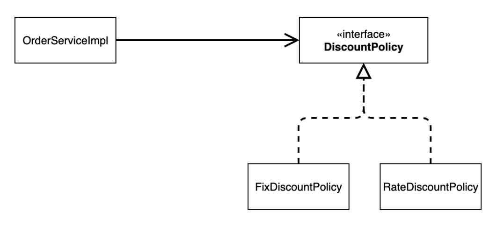
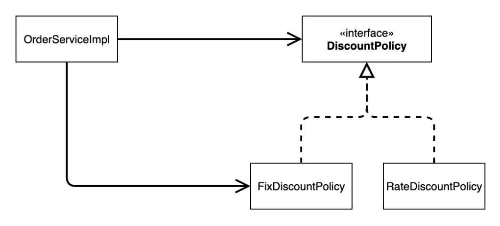

<em><strong>[스프링 핵심 원리 - 기본편](https://www.inflearn.com/course/%EC%8A%A4%ED%94%84%EB%A7%81-%ED%95%B5%EC%8B%AC-%EC%9B%90%EB%A6%AC-%EA%B8%B0%EB%B3%B8%ED%8E%B8/dashboard)을 들으며 정리하는 POST입니다.</strong></em>

새로운 할인 정책을 개발하는 것을 요구받았다. 하지만 이를 개발하게 되면서 DIP, OCP 원칙을 깨트리게 된다.
- 이 문제를 해결하면서 스프링으로의 전환이 이루어지게 될 것이다!

## 🎯 새로운 할인 정책 개발
**악덕 기획자**: 서비스 오픈 직전에 할인 정책을 지금처럼 고정 금액 할인이 아니라 좀 더 합리적인 주문 금액당 할인하는 정률% 할인으로 변경하고 싶어요. 예를 들어서 기존 정책은 VIP가 10000원을 주문하든 20000원을 주문하든 항상 1000원을 할인했는데, 이번에 새로 나온 정책은 10%로 지정해두면 고객이 10000원 주문시 1000원을 할인해주고, 20000원 주문시에 2000원을 할인해주는 거에요!

**순진 개발자**: 제가 처음부터 고정 금액 할인은 아니라고 했잖아요.

**악덕 기획자**: 애자일 소프트웨어 개발 선언 몰라요? “계획을 따르기보다 변화에 대응하기를”

**순진 개발자**: ... 

새로운 정률 할인 정책을 추가하자!

### 🪔 RateDiscountPolicy 추가


- 새로운 정률 할인 정책 추가를 위해서, `DiscountPolicy` 인터페이스를 구현할 `RateDiscountPolicy` 클래스를 추가로 개발하면 된다!

```java
package hello.core.discount;

import hello.core.member.Grade;
import hello.core.member.Member;

public class RateDiscountPolicy implements DiscountPolicy {

    private int discountPercent = 10;
    @Override
    public int discount(Member member, int price) {
        if (member.getGrade() == Grade.VIP)
            return price * discountPercent / 100;
        return 0;
    }
}
```

- `FixDiscountPolicy` 처럼 만들었다. VIP인 경우에 반환하는 로직은 쉽긴 하지만, 확실한 개발을 위해서는 테스트가 필요할 것 같다.
- 따라서 `command + shift + T` 로 바로 테스트 코드를 작성한다.

```java
package hello.core.discount;

import hello.core.member.Grade;
import hello.core.member.Member;
import org.assertj.core.api.Assertions;
import org.junit.jupiter.api.DisplayName;
import org.junit.jupiter.api.Test;

import static org.junit.jupiter.api.Assertions.*;

class RateDiscountPolicyTest {
    RateDiscountPolicy rateDiscountPolicy = new RateDiscountPolicy();

    @Test
    @DisplayName("VIP는 10% 할인이 적용되어야 한다.")
    void vipO() {
        // given
        Member member = new Member(1L, "memberVIP", Grade.VIP);

        // when
        int discount = rateDiscountPolicy.discount(member, 10000);

        // then
        Assertions.assertThat(discount).isEqualTo(1000);
    }
}
```

- 위 테스트 코드로 VIP인 경우 10000원에 대한 할인 금액이 1000원이 제대로 반환되는지 확인한다.

이제 실패 예시에 대한 코드 또한 필요하다.

```java
...
@Test
@DisplayName("VIP가 아니면 할인이 적용되지 않아야 한다.")
void vipX() {
    // given
    Member member = new Member(2L, "memberVIP", Grade.BASIC);

    // when
    int discount = rateDiscountPolicy.discount(member, 10000);

    // then
    Assertions.assertThat(discount).isEqualTo(0);
}
```

- 일반등급인 경우, 할인 금액이 0원인 것을 확인할 수 있다.

---

## 🎯 새로운 할인 정책 적용과 문제점
새로운 할인 정책(정률 할인)을 적용해보자.

### 🪔 할인 정책 적용
할인 정책의 변경을 위해 클라이언트인 `OrderServiceImpl` 코드를 변경해야 한다.

```java
public class OrderServiceImpl implements OrderService {

    ...

    // private final DiscountPolicy discountPolicy = new FixDiscountPolicy();
    private final DiscountPolicy discountPolicy = new RateDiscountPolicy();

    ...
}
```

### 🪔 문제점
- [x] 역할과 구현을 충실하게 분리했다!
- [x] 다형성도 활용하고 인터페이스와 구현 객체를 분리했다!
- [ ] OCP, DIP와 같은 객체 지향 설계 원칙을 준수했다...?

사실은 준수하지 못하고 있다!
- **DIP**: 주문 서비스 클라이언트(`OrderServiceImpl`) 는 `DiscountPolicy` 인터페이스에 의존하면서 DIP를 지킨 것 같아 보이지만, 사실은 **구현 클래스에도 의존**하고 있다.
  - 위에서 **정책의 변경을 위해 구현체 변경 코드가 필요**했으니...!
- **OCP**: 변경하지 않고 확장할 수 있어야 한다.
  - 지금 코드는 기능을 확장해서 변경하면, 클라이언트 코드(`OrderServiceImpl`)에 영향을 주고 있다. 
  - 따라서 OCP 또한 위반하고 있다.

### 🪔 클래스 다이어그램으로 확인
**기대했던 의존관계**


- 그림과 같이 `DiscountPolicy` 인터페이스에만 의존하고 있다고 생각하고 구현했다.

**실제 의존관계**


- 하지만 실제로는 인터페이스 뿐 아니라 구현 클래스에도 의존하고 있다.
- 따라서 **DIP를 위반**하게 되는 것이다.

---

## 🎯 관심사의 분리
### 🪔 

## 📌 중요한 개념


## 📕 참고
- [스프링 핵심 원리 - 기본편](https://www.inflearn.com/course/%EC%8A%A4%ED%94%84%EB%A7%81-%ED%95%B5%EC%8B%AC-%EC%9B%90%EB%A6%AC-%EA%B8%B0%EB%B3%B8%ED%8E%B8/dashboard)