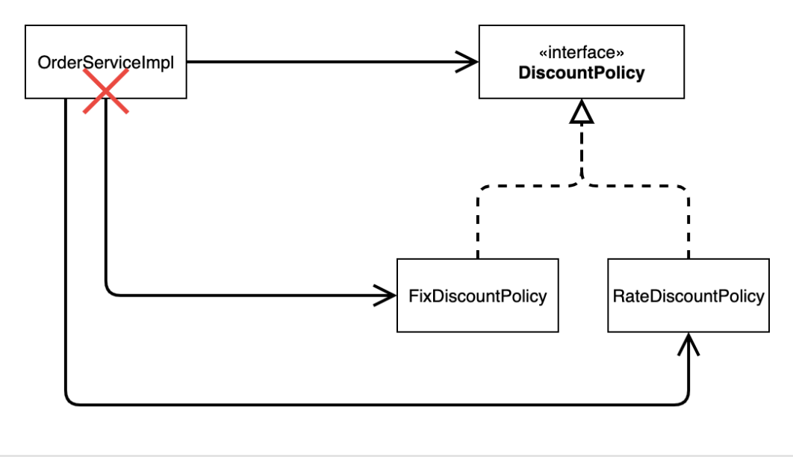
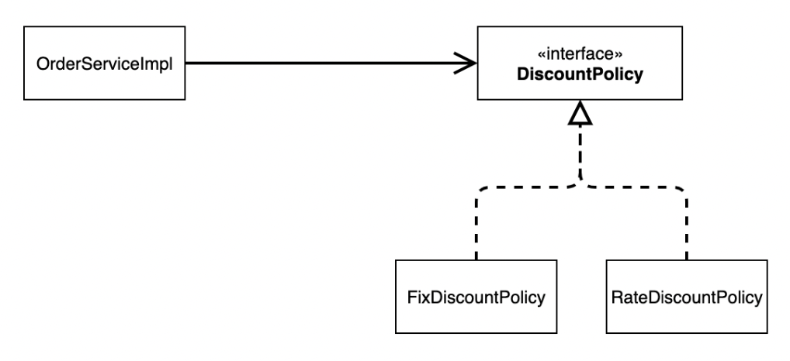
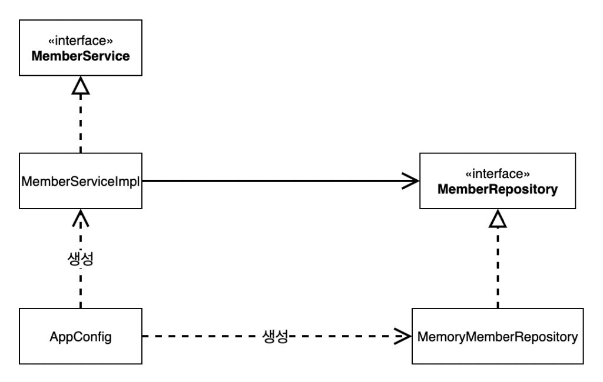
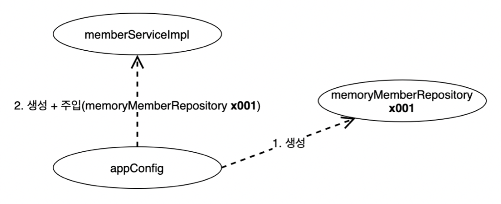
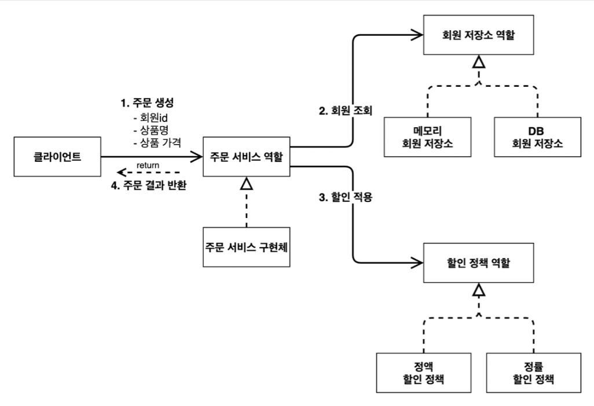
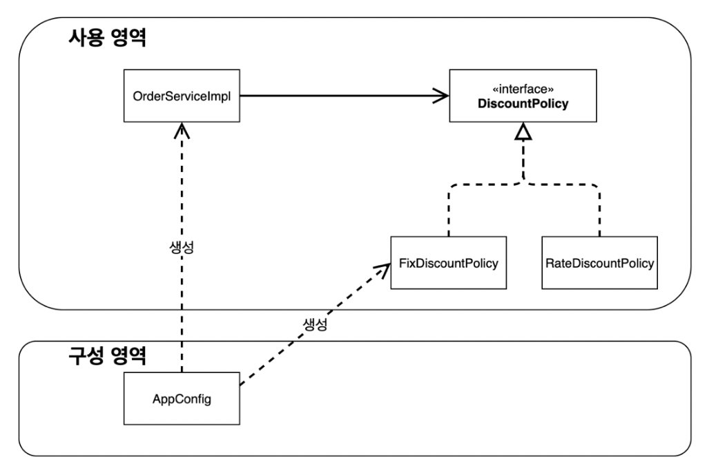
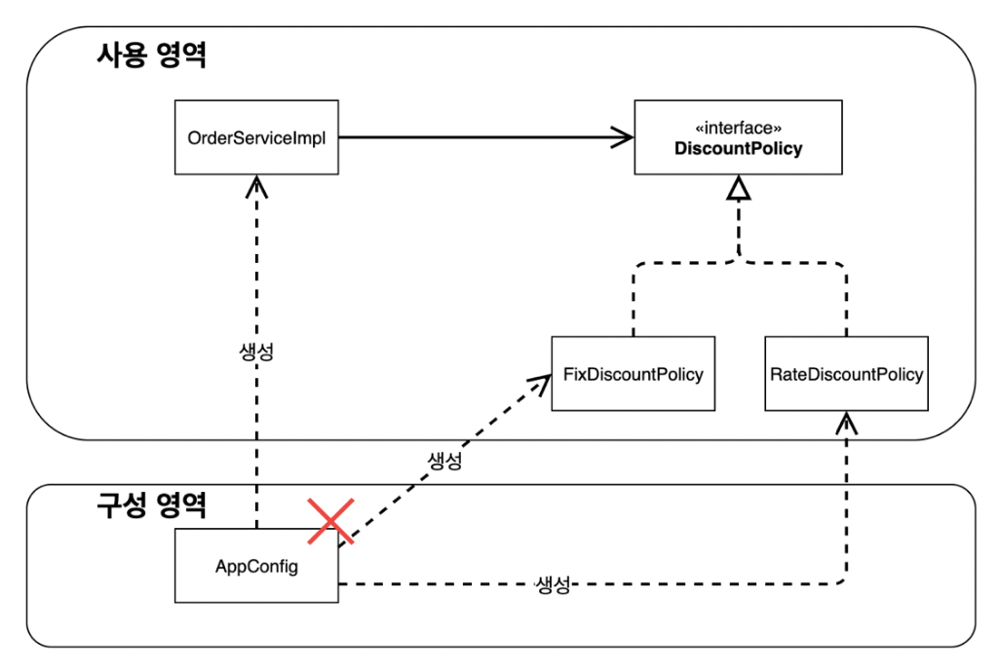

<em><strong>[스프링 핵심 원리 - 기본편](https://www.inflearn.com/course/%EC%8A%A4%ED%94%84%EB%A7%81-%ED%95%B5%EC%8B%AC-%EC%9B%90%EB%A6%AC-%EA%B8%B0%EB%B3%B8%ED%8E%B8/dashboard)을 들으며 정리하는 POST입니다.</strong></em>

새로운 할인 정책을 개발하는 것을 요구받았다. 하지만 이를 개발하게 되면서 DIP, OCP 원칙을 깨트리게 된다.
- 이 문제를 해결하면서 스프링으로의 전환이 이루어지게 될 것이다!

## 🎯 새로운 할인 정책 개발
**악덕 기획자**: 서비스 오픈 직전에 할인 정책을 지금처럼 고정 금액 할인이 아니라 좀 더 합리적인 주문 금액당 할인하는 정률% 할인으로 변경하고 싶어요. 예를 들어서 기존 정책은 VIP가 10000원을 주문하든 20000원을 주문하든 항상 1000원을 할인했는데, 이번에 새로 나온 정책은 10%로 지정해두면 고객이 10000원 주문시 1000원을 할인해주고, 20000원 주문시에 2000원을 할인해주는 거에요!

**순진 개발자**: 제가 처음부터 고정 금액 할인은 아니라고 했잖아요.

**악덕 기획자**: 애자일 소프트웨어 개발 선언 몰라요? “계획을 따르기보다 변화에 대응하기를”

**순진 개발자**: ... 

새로운 정률 할인 정책을 추가하자!

### 🪔 RateDiscountPolicy 추가


- 새로운 정률 할인 정책 추가를 위해서, `DiscountPolicy` 인터페이스를 구현할 `RateDiscountPolicy` 클래스를 추가로 개발하면 된다!

```java
package hello.core.discount;

import hello.core.member.Grade;
import hello.core.member.Member;

public class RateDiscountPolicy implements DiscountPolicy {

    private int discountPercent = 10;
    @Override
    public int discount(Member member, int price) {
        if (member.getGrade() == Grade.VIP)
            return price * discountPercent / 100;
        return 0;
    }
}
```

- `FixDiscountPolicy` 처럼 만들었다. VIP인 경우에 반환하는 로직은 쉽긴 하지만, 확실한 개발을 위해서는 테스트가 필요할 것 같다.
- 따라서 `command + shift + T` 로 바로 테스트 코드를 작성한다.

```java
package hello.core.discount;

import hello.core.member.Grade;
import hello.core.member.Member;
import org.assertj.core.api.Assertions;
import org.junit.jupiter.api.DisplayName;
import org.junit.jupiter.api.Test;

import static org.junit.jupiter.api.Assertions.*;

class RateDiscountPolicyTest {
    RateDiscountPolicy rateDiscountPolicy = new RateDiscountPolicy();

    @Test
    @DisplayName("VIP는 10% 할인이 적용되어야 한다.")
    void vipO() {
        // given
        Member member = new Member(1L, "memberVIP", Grade.VIP);

        // when
        int discount = rateDiscountPolicy.discount(member, 10000);

        // then
        Assertions.assertThat(discount).isEqualTo(1000);
    }
}
```

- 위 테스트 코드로 VIP인 경우 10000원에 대한 할인 금액이 1000원이 제대로 반환되는지 확인한다.

이제 실패 예시에 대한 코드 또한 필요하다.

```java
...
@Test
@DisplayName("VIP가 아니면 할인이 적용되지 않아야 한다.")
void vipX() {
    // given
    Member member = new Member(2L, "memberVIP", Grade.BASIC);

    // when
    int discount = rateDiscountPolicy.discount(member, 10000);

    // then
    Assertions.assertThat(discount).isEqualTo(0);
}
```

- 일반등급인 경우, 할인 금액이 0원인 것을 확인할 수 있다.

---

## 🎯 새로운 할인 정책 적용과 문제점
새로운 할인 정책(정률 할인)을 적용해보자.

### 🪔 할인 정책 적용
할인 정책의 변경을 위해 클라이언트인 `OrderServiceImpl` 코드를 변경해야 한다.

```java
public class OrderServiceImpl implements OrderService {

    ...

    // private final DiscountPolicy discountPolicy = new FixDiscountPolicy();
    private final DiscountPolicy discountPolicy = new RateDiscountPolicy();

    ...
}
```

### 🪔 문제점
- [x] 역할과 구현을 충실하게 분리했다!
- [x] 다형성도 활용하고 인터페이스와 구현 객체를 분리했다!
- [ ] OCP, DIP와 같은 객체 지향 설계 원칙을 준수했다...?

사실은 준수하지 못하고 있다!
- **DIP**: 주문 서비스 클라이언트(`OrderServiceImpl`) 는 `DiscountPolicy` 인터페이스에 의존하면서 DIP를 지킨 것 같아 보이지만, 사실은 **구현 클래스에도 의존**하고 있다.
  - 위에서 **정책의 변경을 위해 구현체 변경 코드가 필요**했으니...!
- **OCP**: 변경하지 않고 확장할 수 있어야 한다.
  - 지금 코드는 기능을 확장해서 변경하면, 클라이언트 코드(`OrderServiceImpl`)에 영향을 주고 있다. 
  - 따라서 OCP 또한 위반하고 있다.

### 🪔 클래스 다이어그램으로 확인
**기대했던 의존관계**


- 그림과 같이 `DiscountPolicy` 인터페이스에만 의존하고 있다고 생각하고 구현했다.

**실제 의존관계**


- 하지만 실제로는 인터페이스 뿐 아니라 구현 클래스에도 의존하고 있다.
- 따라서 **DIP를 위반**하게 된다.

**정책 변경**


- 구현 클래스를 변경하게 되면, `OrderServiceImpl` 의 소스 코드도 함께 변경해야 한다.
- 따라서 **OCP를 위반**하게 된다.

**문제 해결**
- 클라이언트 코드인 `OrderServiceImpl` 가 인터페이스뿐만 아니라 구체 클래스도 의존해서 생기는 문제이므로, 클라이언트 코드가 인터페이스에만 의존하도록 설계를 변경한다!



인터페이스에만 의존하도록 코드를 다음과 같이 변경한다.

```java
public class OrderServiceImpl implements OrderService {
    //private final DiscountPolicy discountPolicy = new RateDiscountPolicy();
    private DiscountPolicy discountPolicy;
}
```

- 하지만 구현체가 없는데 어떻게 코드를 실행할 수 있을까?
  - 실행을 해보면, `NullPointerException` 이 발생한다.

이를 해결하기 위해서는 **누군가가 클라이언트인 `OrderServiceImpl` 에 `DiscountPolicy` 의 구현 객체를 대신 생성하고 주입**해줘야 한다!!!
 
---

## 🎯 관심사의 분리
- 애플리케이션을 하나의 공연이라 생각해보자. 각각의 인터페이스를 배역(배우 역할)이라 생각하자. 그런데! 실제 배역 맞는 배우를 선택하는 것은 **누가 하는가?**
- 로미오와 줄리엣 공연을 하면 로미오 역할을 누가 할지 줄리엣 역할을 누가 할지는 배우들이 정하는게 아니다. 이전 코드는 마치 로미오 역할(인터페이스)을 하는 레오나르도 디카프리오(구현체, 배우)가 줄리엣 역할(인터페이스)을 하는 여자 주인공(구현체, 배우)을 직접 초빙하는 것과 같다. 디카프리오는 공연도 해야하고 동시에 여자 주인공도 공연에 직접 초빙해야 하는 다양한 책임을 가지고 있다.
  - `OrderServiceImpl` 은 `OrderService` 와 관련된 로직만을 수행해야 하는데, `DiscountPolicy` 에 대한 객체 생성과 선택까지 수행하고 있는 것이다.

> 각자 할 역할이 정해져 있다 !!!

**관심사를 분리하자**
- 배우는 본인의 역할인 배역을 수행하는 것에만 집중해야 한다.
- 디카프리오는 어떤 여자 주인공이 선택되더라도 똑같이 공연을 할 수 있어야 한다.
- 공연을 구성하고, 담당 배우를 섭외하고, 역할에 맞는 배우를 지정하는 책임을 담당하는 별도의 **공연 기획자가 나올 시점**이다.
- 공연 기획자를 만들고, 배우와 공연 기획자의 책임을 확실히 분리하자.

### 🪔 AppConfig 등장
애플리케이션의 전체 동작 방식을 구성(Config)하기 위해, **구현 객체를 생성하고 연결하는 책임**을 가지는 **별도의 설정 클래스**를 만든다.

```java
package hello.core;

import hello.core.discount.FixDiscountPolicy;
import hello.core.member.MemberService;
import hello.core.member.MemberServiceImpl;
import hello.core.member.MemoryMemberRepository;
import hello.core.order.OrderService;
import hello.core.order.OrderServiceImpl;

public class AppConfig {

    public MemberService memberService() {
        return new MemberServiceImpl(new MemoryMemberRepository());
    }

    public OrderService orderService() {
        return new OrderServiceImpl(new MemoryMemberRepository(), new FixDiscountPolicy());
    }
}

package hello.core.order;

import hello.core.discount.DiscountPolicy;
import hello.core.discount.FixDiscountPolicy;
import hello.core.discount.RateDiscountPolicy;
import hello.core.member.Member;
import hello.core.member.MemberRepository;
import hello.core.member.MemoryMemberRepository;

public class OrderServiceImpl implements OrderService {

    // 회원을 찾기 위해 필요
    private final MemberRepository memberRepository;
    // 할인 정책 사용을 위해 필요
    // private final DiscountPolicy discountPolicy = new FixDiscountPolicy();
    private final DiscountPolicy discountPolicy;

    public OrderServiceImpl(MemberRepository memberRepository, DiscountPolicy discountPolicy) {
        this.memberRepository = memberRepository;
        this.discountPolicy = discountPolicy;
    }

    @Override
    public Order createOrder(Long memberId, String itemName, int itemPrice) {
        Member member = memberRepository.findById(memberId);
        // 할인에 대해서는 createOrder는 아예 알지 못함, 단일 책임 원칙을 잘 지킨 예
        int discountPrice = discountPolicy.discount(member, itemPrice);

        return new Order(memberId, itemName, itemPrice, discountPrice);
    }
}
```

- 이전에는 어떤 인터페이스와 어떤 구현체를 사용할 지를 `MemberService` 내에서 직접 선언했었다. (배우가 직접 상대 배역을 지정하는 것과 동일)
- `MemberServiceImpl` 는 `MemoryMemberRepository` 를 사용하고 있으므로, 이 구현체 선언부를 지우고, **생성자를 만든다.**
- 이렇게 되면, `MemberRepository` 인터페이스에 어떤 구체 클래스를 사용할지가 생성자를 통해서 지정된다.
  - 그리고, `MemberServiceImpl` 에서 `MemoryMemberRepository` 라는 구체 클래스에 대한 코드는 없어진다.
- `OrderServiceImpl` 은 사용하는 field가 2개이므로, 생성자 주입을 위해 2개의 구체 클래스를 인자로 넘겨준다.

어디선가 `AppConfig` 의 메소드를 호출하면, `MemberServiceImpl` 과 `OrderServiceImpl` 이 생성되고, 생성한 객체 인스턴스의 참조를 생성자를 통해 주입해준다.
- `MemberServiceImpl` -> `MemoryMemberRepository`
- `OrderServiceImpl` -> `MemoryMemberRepository` , `FixDiscountPolicy`

이로써, **인터페이스에만 의존**하게 되어 DIP를 위반하지 않게 되었다.
- `MemberServiceImpl` 입장에서, 생성자를 통해 어떤 구현 객체가 들어올 지(주입될 지)는 전혀 알 수 없다.
  - 이는 클래스 내부가 아니라, 외부(`AppConfig`)에서 결정된다.
- **의존관계에 대한 고민은 외부로 넘기고, 실행에만 집중**하도록 한다!

**클래스 다이어그램**


- 객체의 생성과 연결은 `AppConfig` 가 담당한다.
- **DIP 완성** : `MemberServiceImpl` 은 `MemberRepository` 인 추상 인터페이스에만 의존하면 된다. 구체 클래스는 몰라도 된다!
- **관심사의 분리** : 객체를 생성하고 연결하는 역할과(`AppConfig`), 실행하는 역할이(`MemberServiceImpl` , `OrderServiceImpl`) 명확히 분리되었다.

**회원 객체 인스턴스 다이어그램**


- `appConfig` 객체는 `memoryMemberRepository` 객체를 생성하고, 그 참조값을 `memberServiceImpl` 을 생성하면서 생성자로 전달한다.
- 클라이언트(`memberServiceImpl`) 입장에서는 의존관계를 마치 외부에서 주입해주는 것과 같아 **DI(Dependency Injection), 의존관계 주입, 의존성 주입**이라 한다.

### 🪔 AppConfig 실행
**사용 클래스 - `MemberApp`**
```java
package hello.core;

import hello.core.member.Grade;
import hello.core.member.Member;
import hello.core.member.MemberService;
import hello.core.member.MemberServiceImpl;

public class MemberApp {
    public static void main(String[] args) {
        AppConfig appConfig = new AppConfig();
        MemberService memberService = appConfig.memberService();

        Member member = new Member(1L, "memberA", Grade.VIP);
        memberService.join(member);

        Member findMember = memberService.findMember(1L);
        System.out.println("new Member = " + member.getName());
        System.out.println("findMember = " + findMember.getName());
    }
}
```

**사용 클래스 - `OrderApp`**
```java
package hello.core;

import hello.core.member.Grade;
import hello.core.member.Member;
import hello.core.member.MemberService;

public class MemberApp {
    public static void main(String[] args) {
        AppConfig appConfig = new AppConfig();
        MemberService memberService = appConfig.memberService();

        Member member = new Member(1L, "memberA", Grade.VIP);
        memberService.join(member);

        Member findMember = memberService.findMember(1L);
        System.out.println("new Member = " + member.getName());
        System.out.println("findMember = " + findMember.getName());
    }
}
```

**테스트 코드 수정**

```java
MemberService memberService;
OrderService orderService;

@BeforeEach
public void beforeEach() {
    AppConfig appConfig = new AppConfig();
    memberService = appConfig.memberService();
    orderService = appConfig.orderService();
}
```
- `@BeforeEach` 를 사용해 각 테스트를 실행하기 전에 호출되도록 수정한다.

---

## 🎯 AppConfig 리팩토링
현재의 `AppConfig` 에 중복이 있고, 역할에 따른 구현이 잘 보이지 않아 리팩토링을 수행한다.

**기대하는 그림**


```java
package hello.core;

import hello.core.discount.DiscountPolicy;
import hello.core.discount.FixDiscountPolicy;
import hello.core.member.MemberRepository;
import hello.core.member.MemberService;
import hello.core.member.MemberServiceImpl;
import hello.core.member.MemoryMemberRepository;
import hello.core.order.OrderService;
import hello.core.order.OrderServiceImpl;

public class AppConfig {

    public MemberService memberService() {
        return new MemberServiceImpl(memberRepository());
    }

    private MemberRepository memberRepository() {
        return new MemoryMemberRepository();
    }

    public OrderService orderService() {
        return new OrderServiceImpl(
                memberRepository(),
                discountPolicy()
        );
    }

    public DiscountPolicy discountPolicy() {
        return new FixDiscountPolicy();
    }
}
```

- 역할과 구현 클래스가 한눈에 보기 쉽다. 애플리케이션 전체 구성이 어떻게 되어 있는지 빠른 파악이 가능해졌다.
- 구현체의 변경 시에는 세부 메소드의 한 부분만 변경하면 된다.

---

## 🎯 새로운 구조와 할인 정책 적용
- 정액 할인 정책을 정률 할인 정책으로 변경한다.
  - 이제 AppConfig만 수정하면 된다.

"AppConfig의 등장으로 애플리케이션이 크게 사용 영역과 객체를 생성하고 구성하는 영역으로 분리되었다!"

**사용, 구성의 분리**


**할인 정책의 변경**


- 구성 영역에만 영향을 받고, 사용 영역은 전혀 구애받지 않는다.

**할인 정책 변경 구성 코드**
```java
package hello.core;

import hello.core.discount.DiscountPolicy;
import hello.core.discount.FixDiscountPolicy;
import hello.core.discount.RateDiscountPolicy;
import hello.core.member.MemberRepository;
import hello.core.member.MemberService;
import hello.core.member.MemberServiceImpl;
import hello.core.member.MemoryMemberRepository;
import hello.core.order.OrderService;
import hello.core.order.OrderServiceImpl;

public class AppConfig {

    ...

    public DiscountPolicy discountPolicy() {
//        return new FixDiscountPolicy();
        return new RateDiscountPolicy();
    }
}
```

- 할인 정책 역할을 담당하는 구현을 `RateDiscountPolicy` 객체로 변경했다.

---

## 🎯 좋은 객체 지향 설계의 5가지 원칙의 적용
크게 3가지 SRP, DIP, OCP 원칙이 적용되었다.

### 🪔 SRP 단일 책임 원칙
**한 클래스는 하나의 책임만 가져야 한다.**
- 관심사의 분리를 통해, 
  - 구현 객체를 생성하고 연결하는 책임은 `AppConfig` 가 담당
  - 실행하는 책임은 클라이언트 객체가 담당

### 🪔 DIP 의존관계 역전 원칙
**추상화에 의존해야지, 구체화에 의존하면 안된다.**
- 새로운 할인 정책 개발 후 적용하려 할 때 클라이언트 코드의 변경을 요구했다.
  - 이는 구체 클래스에 함께 의존하고 있었기 때문이었다.
- 따라서 추상화 인터페이스에만 의존하도록 코드를 변경했다.
  - 클라이언트 코드는 인터페이스만으로 아무것도 실행할 수 없기에, `AppConfig` 를 통해 객체를 생성하고, 의존관계를 주입했다.

### 🪔 OCP 개방 폐쇄 원칙
**소프트웨어 요소는 확장에는 열려 있으나 변경에는 닫혀 있어야 한다.**
- 다형성을 사용하고 클라이언트가 DIP를 지키게 되면, OCP 원칙이 적용될 가능성이 열린다.
- 애플리케이션을 사용 영역과 구성 영역으로 나눈다.
- 변경이 일어나도, 클라이언트 코드를 변경할 필요가 없게 되었으므로, 사용 영역에 대한 변경은 완전히 닫혀 있게 되었다.

---

## 🎯 IoC, DI, 그리고 컨테이너
### 🪔 제어의 역전 (Inversion of Control)

### 🪔 의존관계 주입(Dependency Injection)

---

## 🎯 스프링으로 전환하기


## 📌 중요한 개념


## 📕 참고
- [스프링 핵심 원리 - 기본편](https://www.inflearn.com/course/%EC%8A%A4%ED%94%84%EB%A7%81-%ED%95%B5%EC%8B%AC-%EC%9B%90%EB%A6%AC-%EA%B8%B0%EB%B3%B8%ED%8E%B8/dashboard)