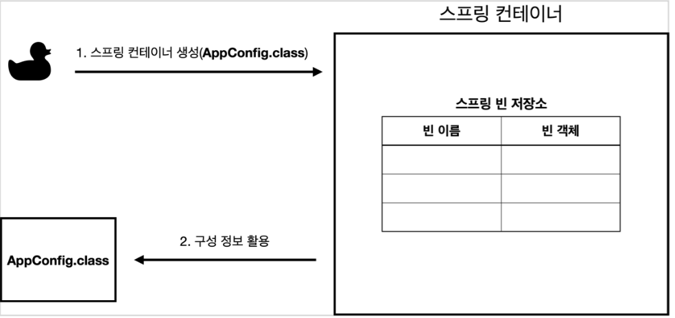
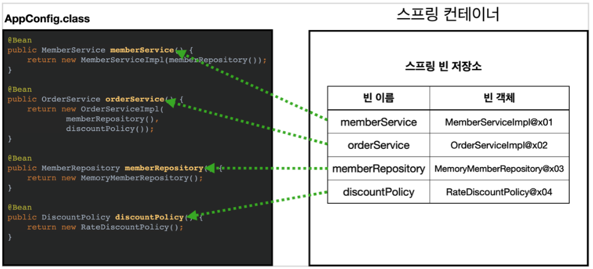
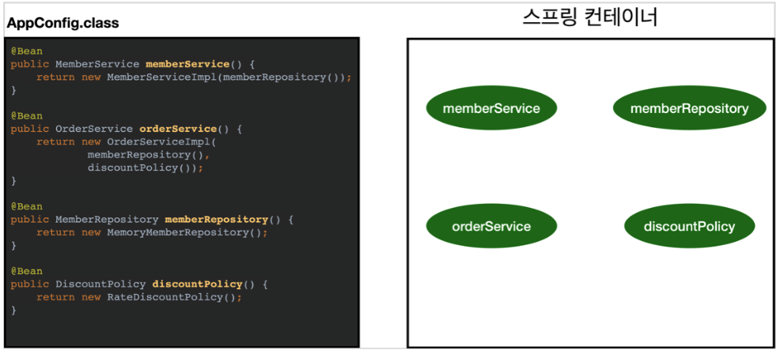
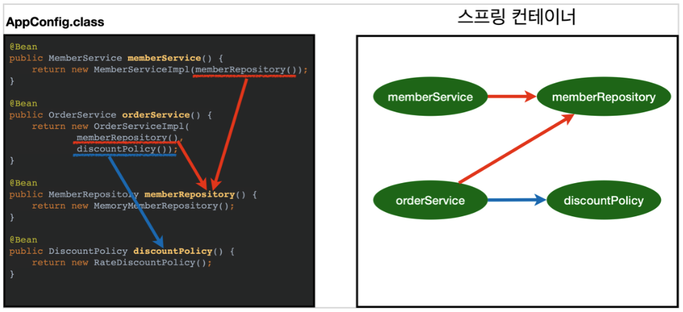
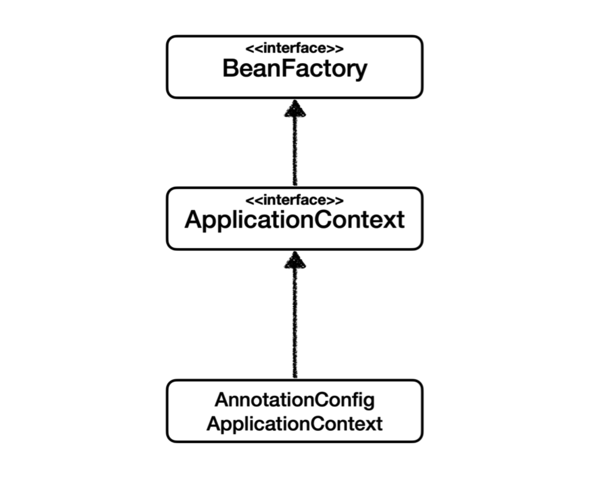
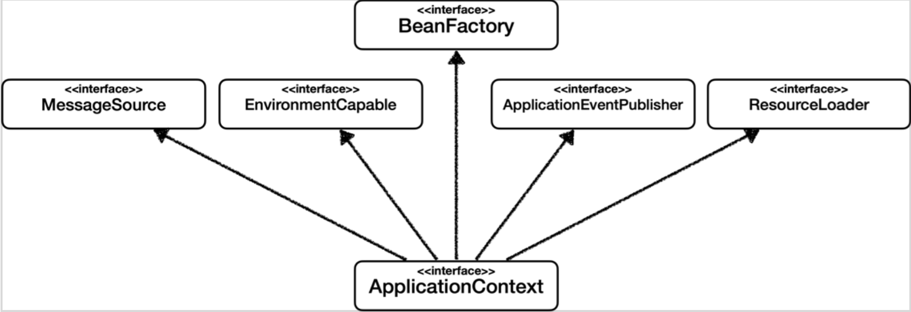
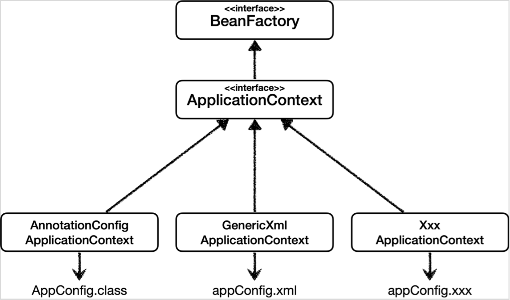
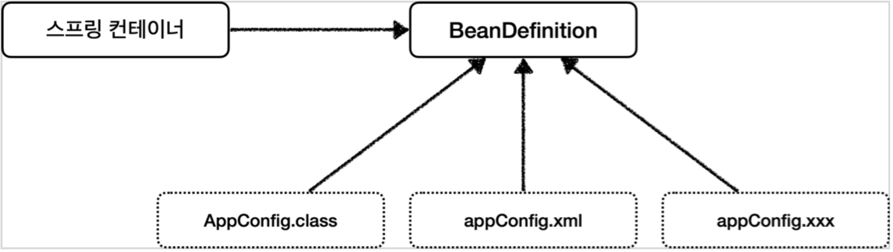
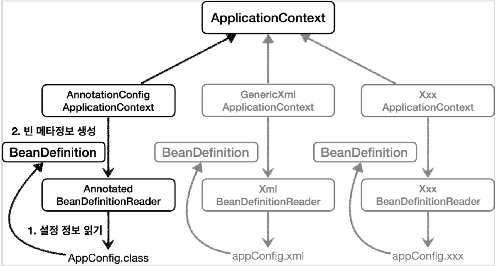

<em><strong>[스프링 핵심 원리 - 기본편](https://www.inflearn.com/course/%EC%8A%A4%ED%94%84%EB%A7%81-%ED%95%B5%EC%8B%AC-%EC%9B%90%EB%A6%AC-%EA%B8%B0%EB%B3%B8%ED%8E%B8/dashboard)을 들으며 정리하는 POST입니다.</strong></em>

## 🎯 스프링 컨테이너 생성
스프링 컨테이너가 생성되는 과정을 알아본다.

```java
ApplicationContext applicationContext = new AnnotationConfigApplicationContext(AppConfig.class);
```

- `ApplicationContext` 를 스프링 컨테이너라 한다. 그리고 이는 인터페이스이다. (`AnnotationConfigApplicationContext` 는 구체 클래스)
- 스프링 컨테이너는 XML을 기반으로 만들 수 있고, 어노테이션 기반의 자바 설정 클래스로 만들 수 있다. (이전에 다룬 `AppConfig` 를 사용한 방식이 어노테이션 기반의 자바 설정 클래스로 만든 예)

### 🪔 1. 스프링 컨테이너 생성


- `new AnnotationConfigApplicationContext(AppConfig.class)` 를 통해 스프링 컨테이너가 생성된다. 이때 구성 정보를 넘겨줘야 하기에 `AppConfig.class` 를 지정했다.
- 스프링 컨테이너 내부에는 이름 - 객체 쌍으로 이뤄진 빈 정보를 저장하기 위한 스프링 빈 저장소가 있다.

### 🪔 2. 스프링 빈 등록


- 스프링 컨테이너는 파라미터로 넘어온 설정 클래스 정보를 사용해 스프링 빈을 등록한다. (`@Bean` 이 붙은 메소드를 모두 호출)

**빈 이름**
- 메소드 이름을 사용한다.
- 직접 부여할 수도 있다. (`@Bean(name="???")`)

> 빈 이름은 항상 고유해야 한다. 다른 빈이 무시되거나 기존 빈을 덮어버리는 오류가 발생할 수 있다.

### 🪔 3. 스프링 빈 의존관계 설정 - 준비


### 🪔 4. 스프링 빈 의존관계 설정 - 완료


- 스프링 컨테이너는 설정 정보를 참고해 의존관계를 주입(DI)한다.
- 단순히 자바 코드를 호출하는 것과는 차이가 있다. 이는 싱글톤 컨테이너에서 설명한다.

> 스프링은 빈을 생성하는 단계와 의존관계를 주입하는 단계가 나눠져 있다. 그런데 자바 코드로 스프링 빈을 등록하면, 생성자를 호출하면서 의존관계 주입도 한 번에 처리된다.

---

## 🎯 컨테이너에 등록된 모든 빈 조회
스프링 컨테이너에 실제 스프링 빈들이 잘 등록되었는지 확인한다.

```java
package hello.core.beanFind;

import hello.core.AppConfig;
import org.junit.jupiter.api.DisplayName;
import org.junit.jupiter.api.Test;
import org.springframework.context.annotation.AnnotationConfigApplicationContext;

public class ApplicationContextInfoTest {
    AnnotationConfigApplicationContext ac = new AnnotationConfigApplicationContext(AppConfig.class);

    @Test
    @DisplayName("모든 빈 출력하기")
    void findAllBean() {
        String[] beanDefinitionNames = ac.getBeanDefinitionNames();

        for (String beanDefinitionName : beanDefinitionNames) {
            Object bean = ac.getBean(beanDefinitionName);
            System.out.println("name = " + beanDefinitionName + " object = " + bean);
        }
    }
}
```

- 위와 같은 테스트 코드로 현재 스프링 컨테이너에 등록된 모든 빈들을 확인할 수 있다.
  - `getBeanDefinitionNames()` 로 스프링에 등록된 모든 빈 이름을 조회할 수 있고, `getBean()` 메소드에 빈 이름을 전달함으로써 빈 객체(인스턴스)를 조회할 수 있다.
- 하지만 이와 같이 확인하게 되면, 내가 만들지 않고 자동으로 등록된 빈들 또한 출력되기에, 역할에 따라 빈들을 출력해보자.

```java
package hello.core.beanFind;

import hello.core.AppConfig;
import org.junit.jupiter.api.DisplayName;
import org.junit.jupiter.api.Test;
import org.springframework.beans.factory.config.BeanDefinition;
import org.springframework.context.annotation.AnnotationConfigApplicationContext;

public class ApplicationContextInfoTest {
    AnnotationConfigApplicationContext ac = new AnnotationConfigApplicationContext(AppConfig.class);

    ...

    @Test
    @DisplayName("애플리케이션 빈 출력하기")
    void findApplicationBean() {
        String[] beanDefinitionNames = ac.getBeanDefinitionNames();

        for (String beanDefinitionName : beanDefinitionNames) {
            BeanDefinition beanDefinition = ac.getBeanDefinition(beanDefinitionName);

            if (beanDefinition.getRole() == BeanDefinition.ROLE_APPLICATION) {
                Object bean = ac.getBean(beanDefinitionName);
                System.out.println("name = " + beanDefinitionName + " object = " + bean);
            }
        }
    }
}
```

- `getBeanDefinition` 을 통해 해당 빈에 대한 정보를 얻을 수 있다. 
  - 해당 빈의 역할이 직접 등록한 애플리케이션 빈(`ROLE_APPLICATION`) 또는 스프링이 내부에서 사용하는 빈(`ROLE_INFRASTRUCTURE`)이냐에 따라 나눌 수 있다.

---

## 🎯 스프링 빈 조회 - 기본
스프링 컨테이너에서 스프링 빈을 찾는 가장 기본적인 조회 방법
- `getBean(빈 이름, 타입)` , `getBean(타입)`
- 조회 대상 스프링 빈이 없으면 예외가 발생한다.
  - `NoSuchBeanDefinitionException: No bean named 'xxxxx' available`

```java
package hello.core.beanFind;

import hello.core.AppConfig;
import hello.core.member.MemberService;
import hello.core.member.MemberServiceImpl;
import org.assertj.core.api.Assertions;
import org.junit.jupiter.api.DisplayName;
import org.junit.jupiter.api.Test;
import org.springframework.beans.factory.config.BeanDefinition;
import org.springframework.context.annotation.AnnotationConfigApplicationContext;

import static org.assertj.core.api.Assertions.*;

class ApplicationContextBasicFindTest {
    AnnotationConfigApplicationContext ac = new AnnotationConfigApplicationContext(AppConfig.class);

    @Test
    @DisplayName("빈 이름으로 조회")
    void ifnBeanByName() {
        MemberService memberService = ac.getBean("memberService", MemberService.class);

        assertThat(memberService).isInstanceOf(MemberServiceImpl.class);
    }
}
```

- 빈 이름으로 등록된 빈을 조회했고, 조회한 빈이 `MemberServiceImpl` 의 인스턴스인지 확인하는 테스트 코드를 작성한다.

```java
package hello.core.beanFind;

import hello.core.AppConfig;
import hello.core.member.MemberService;
import hello.core.member.MemberServiceImpl;
import org.assertj.core.api.Assertions;
import org.junit.jupiter.api.DisplayName;
import org.junit.jupiter.api.Test;
import org.springframework.beans.factory.config.BeanDefinition;
import org.springframework.context.annotation.AnnotationConfigApplicationContext;

import static org.assertj.core.api.Assertions.*;

class ApplicationContextBasicFindTest {
    AnnotationConfigApplicationContext ac = new AnnotationConfigApplicationContext(AppConfig.class);

    ...

    @Test
    @DisplayName("이름 없이 타입으로만 조회")
    void findBeanByType() {
        MemberService memberService = ac.getBean(MemberService.class);

        assertThat(memberService).isInstanceOf(MemberServiceImpl.class);
    }
}
```

- 타입으로만 조회도 가능하다. 하지만 같은 타입을 가지는 빈이 여러 개인 경우도 고려해야 한다.

> 현재 두 조회 모두 **인터페이스**로 조회하고 있다. 이를 구체 클래스로 조회해도 가능은 하지만, 이는 역할이 아닌 구현에 의존하는 코드이고, 변경 시 유연성이 떨어지는 단점이 있다.

이제 실패한 경우의 테스트 코드 또한 작성해야 한다.

```java
package hello.core.beanFind;

import hello.core.AppConfig;
import hello.core.member.MemberService;
import hello.core.member.MemberServiceImpl;
import org.assertj.core.api.Assertions;
import org.junit.jupiter.api.DisplayName;
import org.junit.jupiter.api.Test;
import org.springframework.beans.factory.NoSuchBeanDefinitionException;
import org.springframework.beans.factory.config.BeanDefinition;
import org.springframework.context.annotation.AnnotationConfigApplicationContext;

import static org.assertj.core.api.Assertions.*;
import static org.junit.jupiter.api.Assertions.*;

class ApplicationContextBasicFindTest {
    AnnotationConfigApplicationContext ac = new AnnotationConfigApplicationContext(AppConfig.class);

    ...

    @Test
    @DisplayName("빈 이름으로 조회 X")
    void findBeanByNameX() {
        
        assertThrows(NoSuchBeanDefinitionException.class, 
                () -> ac.getBean("xxxxx", MemberService.class));   
    }
}
```

- `assertThrows` 는 `() -> ` 뒤의 로직을 실행했을 때, 앞에 명시한 예외가 발생해야 테스트가 성공함을 assert한다.

---

## 🎯 스프링 빈 조회 - 동일한 타입이 둘 이상
타입으로 조회 시 같은 타입의 스프링 빈이 둘 이상이면 오류가 발생한다. 이때는 빈 이름을 지정한다.
- `getBeanOfType()` 을 사용하면 해당 타입의 모든 빈을 조회할 수 있다.

```java
package hello.core.beanFind;

import hello.core.AppConfig;
import hello.core.discount.DiscountPolicy;
import hello.core.member.MemberRepository;
import hello.core.member.MemberService;
import hello.core.member.MemberServiceImpl;
import hello.core.member.MemoryMemberRepository;
import org.junit.jupiter.api.DisplayName;
import org.junit.jupiter.api.Test;
import org.springframework.beans.factory.NoSuchBeanDefinitionException;
import org.springframework.context.annotation.AnnotationConfigApplicationContext;
import org.springframework.context.annotation.Bean;
import org.springframework.context.annotation.Configuration;

import static org.assertj.core.api.Assertions.assertThat;
import static org.junit.jupiter.api.Assertions.assertThrows;

public class ApplicationContextSameBeanFindTest {
    AnnotationConfigApplicationContext ac = new AnnotationConfigApplicationContext(SameBeanConfig.class);

    @Test
    @DisplayName("타입으로 조회 시 같은 타입이 둘 이상 있으면, 중복 오류가 발생한다.")
    void findBeanByTypeDuplicate() {
        MemberRepository memberRepository = ac.getBean(MemberRepository.class);
    }

    // 동일 타입의 빈을 생성하기 위해 내부에서 생성한 클래스
    @Configuration
    static class SameBeanConfig {

        @Bean
        public MemberRepository memberRepository1() {
            return new MemoryMemberRepository();
        }

        @Bean
        public MemberRepository memberRepository2() {
            return new MemoryMemberRepository();
        }
    }
}
```

- 기존의 `AppConfig` 를 수정하지 않고 동일한 타입의 빈을 생성하기 위해 `SameBeanConfig` 클래스를 내부에서 생성하고, 이를 이용해 `ApplicationContext` 를 생성하도록 한다.
  - 따라서, 스프링 컨테이너는 `MemberRepository` 타입의 빈을 2개 생성한다.
- 그리고 타입으로 빈을 조회하게 되면, `NoUniqueBeanDefinitionException` 예외가 발생한다.

```java
@Test
  @DisplayName("타입으로 조회 시 같은 타입이 둘 이상 있으면, 중복 오류가 발생한다.")
  void findBeanByTypeDuplicate() {
      assertThrows(NoUniqueBeanDefinitionException.class,
              () -> ac.getBean(MemberRepository.class));
  }
```

- 위와 같이 예외가 발생함을 assert한다.

```java
@Test
@DisplayName("타입으로 조회 시 같은 타입이 둘 이상 있으면, 빈 이름을 지정하면 된다.")
void findBeanByName() {
    MemberRepository memberRepository = ac.getBean("memberRepository1", MemberRepository.class);
    assertThat(memberRepository).isInstanceOf(MemberRepository.class);
}
```

- 이전에 한 것과 같이, 빈 이름을 지정하여 특정 빈만 조회할 수 있다.

```java
@Test
@DisplayName("특정 타입을 모두 조회하기")
void findAllBeanByType() {
    Map<String, MemberRepository> beansOfType = ac.getBeansOfType(MemberRepository.class);
    for (String key : beansOfType.keySet()) {
        System.out.println("key = " + key + " value = " + beansOfType.get(key));
    }

    assertThat(beansOfType.size()).isEqualTo(2);
}
```

- 또는 특정 타입의 빈을 모두 조회하는 방법도 있다.
  - 이때 `getBeansOfType()` 의 반환형은 `Map` 이다.

---

## 🎯 스프링 빈 조회 - 상속 관계
"부모 타입으로 조회하면, 자식 타입도 함께 조회한다."
- 그래서 모든 자바 객체의 최고 부모인 `Object` 타입으로 조회하면, 모든 스프링 빈을 조회한다. 

```java
package hello.core.beanFind;

import hello.core.discount.DiscountPolicy;
import hello.core.discount.FixDiscountPolicy;
import hello.core.discount.RateDiscountPolicy;
import org.junit.jupiter.api.DisplayName;
import org.junit.jupiter.api.Test;
import org.springframework.beans.factory.NoUniqueBeanDefinitionException;
import org.springframework.context.annotation.AnnotationConfigApplicationContext;
import org.springframework.context.annotation.Bean;
import org.springframework.context.annotation.Configuration;

import static org.assertj.core.api.Assertions.assertThat;
import static org.junit.jupiter.api.Assertions.assertThrows;

class ApplicationContextExtendsFindTest {
    AnnotationConfigApplicationContext ac = new AnnotationConfigApplicationContext(TestConfig.class);

    @Test
    @DisplayName("부모 타입으로 조회 시, 자식이 둘 이상 있으면 중복 오류가 발생한다.")
    void findBeanByParentTypeDuplicate() {

        assertThrows(NoUniqueBeanDefinitionException.class,
                () -> ac.getBean(DiscountPolicy.class));
    }

    @Test
    @DisplayName("부모 타입으로 조회 시, 자식이 둘 이상 있으면 빈 이름을 지정하면 된다.")
    void findBeanByParentTypeBeanName() {
        DiscountPolicy rateDiscountPolicy = ac.getBean("rateDiscountPolicy", DiscountPolicy.class);

        assertThat(rateDiscountPolicy).isInstanceOf(RateDiscountPolicy.class);
    }

    @Configuration
    static class TestConfig {
        @Bean
        public DiscountPolicy rateDiscountPolicy() {
            return new RateDiscountPolicy();
        }

        @Bean
        public DiscountPolicy fixDiscountPolicy() {
            return new FixDiscountPolicy();
        }
    }
}
```

- 부모 타입으로 조회 시, 모든 자식 타입도 조회된다. 이때 자식이 둘 이상 있으면 중복 오류가 발생할 것이고, 빈 이름을 지정함으로써 이를 해결할 수 있다.

```java
@Test
@DisplayName("부모 타입으로 모두 조회하기")
void findAllBeanByParentType() {
    Map<String, DiscountPolicy> beansOfType = ac.getBeansOfType(DiscountPolicy.class);
    for (String key : beansOfType.keySet()) {
        System.out.println("key = " + key + " value=" + beansOfType.get(key));
    }
    assertThat(beansOfType.size()).isEqualTo(2);
}

@Test
@DisplayName("부모 타입으로 모두 조회하기 - Object")
void findAllBeanByObjectType() {
    Map<String, Object> beansOfType = ac.getBeansOfType(Object.class);
    for (String key : beansOfType.keySet()) {
        System.out.println("key = " + key + " value=" +
                beansOfType.get(key));
    } 
}
```

- 최고 부모 타입인 `Object` 로 조회하면, 등록된 모든 빈들을 조회할 수 있다.
  - 자바의 객체는 모두 `Object` 이기 때문이다.

---

## 🎯 BeanFactory와 ApplicationContext


**BeanFactory**
- 스프링 컨테이너의 최상위 인터페이스
- 스프링 빈을 관리하고 조회하는 역할을 담당한다.
  - `getBean()` 제공
- 지금까지 사용했던 대부분의 기능을 제공한다. 하지만 `BeanFactory` 를 직접 사용할 일은 거의 없고, 아래의 `ApplicationContext` 를 사용한다.

**ApplicationContext**
- `BeanFactory` 를 상속받기에, 해당 기능에 부가 기능을 추가하고 있다.
- 빈을 관리하고 검색하는 기능을 `BeanFactory` 가 제공하고 있는데, 어떤 차이가 있을까?
- 애플리케이션 개발 시 빈을 관리하고 조회하는 기능 뿐 아니라 수많은 부가 기능이 필요하다. 아래는 `ApplicationContext` 가 제공하는 부가 기능이다.

**ApplicationContext가 제공하는 부가 기능**


- `MessageSource` 를 활용한 국제화 기능
  - 한국에서 들어오면 한국어로, 영어권에서 들어오면 영어로 출력
- `EnvironmentCapable` 환경 변수
  - 로컬, 개발, 운영 등을 구분해서 처리
- `ApplicationEventPublisher`
  - 이벤트를 발행하고 구독하는 모델을 편리하게 지원
- `ResourceLoader` 편리한 리소스 조회
  - 파일, 클래스패스, 외부 등에서 리소스를 편리하게 조회

> `BeanFactory` 나 `ApplicationContext` 를 **스프링 컨테이너**라 한다.

---

## 🎯 다양한 설정 형식 지원 - 자바 코드, XML
스프링 컨테이너는 다양한 형식의 설정 정보를 지원하도록 설계되어 있다.
- 자바 코드, XML, Groovy 등



**어노테이션 기반 자바 코드 설정 사용**
- `new AnnotationConfigApplicationContext(AppConfig.class)`
- `AnnotationConfigApplicationContext` 클래스를 사용하면서 자바 코드로 된 설정 정보를 넘겨 사용한다.

**XML 설정 사용**
- 최근에는 많이 사용하진 않지만, 아직 많은 프로젝트들이 XML로 되어 있다.
- 이를 사용하면 컴파일 없이 빈 설정 정보를 변경할 수 있는 장점이 있다.
- `GenericXmlApplicationContext` 를 사용하면서 `xml` 설정 파일을 넘겨 사용한다.

**`XmlAppConfig` 사용 자바 코드**
```java
package hello.core.xml;

import hello.core.member.MemberService;
import org.assertj.core.api.Assertions;
import org.junit.jupiter.api.Test;
import org.springframework.context.ApplicationContext;
import org.springframework.context.support.GenericXmlApplicationContext;

import static org.assertj.core.api.Assertions.assertThat;

public class XmlAppContext {

    @Test
    void xmlAppContext() {
        ApplicationContext ac = new GenericXmlApplicationContext("appConfig.xml");
        MemberService memberService = ac.getBean("memberService", MemberService.class);

        assertThat(memberService).isInstanceOf(MemberService.class);
    }
}
```

**xml 기반의 스프링 빈 설정 정보**
```xml
<!-- src/main/resources/appConfig.xml -->
<?xml version="1.0" encoding="UTF-8"?>
<beans xmlns="http://www.springframework.org/schema/beans"
       xmlns:xsi="http://www.w3.org/2001/XMLSchema-instance"
       xsi:schemaLocation="http://www.springframework.org/schema/beans http://www.springframework.org/schema/beans/spring-beans.xsd">
    <bean id="memberService" class="hello.core.member.MemberServiceImpl">
        <constructor-arg name="memberRepository" ref="memberRepository" />
    </bean>
    
    <bean id="memberRepository" class="hello.core.member.MemoryMemberRepository" />

    <bean id="orderService" class="hello.core.order.OrderServiceImpl">
          <constructor-arg name="memberRepository" ref="memberRepository" />
          <constructor-arg name="discountPolicy" ref="discountPolicy" />
    </bean>
    <bean id="discountPolicy" class="hello.core.discount.RateDiscountPolicy" />
</beans>
```

- xml 기반의 스프링 설정 정보와 자바 코드로 된 설정 정보를 비교하면 거의 비슷하다.

---

## 🎯 스프링 빈 설정 메타 정보 - BeanDefinition
스프링이 다양한 설정 형식을 지원할 수 있는 중심에 `BeanDefinition` 이라는 추상화가 있다.
- **역할과 구현을 개념적으로 나누었다.**
  - XML을 읽어 `BeanDefinition` 을 만든다.
  - 자바 코드를 읽어 `BeanDefinition` 을 만든다.
  - **스프링 컨테이너는 오직 만들어진 `BeanDefinition` 만 필요**로 한다.
- `BeanDefinition` 을 **빈 설정 메타 정보**라 한다.
  - `@Bean` , `<bean></bean>` 당 각각 하나씩의 메타 정보가 생성된다.
- 그리고 스프링 컨테이너는 이 메타 정보를 기반으로 스프링 빈을 생성한다.



**코드 레벨**


- `AnnotationConfigApplicationContext` 는 `AnnotatedBeanDefinitionReader` 를 사용해서 `AppConfig.class` 를 읽고 `BeanDefinition` 을 생성한다.
- `GenericXmlApplicationContext` 는 `XmlBeanDefinitionReader` 를 사용해서 `appConfig.xml` 설정 정보를 읽고 `BeanDefinition` 을 생성한다.
- 새로운 형식의 설정 정보가 추가되면, `XxxBeanDefinitionReader를` 만들어서 `BeanDefinition` 을 생성하면 된다.

### 🪔 BeanDefinition 살펴보기
**BeanDefinition** 정보
- `BeanClassName`: 생성할 빈의 클래스 명(자바 설정 처럼 팩토리 역할의 빈을 사용하면 없음) 
- `factoryBeanName`: 팩토리 역할의 빈을 사용할 경우 이름, 예) appConfig 
- `factoryMethodName`: 빈을 생성할 팩토리 메서드 지정, 예) memberService
- `Scope`: 싱글톤(기본값)
- `lazyInit`: 스프링 컨테이너를 생성할 때 빈을 생성하는 것이 아니라, 실제 빈을 사용할 때 까지 최대한 생성을 지연처리 하는지 여부
- `InitMethodName`: 빈을 생성하고, 의존관계를 적용한 뒤에 호출되는 초기화 메서드 명 
- `DestroyMethodName`: 빈의 생명주기가 끝나서 제거하기 직전에 호출되는 메서드 명 
- `Constructor arguments`, `Properties`: 의존관계 주입에서 사용한다. (자바 설정 처럼 팩토리 역할의
빈을 사용하면 없음)

## 📌 중요한 개념
스프링 컨테이너, 빈

## 📕 참고
- [스프링 핵심 원리 - 기본편](https://www.inflearn.com/course/%EC%8A%A4%ED%94%84%EB%A7%81-%ED%95%B5%EC%8B%AC-%EC%9B%90%EB%A6%AC-%EA%B8%B0%EB%B3%B8%ED%8E%B8/dashboard)