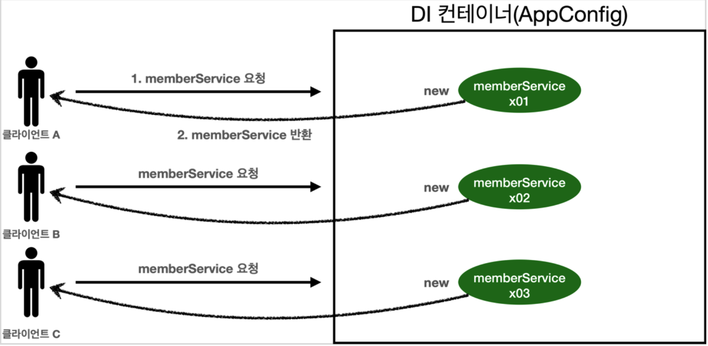
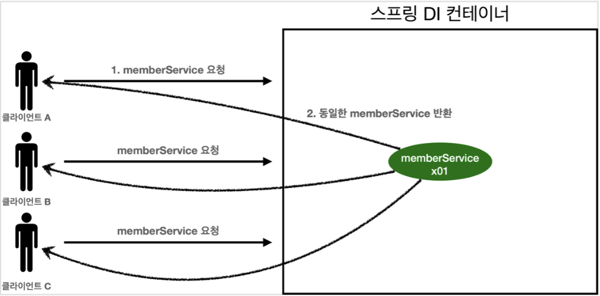
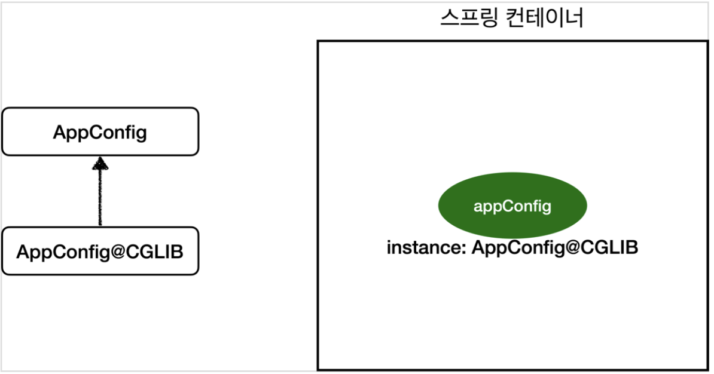

<em><strong>[스프링 핵심 원리 - 기본편](https://www.inflearn.com/course/%EC%8A%A4%ED%94%84%EB%A7%81-%ED%95%B5%EC%8B%AC-%EC%9B%90%EB%A6%AC-%EA%B8%B0%EB%B3%B8%ED%8E%B8/dashboard)을 들으며 정리하는 POST입니다.</strong></em>

## 🎯 웹 애플리케이션과 싱글톤
대부분의 스프링 애플리케이션은 웹 애플리케이션이다. (물론 웹이 아닌 애플리케이션 개발도 얼마든지 개발 가능하다.)
- 웹 애플리케이션은 보통 여러 고객이 동시에 요청을 한다.



- 새로운 클라이언트가 요청할 때마다 인스턴스를 새로 생성하여 반환한다. 
- 따라서, 매 요청마다 새로운 인스턴스를 생성하여 요청 수만큼 생성된다.
  - 이전에 수행했던 `AppConfig` 를 이용한 방식이 이와 같다.

**스프링 없는 순수한 DI 컨테이너 테스트**
```java
package hello.core.singleton;

import hello.core.AppConfig;
import hello.core.member.MemberService;
import org.assertj.core.api.Assertions;
import org.junit.jupiter.api.DisplayName;
import org.junit.jupiter.api.Test;

import static org.assertj.core.api.Assertions.*;

public class SingletonTest {

    @Test
    @DisplayName("스프링 없는 순수한 DI 컨테이너")
    void pureContainer() {
        AppConfig appConfig = new AppConfig();

        // 1. 조회: 호출할 때마다 객체를 생성
        MemberService memberService1 = appConfig.memberService();

        // 2. 조회: 호출할 때마다 객체를 생성
        MemberService memberService2 = appConfig.memberService();

        // 참조값이 다른지 확인
        System.out.println("memberService1 = " + memberService1);
        System.out.println("memberService2 = " + memberService2);

        assertThat(memberService1).isNotSameAs(memberService2);
    }
} 
```

- 이전에 만든 스프링 없는 순수한 DI 컨테이너인 `AppConfig` 는 요청마다 객체를 새로 생성한다.
- 고객 트래픽이 초당 100이라고 가정하면, 초당 100개의 객체를 생성하고 소멸한다. 이는 심각한 메모리 낭비를 초래한다.

> 이에 대한 해결방안으로 **해당 객체가 딱 1개만 생성되고, 이를 공유하도록 설계한다. -> 싱글톤 패턴**

---

## 🎯 싱글톤 패턴
**클래스의 인스턴스가 딱 1개만 생성되는 것을 보장하는 디자인 패턴**이다.
- 객체 인스턴스를 2개 이상 생성하지 못하도록 막아야 한다!
  - `private` 생성자를 이용해 외부에서 임의로 `new` 키워드를 사용하지 못하도록 막아야 한다.

```java
package hello.core.singleton;

public class SingletonService {

    // 자기 자신을 내부에 private으로 가짐
    // 이때 static으로 가지기에 클래스 레벨에 딱 1개만 생성된다.
    private static final SingletonService instance = new SingletonService();

    public static SingletonService getInstance() {
        // 내부적으로 new SingletonService를 실행해 참조값을 넣어놓은 instance를 반환
        return instance;
    }
}
```
- 위와 같이 `getInstance()` 를 통해 생성해놓은 `SingletonService` 를 반환받을 수 있도록 구현한다.
- 하지만 외부에서 임의로 `new SingletonService()` 를 호출한다면, 여러 개의 인스턴스를 생성하게 된다.

```java
package hello.core.singleton;

public class SingletonService {

    // 자기 자신을 내부에 private으로 가짐
    // 이때 static으로 가지기에 클래스 레벨에 딱 1개만 생성된다.
    private static final SingletonService instance = new SingletonService();

    public static SingletonService getInstance() {
        // 내부적으로 new SingletonService를 실행해 참조값을 넣어놓은 instance를 반환
        return instance;
    }

    private SingletonService() {

    }

    public void logic() {
        System.out.println("싱글톤 객체 로직 호출");
    }
}
```

1. `static` 영역에 객체 `instance` 를 미리 하나 생성해 올려둔다.
2. 이 객체 인스턴스가 필요하면 오직 `getInstance()` 메소드를 통해서만 조회할 수 있다. 이 메소드는 항상 같은 인스턴스를 반환한다.
3. 딱 1개의 객체 인스턴스만 존재해야 하므로, 생성자를 `private` 으로 막아 혹시라도 외부에서 `new` 키워드로 객체 인스턴스가 생성되는 것을 막는다.

**싱글톤 패턴을 사용하는 테스트 코드**
```java
@Test
@DisplayName("싱글톤 패턴을 적용한 객체 사용")
void singletonServiceTest() {
    SingletonService singletonService1 = SingletonService.getInstance();
    SingletonService singletonService2 = SingletonService.getInstance();

    System.out.println("singletonService1 = " + singletonService1);
    System.out.println("singletonService2 = " + singletonService2);

    assertThat(singletonService1).isSameAs(singletonService2);
    // same ==
    // equal 
}
```

- `private` 으로 `new` 키워드를 막아두었다.
- **호출마다 같은 객체 인스턴스를 반환**하는 것을 확인할 수 있다.

> 싱글톤 패턴을 구현하는 방법은 매우 많다. 여기서는 객체를 미리 생성해두는 가장 단순하고 안전한 방법을 구현했다.

이미 만들어진 객체를 공유해서 효율적으로 사용할 수 있지만, **싱글톤 패턴은 다음과 같은 문제점들**을 가지고 있다.
- 싱글톤 패턴을 구현하는 코드 자체가 많이 들어간다.
- 의존관계상 클라이언트가 구체 클래스에 의존한다. -> DIP 위반!!!
- 클라이언트가 구체 클래스에 의존해서 OCP 원칙을 위반할 가능성이 높다.
- 테스트가 어렵다.
- 내부 속성을 변경하거나 초기화하기 어렵다.
- `private` 생성자로 인해 자식 클래스를 만들기 어렵다.
- 결론적으로 유연성이 떨어진다. (DI의 적용을 어렵게 함)
- 안티 패턴으로 불리기도 한다.

---

## 🎯 싱글톤 컨테이너
스프링 컨테이너는 **싱글톤 패턴의 문제점을 해결**하면서, **객체 인스턴스를 싱글톤(1개만 생성)으로 관리**한다.
- 지금까지 배운 스프링 빈이 바로 싱글톤으로 관리되는 빈이다!

### 🪔 싱글톤 컨테이너
- 스프링 컨테이너는 싱글톤 패턴을 적용하지 않아도, 객체 인스턴스를 싱글톤으로 관리한다.
  - 이전에 다룬 컨테이너 생성 과정을 자세히 보면, **컨테이너는 객체를 하나만 생성해서 관리**한다.
- 스프링 컨테이너는 싱글톤 컨테이너 역할을 한다. 이렇게 싱글톤 객체를 생성하고 관리하는 기능을 싱글톤 레지스트리라 한다.
- 스프링 컨테이너의 이런 기능덕에 싱글톤 패턴의 모든 단점을 해결하면서 객체를 싱글톤으로 유지할 수 있다.
  - 지저분한 코드가 들어가지 않아도 된다.
  - DIP, OCP, 테스트, `private` 생성자로부터 자유롭게 싱글톤을 사용할 수 있다.

**스프링 컨테이너를 사용하는 테스트 코드**
```java
@Test
@DisplayName("스프링 컨테이너와 싱글톤")
void springContainer() {
//        AppConfig appConfig = new AppConfig();
    ApplicationContext ac = new AnnotationConfigApplicationContext(AppConfig.class);

    // 1. 조회: 호출할 때마다 객체를 생성
//        MemberService memberService1 = appConfig.memberService();
    MemberService memberService1 = ac.getBean("memberService", MemberService.class);

    // 2. 조회: 호출할 때마다 객체를 생성
    MemberService memberService2 = ac.getBean("memberService", MemberService.class);
//        MemberService memberService2 = appConfig.memberService();

    // 참조값이 같은지 확인
    System.out.println("memberService1 = " + memberService1);
    System.out.println("memberService2 = " + memberService2);

    assertThat(memberService1).isSameAs(memberService2);
}
```

- 스프링 컨테이너에 등록한 빈이 계속 조회되어 같은 참조값을 가지는 것을 확인할 수 있다.
  - 그리고 `MemberService` 코드를 확인해보아도, **싱글톤과 관련된 코드는 하나도 없는 것을 확인할 수 있다.**

**싱글톤 컨테이너 적용 후**


- 스프링 컨테이너 덕분에 고객의 요청마다 객체를 생성하는 것이 아닌 **이미 만들어진 객체를 공유해서 효율적인 재사용이 가능**해졌다.

> 스프링의 기본 빈 등록 방식은 싱글톤이지만, 싱글톤 방식만 지원하는 것은 아니다. 
> - 요청마다 새로운 객체를 생성해서 반환하는 기능도 제공하긴 한다!

---

## 🎯 싱글톤 방식의 주의점
싱글톤 패턴이든, 스프링과 같은 싱글톤 컨테이너를 사용하든, 객체 인스턴스를 하나만 생성해서 공유하는 싱글톤 방식은 여러 클라이언트가 하나의 같은 객체 인스턴스를 공유하기에, **싱글톤 객체는 상태를 유지하게 설계하면 안된다!**
- 즉, **무상태(stateless)로 설계**해야 한다!
  - 특정 클라이언트에 의존적인 필드가 있으면 안된다! (특정 클라이언트가 값을 바꾸게 두면 안된다!)
  - 특정 클라이언트가 값을 변경할 수 있는 필드가 있으면 안된다!
  - 가급적 읽기만 가능해야 한다. (값의 수정이 없도록 해야 한다.)
  - 필드 대신에 자바에서 공유되지 않는, 지역변수, 파라미터, ThreadLocal 등을 사용해야 한다.
- 스프링 빈의 필드에 공유 값을 설정하면 정말 큰 장애가 발생할 수 있다..!

**상태를 유지할 경우 발생하는 문제점 예시**
```java
package hello.core.singleton;

public class StatefulService {
    // 상태를 유지하는 필드
    private int price;
    
    public void order(String name, int price) {
        System.out.println("name = " + name + " price = " + price);
        
        // 여기가 문제!!!
        this.price = price;
    }
    
    public int getPrice() {
        return price;
    }
}

//

package hello.core.singleton;

import org.junit.jupiter.api.Test;
import org.springframework.context.ApplicationContext;
import org.springframework.context.annotation.AnnotationConfigApplicationContext;
import org.springframework.context.annotation.Bean;
import static org.assertj.core.api.Assertions.*;

class StatefulServiceTest {

    @Test
    void statefulServiceSingleton() {
        // TestConfig로 ac 생성
        ApplicationContext ac = new AnnotationConfigApplicationContext(TestConfig.class);
        StatefulService statefulService1 = ac.getBean(StatefulService.class);
        StatefulService statefulService2 = ac.getBean(StatefulService.class);

        // ThreadA: A 사용자가 10000원 주문
        statefulService1.order("userA", 10000);
        // ThreadB: B 사용자가 20000원 주문
        statefulService2.order("userB", 20000);

        // ThreadA: A 사용자가 주문 금액 조회 -> 과연 얼마가 나올까?
        int price = statefulService1.getPrice();

        System.out.println("price = " + price);

        assertThat(statefulService1.getPrice()).isEqualTo(20000);
    }

    static class TestConfig {

        @Bean
        public StatefulService statefulService() {
            return new StatefulService();
        }
    }
}
```

- `StatefulServiceTest` 의 출력문에서 기대한 값은 10000원이다.
  - 사용자 A가 주문한 금액이 10000원이고, 이를 다시 조회한 것이므로 10000원을 기대했다.
  - 하지만, 중간에 사용자 B의 주문이 끼어들어 기대와 다른 값이 출력되었다. (사용자 B의 주문이 `StatefulService` 의 `price` 필드를 20000으로 변경!!!)
  - 그리고, `statefulService1` 과 `statefulService2` 로 다른 인스턴스를 사용했다해도, 사실 둘은 같은 참조값을 갖는 인스턴스이기에 동일하다.
- 이를 해결하기 위해 `order` 를 `int` 형으로 변환하고, `price` 필드 제거, `price` 를 반환하는 형태로 바꿀 수 있다.

---

## 🎯 @Configuration과 싱글톤
> `@Configuration` 은 싱글톤을 위해 존재한다.

`AppConfig` 를 보면 이상한 점이 있다.

```java
package hello.core;

import hello.core.discount.DiscountPolicy;
import hello.core.discount.FixDiscountPolicy;
import hello.core.discount.RateDiscountPolicy;
import hello.core.member.MemberRepository;
import hello.core.member.MemberService;
import hello.core.member.MemberServiceImpl;
import hello.core.member.MemoryMemberRepository;
import hello.core.order.OrderService;
import hello.core.order.OrderServiceImpl;
import org.springframework.context.annotation.Bean;
import org.springframework.context.annotation.Configuration;

@Configuration
public class AppConfig {
    
    // @Bean memberService -> new MemoryMemberRepository()
    
    // @Bean orderService -> new MemoryMemberRepository()

    @Bean
    public MemberService memberService() {
        return new MemberServiceImpl(memberRepository());
    }

    @Bean
    public MemberRepository memberRepository() {
        return new MemoryMemberRepository();
    }

    @Bean
    public OrderService orderService() {
        return new OrderServiceImpl(
                memberRepository(),
                discountPolicy()
        );
    }
    
    ...
}
```

- `memberService` 빈을 만드는 코드를 보면, `memberRepository()` 를 호출한다.
  - 이때 `new MemoryMemberRepository()` 를 호출한다.
- `orderService` 빈을 만드는 코드를 보면, 동일하게 `memberRepository()` 를 호출한다.
  - 이때 `new MemoryMemberRepository()` 를 호출한다.

결과적으로 각각 다른 2개의 `MemoryMemberRepository` 가 생성되면서 싱글톤이 깨지는 것처럼 보인다!!!
- 스프링 컨테이너는 이를 어떻게 해결할까?

**검증 용도의 테스트 코드 추가**
- `memberService` 와 `orderService` 에서 생성하는 `memberRepository` 의 구체 클래스가 같은 것처럼 보인다.
- 따라서 두 구현 클래스에서 테스트 용으로 `MemberRepository` 를 조회할 수 있는 메소드를 추가한다.
```java
package hello.core.member;

public class MemberServiceImpl implements MemberService {

    private final MemberRepository memberRepository;

    // 테스트 용도
    public MemberRepository getMemberRepository() {
        return memberRepository;
    }
}

//

package hello.core.order;


public class OrderServiceImpl implements OrderService {

    // 회원을 찾기 위해 필요
    private final MemberRepository memberRepository;
    
    // 테스트 용도
    public MemberRepository getMemberRepository() {
        return memberRepository;
    }
}
```

**테스트 코드**
```java
package hello.core.singleton;

import hello.core.AppConfig;
import hello.core.member.MemberRepository;
import hello.core.member.MemberServiceImpl;
import hello.core.order.OrderServiceImpl;
import org.assertj.core.api.Assertions;
import org.junit.jupiter.api.Test;
import org.springframework.context.ApplicationContext;
import org.springframework.context.annotation.AnnotationConfigApplicationContext;

public class ConfigurationSingletonTest {

    @Test
    void configurationTest() {
        ApplicationContext ac = new AnnotationConfigApplicationContext(AppConfig.class);

        MemberServiceImpl memberService = ac.getBean(MemberServiceImpl.class);
        OrderServiceImpl orderService = ac.getBean(OrderServiceImpl.class);
        MemberRepository memberRepository = ac.getBean("memberRepository", MemberRepository.class);

        MemberRepository memberRepository1 = memberService.getMemberRepository();
        MemberRepository memberRepository2 = orderService.getMemberRepository();
        
        // 모두 같은 인스턴스를 참조하고 있다.
        System.out.println("memberService -> memberRepository = " + memberRepository1);
        System.out.println("orderService -> memberRepository = " + memberRepository2);
        System.out.println("memberRepository = " + memberRepository);
    }
}
```
- 모두 같은 인스턴스를 참조하고 있는 것을 확인할 수 있다.
- 각각 서로 `new MemoryMemberRepository()` 를 호출했는데 어떻게 가능한 것일까..?
  - `memberService()` , `@Bean` 으로 인한 빈 등록 시 호출, `orderService()` 로 총 3번의 호출이 될텐데 .. ?!
  - `AppConfig` 에서 호출마다 출력문을 작성해 실행하면 출력 결과는 모두 1번만 호출되어 총 3개의 출력문을 확인할 수 있다.
  - `memberService() -> memberRepository()`
  - `memberRepository()`
  - `orderService() -> memberRepository()`
  - 총 출력문이 5개가 나와야 하는데 ..?

> 스프링 컨테이너는 어떻게든 싱글톤 방식을 보장하는구나..!

---

## 🎯 @Configuration과 바이트코드 조작의 마법
스프링 컨테이너는 **싱글톤 레지스트리**다. 따라서 스프링 빈이 싱글톤이 되도록 보장해야 한다!
- 하지만 스프링이 자바 코드까지 어떻게 할 수는 없다. 
  - 위에서 저 자바 코드만 봤을때, 분명 `memberRepository()` 는 3번 호출되어야 하는 것이 맞다.
- 그래서 스프링은 클래스의 바이트코드를 조작하는 라이브러리를 사용한다.
- `@Configuration` 을 적용한 `AppConfig` 를 확인한다.

```java
@Test
void configurationDeep() {
    // AppConfig 또한 빈으로 등록됨!!!
    ApplicationContext ac = new AnnotationConfigApplicationContext(AppConfig.class);

    AppConfig bean = ac.getBean(AppConfig.class);

    System.out.println("bean = " + bean.getClass());
    // 출력: bean = class hello.core.AppConfig$$EnhancerBySpringCGLIB$$79b7202a
}
```

- 빈으로 등록된 `AppConfig` 의 클래스 타입을 출력하면, `EnhancerBySpringCGLIB` 이라는 정보가 출력되는 것을 확인할 수 있다.
  - 순수한 클래스라면, `class hello.core.AppConfig` 가 출력되어야 한다.
- 이는 내가 만든 클래스가 아니라, 스프링이 `CGLIB` 라는 바이트코드 조작 라이브러리를 사용해 `AppConfig` 클래스를 상속받은 임의의 다른 클래스를 만들고, 이를 스프링 빈으로 등록한 것이다!!!



- 그리고 이 임의의 클래스가 싱글톤이 보장되도록 한다.
- 그리고 이 과정은 `@Configuration` 어노테이션을 통해 수행된다.

**AppConfig@CGLIB 예상 코드**
```java
@Bean
public MemberRepository memberRepository() {
    
    if (memoryMemberRepository가 이미 스프링 컨테이너에 등록되어 있으면?) { 
        return 스프링 컨테이너에서 찾아서 반환;
    } else { //스프링 컨테이너에 없으면
        기존 로직을 호출해서 MemoryMemberRepository를 생성하고 스프링 컨테이너에 등록 
        return 반환
    } 
}
```

- `@Bean` 이 붙은 메소드마다 이미 스프링 빈이 존재하면, 존재하는 빈을 반환하고, 없다면 생성해서 스프링 빈으로 등록하고 반환하는 코드가 동적으로 만들어진다.
  - 이 덕분에 싱글톤이 보장된다.

> `AppConfig@CGLIB` 는 `AppConfig` 의 자식 타입이다. 따라서 부모 타입인 `AppConfig` 타입으로 조회가 가능했던 것이다.

### 🪔 @Configuration 없이 @Bean만 적용하면 어떻게 될까?
`@Configuration` 을 붙여 바이트코드를 조작하는 CGLIB 기술을 사용해서 싱글톤을 보장하지만, `@Bean` 만 적용하면 어떻게 될까?
- `@Configuration` 삭제 후, 다시 출력을 보면 `bean = class hello.core.AppConfig` 와 같이 순수한 `AppConfig` 로 스프링 빈에 등록된 것을 확인할 수 있다.

하지만! 싱글톤이 보장되지 않아, 빈 등록 시 호출되는 출력문이 총 5번 출력되는 것을 확인할 수 있다. (`MemberRepository` 가 총 3번 모두 호출됨)
- **당연히 모두 다른 인스턴스로 생성**될 것이다!!!

> 스프링 설정 정보는 항상 `@Configuration` 을 명시하여 싱글톤을 보장하도록 하자.

## 📌 중요한 개념
싱글톤 패턴, 무상태 설계, `@Configuration`

## 📕 참고
- [스프링 핵심 원리 - 기본편](https://www.inflearn.com/course/%EC%8A%A4%ED%94%84%EB%A7%81-%ED%95%B5%EC%8B%AC-%EC%9B%90%EB%A6%AC-%EA%B8%B0%EB%B3%B8%ED%8E%B8/dashboard)