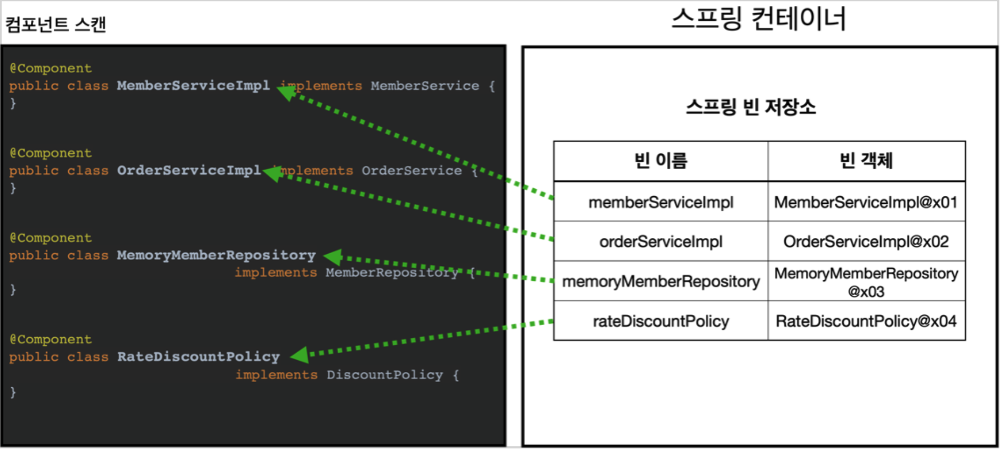
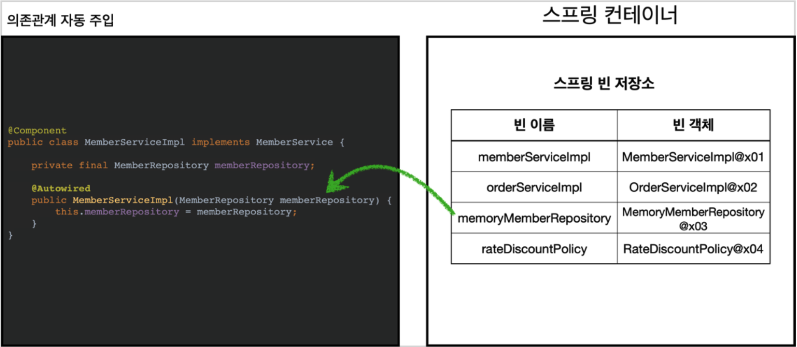
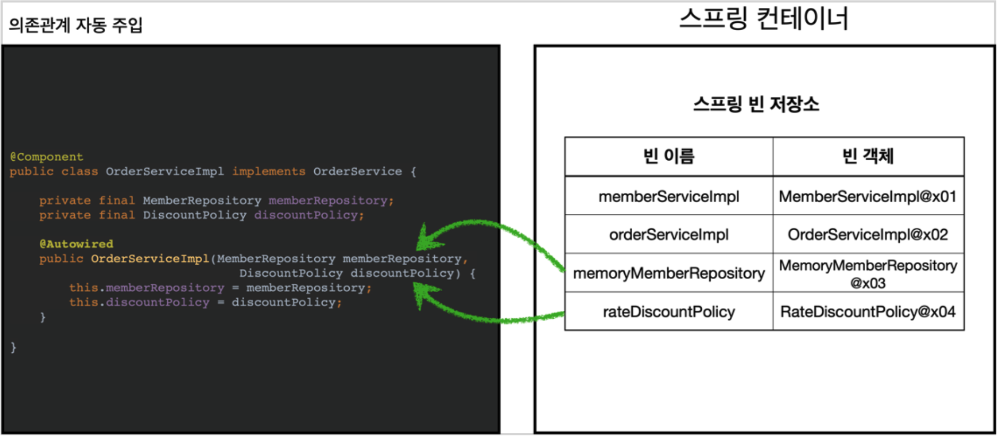

<em><strong>[스프링 핵심 원리 - 기본편](https://www.inflearn.com/course/%EC%8A%A4%ED%94%84%EB%A7%81-%ED%95%B5%EC%8B%AC-%EC%9B%90%EB%A6%AC-%EA%B8%B0%EB%B3%B8%ED%8E%B8/dashboard)을 들으며 정리하는 POST입니다.</strong></em>

## 🎯 컴포넌트 스캔과 의존관계 자동 주입 시작하기
지금까지는 스프링 빈 등록 시, 자바 코드의 `@Bean` 이나 XML의 `<bean></bean>` 을 통해 설정 정보에 직접 등록할 스프링 빈을 명시했다.
- 하지만 등록해야 할 스프링 빈의 수가 많아지게 되면, 이러한 과정은 매우 비효율적이다.

스프링은 **설정 정보가 없어도 자동으로 스프링 빈을 등록**하는 **컴포넌트 스캔**이라는 기능을 제공한다!
- 또한 의존관계도 자동으로 주입하는 **`@Autowired`** 라는 기능도 제공한다.

먼저 코드로 알아보기 위해, 새로운 `AutoAppConfig.java` 를 생성한다.
```java
package hello.core;

import org.springframework.context.annotation.ComponentScan;
import org.springframework.context.annotation.Configuration;
import org.springframework.context.annotation.FilterType;

@Configuration
@ComponentScan(
        excludeFilters = @ComponentScan.Filter(type = FilterType.ANNOTATION, classes = Configuration.class)
)
public class AutoAppConfig {

}
```

- `@ComponentScan` 이 추가되었다. 이는 스프링 빈을 다 읽어 자동으로 등록하기 위해 필요한 어노테이션이다.
  - 이는 `@Component` 어노테이션이 붙은 클래스를 찾아 자동으로 스프링 빈으로 등록해준다.
  - `excludeFilters` 는 이때 제외할 클래스를 의미한다.
  - 현재 예제에서는 이전에 생성했던 `AppConfig` 에 `@Configuration` 어노테이션이 붙어있고, 이를 삭제하지 않기에 이를 제외한다.
- 기존의 `AppConfig` 와 다르게 `@Bean` 으로 등록한 클래스가 하나도 없다!

이제 각 클래스가 컴포넌트 스캔의 대상이 되도록 `@Component` 어노테이션을 붙여준다.

**MemoryMemberRepository @Component 추가**, **RateDiscountPolicy @Component 추가**

**MemberServiceImpl @Component, @Autowired 추가**
```java
package hello.core.member;

import org.springframework.beans.factory.annotation.Autowired;
import org.springframework.stereotype.Component;

@Component
public class MemberServiceImpl implements MemberService {

    private final MemberRepository memberRepository;

    @Autowired
    public MemberServiceImpl(MemberRepository memberRepository) {
        this.memberRepository = memberRepository;
    }

    @Override
    public void join(Member member) {
        memberRepository.save(member);
    }

    @Override
    public Member findMember(Long memberId) {
        return memberRepository.findById(memberId);
    }
}
```

- 이전 `AppConfig` 에서는 `@Bean` 으로 직접 설정 정보를 작성했고, 의존관계도 직접 명시했다.
- 하지만 이제는 컴포넌트 스캔으로 자동 등록하기에 의존관계 주입 또한 해당 클래스 내에서 처리해야 한다.
  - 이때 사용하는 것이 `@Autowired` 어노테이션이다. 이는 의존관계를 자동으로 주입해준다.

**OrderServiceImpl @Component, @Autowired 추가**
```java
package hello.core.order;

import hello.core.discount.DiscountPolicy;
import hello.core.discount.FixDiscountPolicy;
import hello.core.discount.RateDiscountPolicy;
import hello.core.member.Member;
import hello.core.member.MemberRepository;
import hello.core.member.MemoryMemberRepository;
import org.springframework.beans.factory.annotation.Autowired;
import org.springframework.stereotype.Component;

@Component
public class OrderServiceImpl implements OrderService {

    // 회원을 찾기 위해 필요
    private final MemberRepository memberRepository;
    // 할인 정책 사용을 위해 필요
//    private final DiscountPolicy discountPolicy = new FixDiscountPolicy();
    private final DiscountPolicy discountPolicy;

    @Autowired
    public OrderServiceImpl(MemberRepository memberRepository, DiscountPolicy discountPolicy) {
        this.memberRepository = memberRepository;
        this.discountPolicy = discountPolicy;
    }

    @Override
    public Order createOrder(Long memberId, String itemName, int itemPrice) {
        Member member = memberRepository.findById(memberId);
        // 할인에 대해서는 createOrder는 아예 알지 못함, 단일 책임 원칙을 잘 지킨 예
        int discountPrice = discountPolicy.discount(member, itemPrice);

        return new Order(memberId, itemName, itemPrice, discountPrice);
    }
}
```

- `@Autowired` 를 사용하면 생성자에서 여러 의존관계도 한 번에 주입받을 수 있다.

이제 생성한 설정 정보로 스프링 빈 등록이 정상 수행되는지 확인하는 테스트 코드를 작성한다.

**AutoAppConfigTest.java**
```java
package hello.core.scan;

import hello.core.AutoAppConfig;
import hello.core.member.MemberService;
import hello.core.member.MemberServiceImpl;
import org.assertj.core.api.Assertions;
import org.junit.jupiter.api.Test;
import org.springframework.context.ApplicationContext;
import org.springframework.context.annotation.AnnotationConfigApplicationContext;

import static org.assertj.core.api.Assertions.*;

public class AutoAppConfigTest {

    @Test
    void basicScan() {
        ApplicationContext ac = new AnnotationConfigApplicationContext(AutoAppConfig.class);
        MemberService memberService = ac.getBean(MemberService.class);
        assertThat(memberService).isInstanceOf(MemberService.class);
    }
}
```

- 설정 정보로 방금 생성한 `AutoAppConfig` 를 넘겨준다.

### 🪔 컴포넌트 스캔과 자동 의존관계 주입 동작 과정
1. `@ComponentScan`


- `@ComponentScan` 은 `@Component` 가 붙은 모든 클래스를 스프링 빈으로 등록한다. (스프링 컨테이너가 모든 클래스를 확인!, 싱글톤으로 등록)
- 이때 스프링 빈의 기본 이름은 클래스명을 사용하되, 맨 앞글자만 소문자를 사용한다.
  - 만약 빈 이름을 지정하고 싶으면 `@Component("memberService2")` 와 같이 부여하면 된다.

2. `@Autowired` 의존관계 자동 주입


- 생성자에 `@Autowired` 를 지정하면, 스프링 컨테이너가 자동으로 해당 스프링 빈을 찾아서 주입한다.
- 이때 기본 조회 전략은 **타입이 같은 빈**을 찾아 주입한다.
  - `getBean(MemberRepository.class)` 와 동일하다고 이해하면 쉽다.
  - 타입이 같은 빈이 여러 개인 경우는 뒤에서 ...



- 생성자에 파라미터가 많아도, 다 찾아서 자동으로 주입한다.

---

## 🎯 탐색 위치와 기본 스캔 대상


---

## 🎯 필터
### 🪔 

---

## 🎯 중복 등록과 충돌


## 📌 중요한 개념


## 📕 참고
- [스프링 핵심 원리 - 기본편](https://www.inflearn.com/course/%EC%8A%A4%ED%94%84%EB%A7%81-%ED%95%B5%EC%8B%AC-%EC%9B%90%EB%A6%AC-%EA%B8%B0%EB%B3%B8%ED%8E%B8/dashboard)